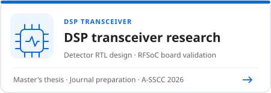
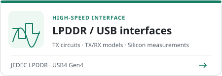

# Juhyeong Yun | High-Speed Interface & DSP Transceiver Research

Kwangwoon University · Master's thesis research in progress

I'm Juhyeong Yun. My research covers **high-speed interfaces based on JEDEC [LPDDR](projects/high-speed-interface-research/docs/lpddr.md) and [USB4 Gen4](projects/high-speed-interface-research/docs/usb4-pam3.md) specifications** and **[DSP-based transceivers](projects/README.md#dsp-transceiver-research) for ultra-high-speed communication**.

I design circuits and systems that compensate for channel loss and ISI to support reliable data transmission at high speeds.

In line with current design trends, I use [AI](docs/ai-assisted-dsp-workflow.en.md) to assist with RTL, testbench and automation code for repeatable verification and measurements.

## DSP transceiver research

**My role and key result:** I implemented PAM4 transceiver DSP and detector RTL and [validated receiver performance on an RFSoC board](projects/zcu208-pam4-dsp-portfolio/docs/validation.md#isi-보드를-통한-rfsoc-측정). The resulting [A-SSCC 2026 paper](https://epapers2.org/asscc2026/ESR/paper_details.php?paper_id=1351) was accepted.

Ongoing **[thesis and journal research](https://github.com/yunjuhyeong0916-glitch/pam4-mlsd-research/blob/main/README.en.md)** is available in a separate repository.

<strong>View research · A-SSCC / AI assistance</strong>

### A-SSCC 2026 | DS-SBM-based PAM4 transceiver DSP

I integrated **[32-lane PAM4 DSP](projects/zcu208-pam4-dsp-portfolio/docs/architecture.md)**, TX FIR, RX 21-tap FIR and DS-SBM RS-MLSD with the ZCU208 RFSoC. The [Vivado / Vitis flow](projects/zcu208-pam4-dsp-portfolio/docs/vitis-bringup.md) covers JTAG programming, CLK104 / RFDC initialization and coefficient updates. Measurement signals pass from the DAC through an [ISI board](projects/zcu208-pam4-dsp-portfolio/docs/validation.md#isi-보드를-통한-rfsoc-측정) to ADC capture.

[A-SSCC project](projects/zcu208-pam4-dsp-portfolio/) · [Design decisions](projects/zcu208-pam4-dsp-portfolio/docs/design-decisions.md) · [Vitis / FPGA bring-up](projects/zcu208-pam4-dsp-portfolio/docs/vitis-bringup.md) · [Measurement and implementation results](projects/zcu208-pam4-dsp-portfolio/docs/validation.md)

### AI assistance | RTL and measurement automation with MATLAB MCP

I used AI to help develop RTL and testbenches, plus automation code connecting ZCU208 coefficient settings, data collection and BER analysis.

[Toolbox roles and automation harness diagrams](docs/ai-assisted-dsp-workflow.en.md)

## LPDDR / USB interface research

- **LPDDR:** Designed a [15.6-Gb/s low-voltage TX circuit](projects/high-speed-interface-research/docs/lpddr-tx-circuit-verification.md) and verified it with post-layout simulation. Participated in measurements of a [28-nm Combo PHY](projects/high-speed-interface-research/docs/lpddr-combo.md) at 14 Gb/s/pin.
- **USB:** Designed and verified [TX RTL](projects/high-speed-interface-research/docs/usb-tx-modeling.md) and [RX CTLE behavioral models](projects/high-speed-interface-research/docs/usb-rx-ctle-modeling.md), and participated in [differential PAM-3 measurements of a 32-Gb/s TX chip](projects/high-speed-interface-research/docs/pam3-differential-measurement.md).

<strong>View design and verification · TX / RX / PCB / HFSS / Measurements</strong>

| Research | Design and verification work | Key results |
|---|---|---|
| [LPDDR](projects/high-speed-interface-research/docs/lpddr.md) | [TX circuits](projects/high-speed-interface-research/docs/lpddr-tx-circuit-verification.md), [TX Verilog models](projects/high-speed-interface-research/docs/lpddr-tx-modeling.md), [PCB / HFSS](projects/high-speed-interface-research/docs/pcb-hfss-verification.md) | 15.6-Gb/s TX circuit simulation; participation in 14-Gb/s/pin Combo PHY measurements |
| [USB&nbsp;PAM&#8209;3](projects/high-speed-interface-research/docs/usb4-pam3.md) | [TX models / RTL](projects/high-speed-interface-research/docs/usb-tx-modeling.md), [RX CTLE models](projects/high-speed-interface-research/docs/usb-rx-ctle-modeling.md), [Differential PAM-3 measurements / FFE](projects/high-speed-interface-research/docs/pam3-differential-measurement.md) | Integrated TX/RX model verification; differential signal evaluation and FFE-effect checks on a 32-Gb/s TX chip |

[PCB / HFSS](projects/high-speed-interface-research/docs/pcb-hfss-verification.md) · [LPDDR / USB interface research](projects/high-speed-interface-research/)

## Measurement / verification

### FPGA measurement and validation

<table>
<thead>
<tr><th nowrap>Area</th><th nowrap>Checks and details</th></tr>
</thead>
<tbody>
<tr>
  <td nowrap>RFSoC tests</td>
  <td>ZCU208 DAC → ISI board → ADC capture BER from PL PRBS checker counts  <a href="projects/zcu208-pam4-dsp-portfolio/docs/validation.md#isi-보드를-통한-rfsoc-측정">ISI-board tests / BER</a></td>
</tr>
<tr>
  <td nowrap>FPGA build (Vivado)</td>
  <td>RTL resource use and timing margin  <a href="projects/zcu208-pam4-dsp-portfolio/docs/validation.md#fpga-자원타이밍">Resources and timing</a></td>
</tr>
<tr>
  <td nowrap>Board setup (Vitis)</td>
  <td>JTAG launch and clock / RFDC setup RX coefficient updates / data collection  <a href="projects/zcu208-pam4-dsp-portfolio/docs/vitis-bringup.md">Board setup and control</a></td>
</tr>
<tr>
  <td nowrap>Automation</td>
  <td>App build / launch and UART capture Python BER analysis of ILA counters  <a href="docs/ai-assisted-dsp-workflow.en.md#zcu208-measurement-harness">Automation harness</a></td>
</tr>
</tbody>
</table>

### 28-nm chip measurements / PCB and HFSS analysis

<table>
<thead>
<tr><th nowrap>Area</th><th nowrap>Checks and details</th></tr>
</thead>
<tbody>
<tr>
  <td nowrap>PCB / HFSS</td>
  <td>LPDDR PCB design / transfer analysis USB TX ground / power-path review  <a href="projects/high-speed-interface-research/docs/pcb-hfss-verification.md">PCB / HFSS analysis</a></td>
</tr>
<tr>
  <td nowrap>28-nm silicon tests</td>
  <td>LPDDR TX eye / RX Shmoo USB differential PAM&#8209;3 upper / lower eyes before / after FFE  <a href="projects/high-speed-interface-research/docs/verification-figures.md">Eye / Shmoo</a> <a href="projects/high-speed-interface-research/docs/pam3-differential-measurement.md">PAM&#8209;3 tests / FFE</a></td>
</tr>
<tr>
  <td nowrap>Automation</td>
  <td>Power-supply / BERT / I2C control Voltage / timing sweeps and early error stops Boundary search / CSV logging  <a href="projects/high-speed-interface-research/docs/measurement-equipment.md">Equipment / control</a></td>
</tr>
</tbody>
</table>

## Research publications

| Research | Paper links |
|---|---|
| DSP / MLSD | [A-SSCC 2026 · RFSoC-verified PAM4 transceiver](https://epapers2.org/asscc2026/ESR/paper_details.php?paper_id=1351) |
| LPDDR | [ICEIC 2025 · NRZ TX](https://doi.org/10.1109/ICEIC64972.2025.10879746) · [A-SSCC 2026 · Combo PHY](https://epapers2.org/asscc2026/ESR/paper_details.php?paper_id=1141) |
| USB PAM-3 | [SMACD 2025 · TX model](https://doi.org/10.1109/SMACD65553.2025.11092283) · [SMACD 2025 · RX model](https://doi.org/10.1109/SMACD65553.2025.11092233) · [IEEE TVLSI 2026 · TX chip](https://doi.org/10.1109/TVLSI.2026.3701343) |

Both A-SSCC 2026 papers are accepted, with presentations forthcoming as of 2026-10-07. [Full publication list](docs/publications.md)

---

[Repository map](docs/repository-map.md) · [Verification status](docs/validation-status.md) · [Glossary](docs/glossary.md)

<!-- page-navigation:bottom -->

  

<!-- /page-navigation:bottom -->
