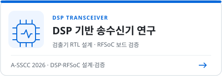

# 윤주형 | High-Speed Interface·DSP Transceiver 연구

광운대학교 · 석사 학위논문 연구 중

안녕하세요. 윤주형입니다. **JEDEC [LPDDR](projects/high-speed-interface-research/docs/lpddr.md) 및 [USB4 Gen4](projects/high-speed-interface-research/docs/usb4-pam3.md) 규격 기반의 High-Speed Interface 연구**와 <strong>Ultra High-Speed 통신을 위한 <a href="projects/README.md#dsp-transceiver-research">DSP 기반 Transceiver 연구</a></strong>를 진행하고 있습니다.

채널 손실과 ISI를 고려해 신호를 보상하고, 높은 전송 속도에서도 데이터를 안정적으로 주고받을 수 있는 회로와 시스템을 설계합니다.

최근 설계 트렌드에 맞게 [AI](docs/ai-assisted-dsp-workflow.md)를 RTL·테스트벤치 작성과 반복 검증·측정 자동화 코드 구성에 활용합니다.

## DSP 기반 송수신기 연구

**담당·대표 성과:** PAM4 송수신 DSP·검출기를 RTL로 구현하고 [RFSoC 보드에서 수신 성능을 검증](projects/zcu208-pam4-dsp-portfolio/docs/validation.md#isi-보드를-통한-rfsoc-측정)했습니다. 이 결과를 정리한 [A-SSCC 2026 논문](https://epapers2.org/asscc2026/ESR/paper_details.php?paper_id=1351)이 채택됐습니다.

진행 중인 **[학위논문·Journal 연구](https://github.com/yunjuhyeong0916-glitch/pam4-mlsd-research/blob/main/README.md)**는 별도 저장소에서 볼 수 있습니다.

<strong>연구 내용 보기 · A-SSCC / AI 활용</strong>

### A-SSCC 2026 | DS-SBM 기반 PAM4 송수신 DSP

ZCU208 RFSoC에 <strong><a href="projects/zcu208-pam4-dsp-portfolio/docs/architecture.md">32-lane PAM4 DSP</a></strong>의 TX FIR·RX 21-tap FIR·DS-SBM RS-MLSD를 통합했습니다. [Vivado·Vitis](projects/zcu208-pam4-dsp-portfolio/docs/vitis-bringup.md)로 JTAG 다운로드, CLK104·RFDC 초기화와 계수 적용을 구성하고, DAC에서 [ISI 보드](projects/zcu208-pam4-dsp-portfolio/docs/validation.md#isi-보드를-통한-rfsoc-측정)를 거쳐 ADC로 수신 신호를 캡처했습니다.

[A-SSCC 프로젝트](projects/zcu208-pam4-dsp-portfolio/) · [설계 판단](projects/zcu208-pam4-dsp-portfolio/docs/design-decisions.md) · [Vitis·FPGA 구동](projects/zcu208-pam4-dsp-portfolio/docs/vitis-bringup.md) · [측정·구현 결과](projects/zcu208-pam4-dsp-portfolio/docs/validation.md)

### AI 활용 | MATLAB MCP 기반 RTL·측정 자동화

RTL·테스트벤치 작성과 ZCU208의 계수 설정·데이터 수집·BER 분석을 연결하는 자동화 코드 구성에 AI를 활용했습니다.

[사용 Toolbox·자동화 harness 연결 구조](docs/ai-assisted-dsp-workflow.md)

## LPDDR·USB 인터페이스 연구

- **LPDDR:** [15.6 Gb/s 저전압 TX 회로](projects/high-speed-interface-research/docs/lpddr-tx-circuit-verification.md)를 설계하고 Post-Layout 시뮬레이션으로 검증했습니다. [28 nm Combo PHY](projects/high-speed-interface-research/docs/lpddr-combo.md)의 14 Gb/s/pin 제작 칩 측정에 참여했습니다.
- **USB:** [TX RTL](projects/high-speed-interface-research/docs/usb-tx-modeling.md)·[RX CTLE 동작 모델](projects/high-speed-interface-research/docs/usb-rx-ctle-modeling.md)을 설계·검증하고, [32 Gb/s TX 칩의 차동 PAM-3 측정](projects/high-speed-interface-research/docs/pam3-differential-measurement.md)에 참여했습니다.

<strong>설계·검증 내용 보기 · TX / RX / PCB·HFSS / 측정</strong>

| 연구 | 담당 설계·검증 | 대표 성과 |
|---|---|---|
| [LPDDR](projects/high-speed-interface-research/docs/lpddr.md) | [TX 회로 설계·검증](projects/high-speed-interface-research/docs/lpddr-tx-circuit-verification.md), [TX Verilog 모델링](projects/high-speed-interface-research/docs/lpddr-tx-modeling.md), [PCB·HFSS](projects/high-speed-interface-research/docs/pcb-hfss-verification.md) | 15.6 Gb/s TX 회로 시뮬레이션, 14 Gb/s/pin Combo PHY 실측 참여 |
| [USB&nbsp;PAM&#8209;3](projects/high-speed-interface-research/docs/usb4-pam3.md) | [TX 모델링·RTL 검증](projects/high-speed-interface-research/docs/usb-tx-modeling.md), [RX CTLE 모델링](projects/high-speed-interface-research/docs/usb-rx-ctle-modeling.md), [차동 PAM-3 측정·FFE 검증](projects/high-speed-interface-research/docs/pam3-differential-measurement.md) | 송수신 모델 통합 검증, 32 Gb/s TX 칩의 차동 신호 평가·FFE 효과 확인 |

[PCB·HFSS](projects/high-speed-interface-research/docs/pcb-hfss-verification.md) · [LPDDR·USB 인터페이스 연구](projects/high-speed-interface-research/)

## 측정·검증

### FPGA 측정·검증

- **[RFSoC 실측](projects/zcu208-pam4-dsp-portfolio/docs/validation.md#isi-보드를-통한-rfsoc-측정):** ZCU208 DAC → ISI 보드 → ADC 경로의 신호를 캡처하고 PL PRBS 검사기 집계값으로 BER을 평가했습니다.

- **[FPGA 구현 · Vivado](projects/zcu208-pam4-dsp-portfolio/docs/validation.md#fpga-자원타이밍):** RTL 구현 결과의 자원 사용량과 타이밍 여유를 확인했습니다.

- **[보드 초기화·제어 · Vitis](projects/zcu208-pam4-dsp-portfolio/docs/vitis-bringup.md):** JTAG 실행, 클록·RFDC 초기화, RX 계수 적용과 데이터 수집을 구성했습니다.

- **[측정 자동화](docs/ai-assisted-dsp-workflow.md#zcu208-측정-harness):** 조건별 앱 빌드·실행과 UART 기록을 묶고, ILA 집계값을 Python으로 분석해 BER을 산출했습니다.

### 28 nm 칩 측정·PCB/HFSS 분석

- **[PCB·HFSS 설계·분석](projects/high-speed-interface-research/docs/pcb-hfss-verification.md):** LPDDR 측정용 PCB의 전달 특성을 분석하고, USB TX의 접지·전원 경로를 검토했습니다.

- **28 nm 칩 측정:** [LPDDR TX Eye·RX Shmoo](projects/high-speed-interface-research/docs/verification-figures.md)를 측정하고, [USB 차동 PAM&#8209;3의 FFE 적용 전후 상·하단 Eye](projects/high-speed-interface-research/docs/pam3-differential-measurement.md)를 비교했습니다.

- **[계측 자동화](projects/high-speed-interface-research/docs/measurement-equipment.md):** 전원·BERT·I2C를 연동해 전압·타이밍을 스윕하고, 오류 조기 종료·경계 탐색을 적용했습니다. 결과는 CSV로 기록했습니다.

## 연구 성과 논문

| 연구 | 논문 링크 |
|---|---|
| DSP·MLSD | [A-SSCC 2026 · RFSoC 검증 PAM4 송수신기](https://epapers2.org/asscc2026/ESR/paper_details.php?paper_id=1351) |
| LPDDR | [ICEIC 2025 · NRZ TX](https://doi.org/10.1109/ICEIC64972.2025.10879746) · [A-SSCC 2026 · Combo PHY](https://epapers2.org/asscc2026/ESR/paper_details.php?paper_id=1141) |
| USB PAM-3 | [SMACD 2025 · TX 모델](https://doi.org/10.1109/SMACD65553.2025.11092283) · [SMACD 2025 · RX 모델](https://doi.org/10.1109/SMACD65553.2025.11092233) · [IEEE TVLSI 2026 · TX 칩](https://doi.org/10.1109/TVLSI.2026.3701343) |

A-SSCC 2026 두 편: 채택·발표 예정(2026-10-07 기준). [전체 논문 목록](docs/publications.md)

---

[문서 지도](docs/repository-map.md) · [검증 상태](docs/validation-status.md) · [기술 용어](docs/glossary.md)

<!-- page-navigation:bottom -->

  

<!-- /page-navigation:bottom -->
