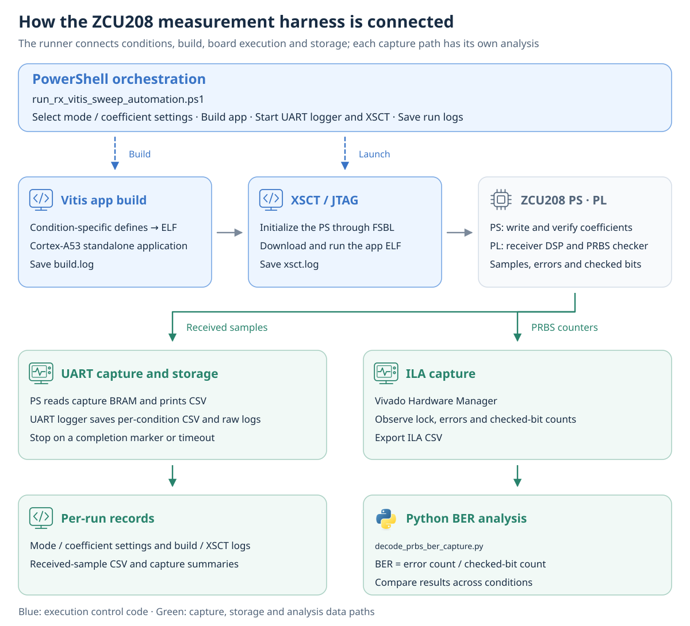

# AI assistance | RTL implementation and FPGA measurement automation

<!-- page-navigation:top -->

  
  

<!-- /page-navigation:top -->

[Repository map](repository-map.md) · [한국어](ai-assisted-dsp-workflow.md)

To repeat checks under the same conditions after changing the PAM4 receiver model or coefficients, I connected inputs, execution and result collection through scripts. AI assisted with **RTL, testbenches and automation code**, while MATLAB MCP connected Codex to MATLAB for model execution and result inspection.

## Toolbox roles and the RTL verification harness

I used `sparameters` in [RF Toolbox](https://www.mathworks.com/help/rf/ref/sparameters.html) to read channel `.s4p` files and generate PRBS PAM4 input CSV with the SDD21 response applied. MATLAB/Simulink defined receiver behavior, interfaces and fixed-point conditions. **HDL Coder** generated Verilog for FFE/DFE prototypes. I configured execution code using `makehdl` for Simulink and `coder.config('hdl')` for MATLAB-to-HDL conversion. [HDL Coder model-to-HDL conversion](https://www.mathworks.com/help/hdlcoder/)

I linked **Python reference-vector generation and Vivado XSim** through a **PowerShell runner**. Channel CSV becomes input and expected-value HEX files. The testbench applies identical inputs and coefficients, comparing **FFE outputs, detector decisions and output timing**. The runner checks tool exit status and the PASS log, allowing the same verification procedure to be repeated after code changes.

[Follow-up DP-SMM model–RTL verification](https://github.com/yunjuhyeong0916-glitch/pam4-mlsd-research/blob/main/projects/dp-smm-journal/docs/validation.md)

## ZCU208 measurement harness

The **PowerShell runner** selects evaluation modes and coefficient settings, builds the corresponding Vitis application ELF, and launches the A53 application through XSCT. The UART logger starts before the application, saves captures, and stops on a completion message or timeout. Each run retains its settings, build log, XSCT log and capture files.

On ZCU208, the PS writes coefficients and verifies their application; the PL performs receiver DSP and PRBS checking. **Received samples** are collected through capture BRAM → PS → UART CSV. For **BER evaluation**, PL lock status, error counts and checked-bit counts are exported as ILA CSV. Python calculates error count / checked-bit count and compares results across conditions.

[Vitis coefficient updates and data collection](../projects/zcu208-pam4-dsp-portfolio/docs/vitis-bringup.md) · [A-SSCC measurement results](../projects/zcu208-pam4-dsp-portfolio/docs/validation.md)

<!-- page-navigation:bottom -->

  
  
  

<!-- /page-navigation:bottom -->
