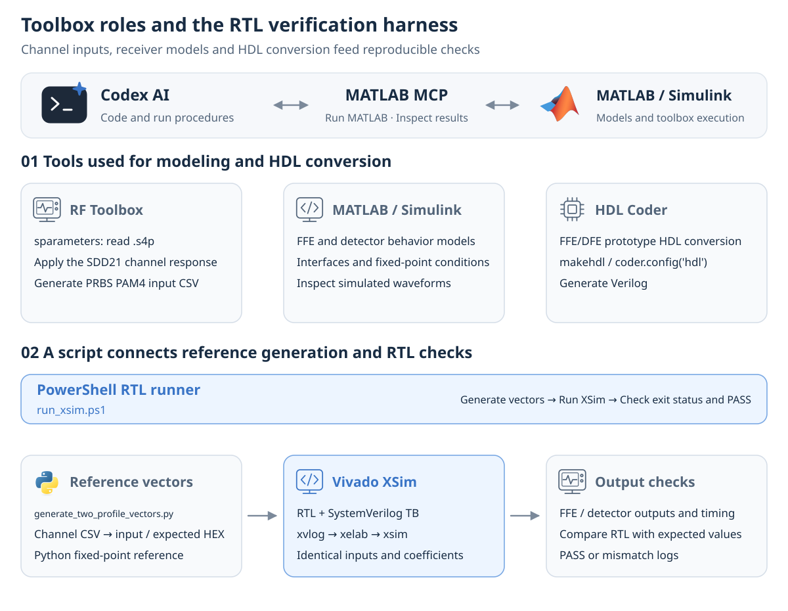

# AI-assisted DSP design, verification and measurement

[DSP transceiver research](../README.en.md#dsp-transceiver-research) · [Repository map](repository-map.md) · [한국어](ai-assisted-dsp-workflow.md)

I used an AI agent connected through MATLAB MCP for **RTL coding and measurement-automation harness development**. It assisted with writing and revising code to implement model behavior in hardware and repeat verification and measurement procedures.

I defined the architecture, test conditions and evaluation criteria, then used the results to refine the code and conditions. Blue marks the stages where AI assisted with code development.

## Checking model behavior in RTL

AI assisted with writing and revising RTL and verification procedures based on the model behavior. I compared the RTL against a fixed-point reference model and checked hardware implementation through FPGA place and route.

[DP-SMM model–RTL verification and FPGA implementation](../projects/dp-smm-journal/docs/validation.md) · [Thesis model–RTL comparison](../projects/pam4-mlsd-thesis/docs/validation.md)

## Building a repeatable measurement harness

I used AI to help develop a measurement-automation harness that connects condition setting, execution and result collection. In the RFSoC system, this workflow connects PS coefficient settings and hardware-update checks with PL PRBS error counting and received-data collection. Results are compared across conditions to guide subsequent evaluations.

[Vitis / FPGA bring-up and data collection](../projects/zcu208-pam4-dsp-portfolio/docs/vitis-bringup.md) · [A-SSCC measurement results](../projects/zcu208-pam4-dsp-portfolio/docs/validation.md) · [Measurement equipment and automation](../projects/high-speed-interface-research/docs/measurement-equipment.md)

## Portfolio editing

AI also assisted with text editing, Korean–English translation, content organization and explanatory diagrams. Research results are grounded in the model–RTL comparisons, FPGA implementation records, simulations and measurement records presented in each project.

---

[Back to DSP transceiver research](../README.en.md#dsp-transceiver-research)
