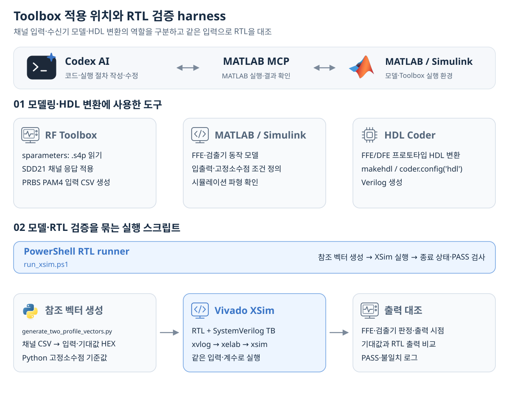

# AI를 활용한 DSP 설계·검증·측정 자동화

[DSP 기반 송수신기 연구](../README.md#dsp-기반-송수신기-연구) · [문서 지도](repository-map.md) · [English](ai-assisted-dsp-workflow.en.md)

MATLAB MCP와 연동한 AI 에이전트를 **RTL 코딩과 측정 자동화 harness 구성**에 활용했습니다. 모델의 동작을 하드웨어로 옮기고 검증·측정 절차를 반복하는 과정에서 코드 작성과 수정을 보조받았습니다.

설계 구조·실험 조건·평가 기준을 정하고, 결과를 확인하며 코드와 조건을 보완했습니다. 그림의 파란색 단계는 AI를 활용한 코드 작성·수정 범위입니다.

## 모델의 동작을 RTL에서 확인

모델에서 정의한 동작을 RTL로 구현하는 과정에서 AI를 활용해 코드와 검증 절차를 작성·수정했습니다. 구현한 RTL은 고정소수점 참조 모델과 대조하고, FPGA 배치배선 결과로 하드웨어 구현을 확인했습니다.

[DP-SMM 모델·RTL 검증과 FPGA 구현](../projects/dp-smm-journal/docs/validation.md) · [학위논문 모델·RTL 비교](../projects/pam4-mlsd-thesis/docs/validation.md)

## 반복 측정을 위한 harness 구성

조건 설정·실행·결과 수집을 반복할 수 있도록 측정 자동화 harness를 구성하는 데 AI를 활용했습니다. RFSoC 시스템에서는 PS의 계수 설정과 하드웨어 반영 확인, PL PRBS 검사기의 오류 집계와 수신 데이터 수집을 연결했습니다. 수집한 결과는 조건별로 비교해 다음 평가에 반영했습니다.

[Vitis·FPGA 구동과 데이터 수집](../projects/zcu208-pam4-dsp-portfolio/docs/vitis-bringup.md) · [A-SSCC 측정 결과](../projects/zcu208-pam4-dsp-portfolio/docs/validation.md) · [측정 장비·제어 자동화](../projects/high-speed-interface-research/docs/measurement-equipment.md)

## 포트폴리오 정리

문장 정리·한영 번역·자료 구성·설명용 도식 제작에도 AI를 활용했습니다. 연구 결과는 각 프로젝트에 제시한 모델·RTL 비교, FPGA 구현, 시뮬레이션·측정 기록을 근거로 정리했습니다.

---

[DSP 기반 송수신기 연구로 돌아가기](../README.md#dsp-기반-송수신기-연구)
