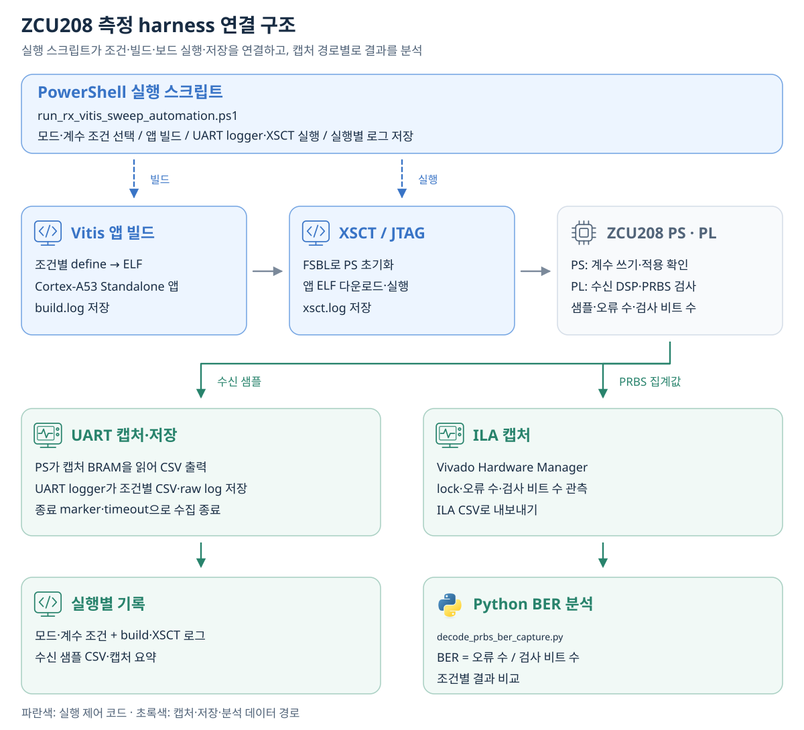

# AI 활용 | RTL 구현·FPGA 측정 자동화

<!-- page-navigation:top -->

  
  

<!-- /page-navigation:top -->

[문서 지도](repository-map.md) · [English](ai-assisted-dsp-workflow.en.md)

PAM4 수신기의 모델이나 계수를 바꿀 때 같은 조건으로 검증을 반복할 수 있도록, 입력·실행·결과 수집을 스크립트로 묶었습니다. AI는 **RTL·테스트벤치와 자동화 코드 작성·수정**에 활용했고, MATLAB MCP로 Codex에서 MATLAB 모델을 실행하고 결과를 확인했습니다.

## Toolbox와 RTL 검증 harness

[RF Toolbox](https://www.mathworks.com/help/rf/ref/sparameters.html)의 `sparameters`로 채널의 `.s4p` 파일을 읽고, SDD21 응답을 적용한 PRBS PAM4 입력 CSV를 생성했습니다. MATLAB/Simulink에서는 수신기의 동작과 입출력·고정소수점 조건을 정의했습니다. **HDL Coder**는 FFE/DFE 프로토타입의 Verilog 생성에 사용했습니다. Simulink용 `makehdl`과 MATLAB-to-HDL용 `coder.config('hdl')` 실행 코드를 구성했습니다. [HDL Coder의 모델·HDL 변환](https://www.mathworks.com/help/hdlcoder/)

RTL 검증은 **PowerShell runner → Python 참조 벡터 생성 → Vivado XSim** 순서로 연결했습니다. 채널 CSV에서 입력·기대값 HEX를 만든 뒤, 테스트벤치가 같은 입력·계수로 **FFE 출력·검출기 판정·출력 시점**을 비교합니다. runner는 각 도구의 종료 상태와 PASS 로그를 검사해, 코드 수정 후에도 같은 절차로 다시 검증하도록 구성했습니다.

[후속 DP-SMM 모델·RTL 검증 결과](https://github.com/yunjuhyeong0916-glitch/pam4-mlsd-research/blob/main/projects/dp-smm-journal/docs/validation.md)

## ZCU208 측정 harness

**PowerShell 실행 스크립트**에서 평가 모드와 계수 조건을 선택하면, 해당 조건으로 Vitis 앱 ELF를 빌드하고 XSCT로 A53 앱을 실행합니다. UART logger는 앱 실행 전에 시작해 캡처를 저장하고, 완료 메시지나 timeout으로 수집을 끝냅니다. 실행마다 조건·빌드 로그·XSCT 로그·캡처 파일을 함께 남겼습니다.

ZCU208에서는 PS가 계수를 쓰고 적용 여부를 확인하며, PL이 수신 DSP 연산과 PRBS 검사를 수행합니다. **수신 샘플**은 캡처 BRAM → PS → UART CSV로 수집했습니다. **BER 평가**에는 PL의 lock·오류 수·검사 비트 수를 ILA CSV로 내보내고, Python에서 오류 수 / 검사 비트 수를 계산해 조건별 결과를 비교했습니다.

[Vitis 계수 적용·데이터 수집](../projects/zcu208-pam4-dsp-portfolio/docs/vitis-bringup.md) · [A-SSCC 측정 결과](../projects/zcu208-pam4-dsp-portfolio/docs/validation.md)

<!-- page-navigation:bottom -->

  
  
  

<!-- /page-navigation:bottom -->
