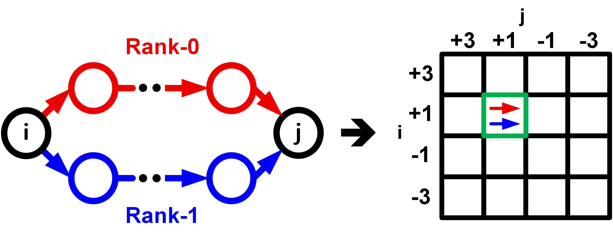

# Journal 준비 | DP-SMM 기반 PAM4 검출기 (진행 중)

기존 DS-SBM의 구간 메트릭 행렬 구조를 확장해, 중간 단계에서 후보를 줄일 때 발생하는 경로 손실을 완화하도록 **DP-SMM RS-MLSD**를 설계했습니다. 행렬 원소마다 두 경로를 보존하고 실제 심볼 이력으로 비용을 다시 계산합니다. 프레임 경계에서도 상태별 두 후보를 남겨 다음 프레임의 판정에 활용합니다.

[첫 화면](../../README.md) · [검출기 구조](docs/architecture.md) · [RTL 검증·FPGA 구현](docs/validation.md) · [DS-SBM·DP-SMM 비교 연구](../pam4-mlsd-thesis/)

**DP-SMM 특허 출원 준비 중.**

## DS-SBM에서 확장한 점

두 구조 모두 32심볼을 구간 행렬로 처리하고 계층적으로 합성합니다. DP-SMM에서는 이 병렬 처리 구조에 **두 경로 보존·이력에 따른 비용 재평가·두 경계 후보 전달**을 결합했습니다.

| 항목 | DS-SBM | DP-SMM |
|---|---|---|
| 분기·BM 처리 | 상태별 두 생존 분기, 심볼당 총 8개 전파 | 심볼당 64개 memory-2 BM 가설을 ROM에서 공급 |
| 행렬 원소별 경로 | 한 경로 보존 | 두 경로와 심볼 이력·복원 정보 보존 |
| 경로 비용과 선택 | 구간 최소 비용을 합성하고 유입 PM과 결합 | 두 제안 경로를 실제 이력으로 재평가한 뒤 유입 PM과 결합 |
| 프레임 경계 | 가시 상태별 PM 한 개 전달 | 가시 상태별 PM·이력을 가진 후보 두 개 전달 |
| 검출기 관측 입력 | 21-tap RX FFE 뒤 별도 3-tap PR FIR 출력 | 11-tap RX FFE 출력, PR 목표는 예상 샘플 계산에 사용 |

DS-SBM의 ‘dual-survivor’는 상태별로 전파하는 두 생존 분기를 뜻합니다. DP-SMM의 ‘dual-path’는 같은 시작·종료 상태를 잇는 행렬 원소에 남기는 두 경로를 뜻합니다. [신호 경로·후보 보존 위치 비교](../pam4-mlsd-thesis/docs/architecture.md)

## 행렬 원소마다 두 경로 보존

같은 시작·종료 상태를 연결하는 두 경로를 한 행렬 원소에 남깁니다. 빨강·파랑은 제안 비용으로 정한 경로 순위이며, 최종 경로는 실제 심볼 이력과 유입 PM을 반영해 선택합니다.

제안 비용에서 2위였던 경로도 실제 이력으로 평가하면 더 낮은 비용을 가질 수 있습니다. DP-SMM은 이 후보를 합성 단계에 남겨 최종 판정에 사용할 기회를 보존합니다. 프레임 경계에서는 상태별 두 후보의 PM과 이력을 전달해, 다음 프레임도 대안 경로를 고려할 수 있도록 했습니다.

**후보 보존 효과:** DP-SMM의 동일 입력 R=1/R=2 코어 비교에서 경계 후보 수를 두 개로 고정했습니다. 합성 응답 A·B의 SNR 16 dB 조건에서, 행렬 원소별 두 경로를 남긴 R=2의 비트 오류 수가 R=1보다 각각 **36.9%·46.1% 감소**했습니다. [비교 조건·오류 수](../pam4-mlsd-thesis/docs/validation.md#동일-입력에서의-후보-보존-효과)

## 32심볼 병렬 처리 구조

여덟 개의 4심볼 기초 행렬을 네 개의 8심볼 세그먼트로 묶고, 두 단계의 rank-2 min-plus 합성으로 32심볼 프레임 행렬을 만듭니다. 구간 계산에는 이전 프레임의 누적 PM을 넣지 않고, 프레임 경계에서 이력을 반영한 비용과 결합합니다.

## RTL 검증 결과

| 검증 대상 | 결과 | 범위 |
|---|---|---|
| 두 경로 검출 코어 | 참조 모델 일치 | 제안 후보·이력 반영 비용·경계 survivor·복원 출력 |
| 행렬 K=1·경계 H=2 비교 코어 | 해당 참조 모델과 일치 | 행렬 후보 수를 제한한 비교 구조 |
| RX FFE를 포함한 경로 | 참조 모델 일치 | 11-tap RX FFE·검출기 통합 |
| 연속 입력 처리 | II=1 | 코어 지연 23클록, FFE 포함 24클록 |

32심볼·125 MHz·II=1의 설계 처리율은 **4 Gsymbol/s**, 비부호화 PAM4 **8 Gb/s**입니다. [검증 조건·구현 자원](docs/validation.md)

## 측정 준비

DP-SMM의 보드 실측을 준비하고 있습니다. AWG 기반 ADC-DSP 수신 경로와 DAC–ISI 보드–ADC 송수신 경로에서 BER·PR 등고선·연속 처리율을 평가할 예정입니다.

[A-SSCC DS-SBM](../zcu208-pam4-dsp-portfolio/) · [학위논문 비교 연구](../pam4-mlsd-thesis/) · [연구 성과 논문](../../docs/publications.md)
