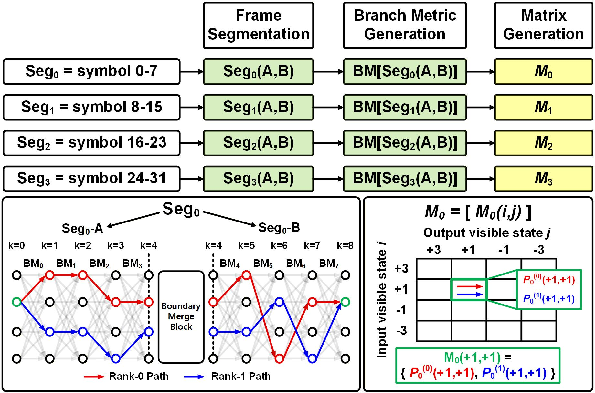
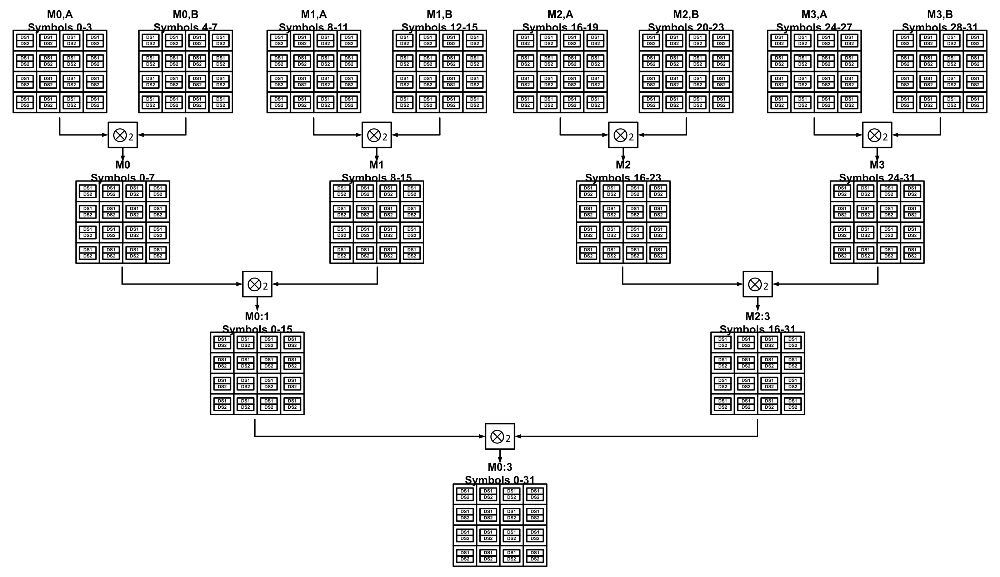
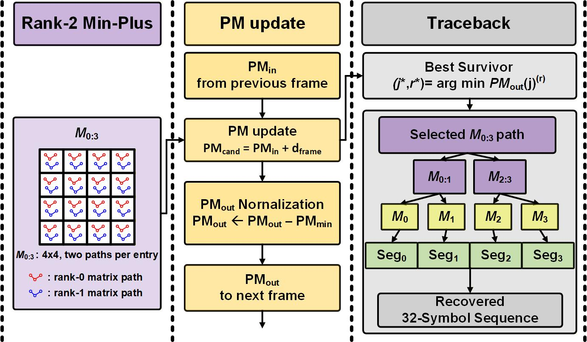

# DP-SMM 검출기 구조

[프로젝트](../README.md) · [검증·구현 결과](validation.md) · [DS-SBM과의 구조 비교](../../pam4-mlsd-thesis/docs/architecture.md)

## DS-SBM의 한 경로 선택을 두 경로 보존으로 확장

DS-SBM은 생존 분기로 만든 구간 행렬에서 시작·종료 상태마다 한 경로를 남깁니다. 중간 합성에서 제외된 경로는 뒤의 비용 계산에 참여할 수 없습니다. DP-SMM은 같은 상태 쌍의 두 경로를 유지하고, 프레임 전체의 후보가 만들어진 뒤 실제 내부 심볼 이력과 유입 survivor의 생략 심볼을 반영해 비용을 다시 평가합니다.

이렇게 남긴 두 번째 경로는 최종 비용 비교에서 첫 번째 경로를 대신할 수 있습니다. 프레임 경계에서도 종료 상태별 PM·이력 후보를 두 개 유지해 다음 프레임에 전달합니다. **행렬 내부의 두 경로 보존**과 **프레임 사이의 두 후보 전달**을 각각 적용한 구조입니다. [DS-SBM·DP-SMM 비교표와 후보 보존 효과](../README.md#ds-sbm에서-확장한-점)

## 후보 생성과 누적 PM 갱신의 분리

DP-SMM은 **Dual-Path Segmented Metric-Matrix** 기반 축소 상태 MLSD입니다. 구간 안에서는 누적 PM과 독립적으로 경로 후보를 생성·합성하고, 프레임 경계에서 이전 프레임의 survivor와 결합합니다. 이 구분을 이용해 행렬 합성 계층 사이에 파이프라인을 배치했습니다.

| 단계 | 처리 내용 |
|---|---|
| 관측 입력 | 11-tap RX FFE 출력. PR 목표는 예상 샘플 계산에 사용 |
| BM 생성 | 프로파일 ROM에서 심볼당 64개 memory-2 BM 가설 공급 |
| 4심볼 기초 행렬 | 4×4 행렬의 시작·종료 상태별로 두 경로 후보 보존 |
| 구간 합성 | 4심볼 → 8심볼 → 16심볼 → 32심볼의 rank-2 min-plus 합성 |
| 이력 반영 비용 | 보존된 프레임 경로를 실제 내부 심볼 이력으로 재평가 |
| 프레임 경계 | 유입 PM·생략 심볼을 반영해 종료 상태별 두 survivor 선택 |
| 경로 복원 | 저장한 중간 상태·하위 경로 순위를 따라 현재 32심볼 복원 |

## 행렬 원소별 두 경로

하나의 4×4 행렬에서 **각 원소가 두 경로 레코드**를 가집니다. 기초 행렬의 첫 BM은 입력의 생략 심볼에 대해 최소화하고, 나머지 BM은 후보 경로의 심볼 이력으로 계산합니다. 합성 단계에서는 중간 가시 상태가 이어지는 후보들의 제안 비용을 더해 원소별 두 경로를 남깁니다.

행렬의 경로 순위와 프레임 경계의 survivor 순위는 각각의 선택 결과입니다. 심볼당 64개 BM 가설 생성, 행렬 원소별 두 후보 보존, 상태별 두 누적 survivor 보존은 서로 다른 수량입니다.

## 두 경로를 유지하는 계층적 합성

최상단의 4심볼 행렬 두 개가 8심볼 세그먼트 M₀–M₃를 만듭니다. 이어 M₀:₁·M₂:₃을 거쳐 32심볼 M₀:₃으로 합성하며, 각 단계에서 원소별 두 경로를 남깁니다. 그림의 DS1·DS2는 해당 원소의 rank-0·rank-1 경로 레코드를 뜻합니다. 합성 시 선택한 중간 상태와 하위 경로 순위도 저장해 마지막 경로 복원에 사용합니다.

## 실제 이력에 따른 비용과 프레임 경계 선택

프레임 행렬에 남은 경로의 내부 비용을 실제 심볼 이력으로 다시 계산합니다. 유입 survivor의 생략 심볼로 첫 BM을 정하고 유입 PM을 더한 뒤, 종료 가시 상태마다 누적 비용이 작은 두 후보를 선택합니다. 네 입력 상태·두 유입 survivor·두 프레임 경로에 따라 종료 상태별 최대 16개 후보가 경쟁합니다.

기존 검증 벡터에서는 제안 비용이 21·22였던 두 경로가 실제 이력을 반영한 뒤 31·27로 바뀌어, 두 번째 경로가 최종 선택됐습니다. 유입 PM은 0인 조건으로, 두 경로를 유지한 덕분에 비용 순위가 바뀐 후보를 복원에 사용할 수 있었습니다. [RTL 대조와 복원 예](../../pam4-mlsd-thesis/docs/validation.md#두-번째-후보가-최종-선택에-사용된-예)

선택한 경로의 정규화 PM과 생략 심볼은 다음 프레임으로 전달합니다. 현재 프레임의 복원은 합성 트리에 저장된 선택 정보를 따라 수행합니다. 후보 제거 단계에서 버린 경로는 재평가로 복구되지 않으므로, 전체 상태 MLSD의 최적성과는 구분해 성능을 평가합니다.

[검증 결과](validation.md) · [학위논문의 후보 보존 비교](../../pam4-mlsd-thesis/docs/validation.md)
