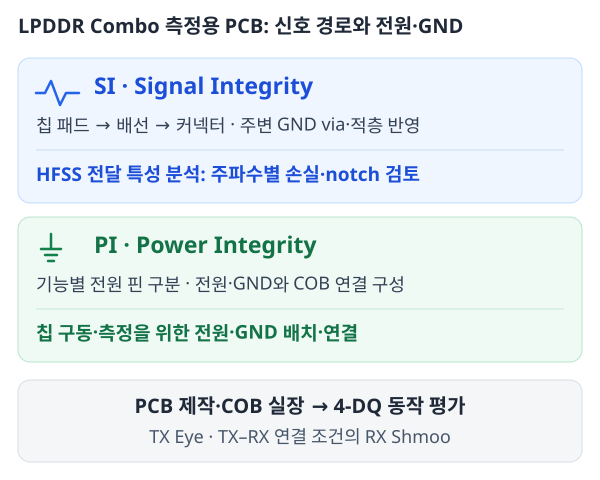

# LPDDR Combo | SI·PI를 고려한 측정용 PCB 설계

<!-- page-navigation:top -->

  
  

<!-- /page-navigation:top -->

[SI·신호 경로](#si-signal-path) · [PI·전원과 GND](#pi-power-ground) · [제작 칩 평가](#silicon-validation) · [PCB·HFSS 전체 자료](pcb-hfss-verification.md)

설계한 DQ TX를 제작 칩에서 평가하기 위해 **측정용 PCB의 회로·배치·배선과 HFSS 분석**을 수행했습니다. 칩 패드에서 커넥터까지의 신호 전달과 기능별 전원·GND 연결을 함께 고려하고, COB 실장 이후 TX Eye·RX Shmoo 측정에 참여했습니다.

## SI | 신호 배선과 GND return path를 함께 검토

고속 신호의 전달 특성을 확인하기 위해 **칩 패드–커넥터 배선과 주변 GND·via를 함께 HFSS 모델에 반영**했습니다. 적층·재료·두께와 포트·기준 접지를 설정한 뒤, 주파수별 전달 S-parameter로 손실과 notch를 검토했습니다.

왼쪽은 칩 쪽 패드, 오른쪽은 커넥터 방향입니다. 신호선 주변 접지와 via를 포함해 보드의 전달 특성을 분석한 모델입니다.

### 전달 손실과 notch 확인

완만하게 증가하는 손실과 특정 대역의 notch를 나누어 살펴보고, 배치·배선을 검토했습니다. 아래 HFSS 결과의 **6.4-GHz 마커에서 여섯 전달 경로의 값은 약 −1.58~−2.14 dB**입니다.

경로별 notch 검토에 사용한 전달 특성 보기

[HFSS 모델 설정·전달 특성 상세](pcb-hfss-verification.md#2-hfss-모델)

## PI | 기능별 전원·GND와 COB 연결 구성

칩 구동과 측정 조건 설정을 위해 **DQ 출력단의 VDDQ와 클록·디지털·I/O 등의 전원 핀을 구분**하고, 전원·GND와 고속 신호의 COB 연결을 함께 구성했습니다. 고속 데이터·클록을 외곽 커넥터에 연결하면서 전원 공급·제어 경로도 포함하도록 PCB를 설계했습니다.

중앙은 칩 실장부이며, 외곽으로 고속 신호 배선과 전원·제어 연결을 배치했습니다.

[제작 보드·COB 실장 사진](pcb-hfss-verification.md#1-pcbcob-실장) · [전원 변화에 따른 오류 판정 조건 관리](measurement-equipment.md#전원-변화와-오류-판정-조건을-함께-관리)

## 제작 보드에서의 4-DQ 동작 평가

제작 보드에 28-nm Combo PHY를 실장한 뒤, **14 Gb/s/pin·4-DQ 활성 조건**에서 TX Eye를 관측하고 TX–RX 연결 조건의 RX Shmoo를 평가했습니다.

| 평가 항목 | 결과 | 조건 |
|---|---|---|
| TX Eye | **0.41 UI · 65.3 mV** | 14 Gb/s/pin, 4-DQ 활성 |
| RX Shmoo | **0.25 UI · 25 mV** | 같은 칩·속도·4-DQ 활성, TX–RX 연결 |

[측정 그림·모드별 파형·평가 조건](lpddr-combo.md#제작-보드에서-확인한-28-nm-combo-phy의-동작)

관련 논문: [A-SSCC 2026 — LPDDR4X/5/5X Combo Controller PHY](https://epapers2.org/asscc2026/ESR/paper_details.php?paper_id=1141)

<!-- page-navigation:bottom -->

  
  
  

<!-- /page-navigation:bottom -->
