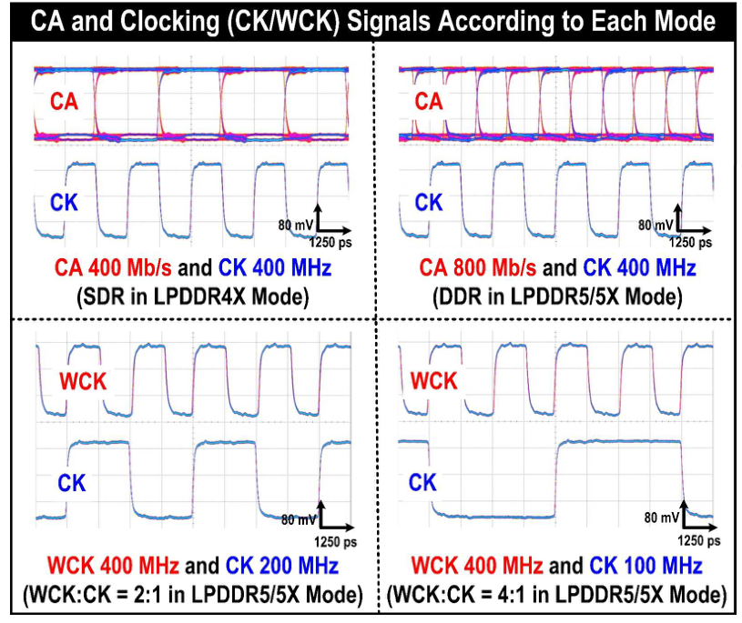

# LPDDR Combo PHY: TX 설계·모델링과 28 nm 칩 검증

<!-- page-navigation:top -->

  
  

<!-- /page-navigation:top -->

[인터페이스 연구](../README.md) · [15.6-Gb/s TX 회로](lpddr-tx-circuit-verification.md) · [TX 모델 상세](lpddr-tx-modeling.md) · [관련 논문](https://epapers2.org/asscc2026/ESR/paper_details.php?paper_id=1141)

LPDDR4X와 LPDDR5/5X는 데이터를 주고받는 클록·strobe 구성이 다릅니다. 이 연구는 세대별 클록·위상 조정 회로를 각각 구현할 때 늘어나는 면적을 줄이기 위해, **클록·위상 조정 자원을 공유하고 모드에 따라 신호 경로를 바꾸는 Combo Controller PHY**를 구현했습니다.

제가 맡은 부분은 **DQ TX 회로 설계·검증과 TX Verilog 동작 모델링**입니다. 병렬 입력이 직렬 데이터와 pre-emphasis 출력으로 이어지는 경로를 확인하고, 측정용 PCB 설계·HFSS 분석과 제작 칩의 TX Eye·RX Shmoo 평가에 참여했습니다.

## 세대에 따라 달라지는 클록·데이터 경로

| 신호 관계 | LPDDR4X | LPDDR5/5X |
|---|---|---|
| Write 데이터 strobe | DQS | WCK |
| Read 데이터 strobe | DQS | RDQS |
| CA와 CK의 관계 | SDR CA | DDR CA |
| Write leveling 대상 | DQS와 CK | WCK와 CK |
| WCK:CK 주파수 비 | 해당 없음 | 2:1 또는 4:1 |

[A-SSCC 2026 논문 Fig. 2](https://epapers2.org/asscc2026/ESR/paper_details.php?paper_id=1141). 빨간색은 LPDDR4X, 보라색은 LPDDR5/5X, 하늘색은 공통 클록 경로입니다.

PHY에는 **4개의 DQ TRX, 2개의 CA TX, CK TX, DQS TRX, WCK TX와 ZQ 보정 블록**이 들어갑니다. 같은 위상 조정 자원을 LPDDR4X에서는 DQS, LPDDR5/5X에서는 WCK에 사용하고, DQ와 strobe의 상대 타이밍은 PI·delay line으로 조정합니다. 제가 담당한 TX는 각 DQ 경로에서 병렬 데이터를 직렬화하고 출력 보상을 적용하는 부분입니다.

## TX 모델에서 데이터 순서·위상·출력 보상을 연결

main 데이터와 지연 데이터의 간격이 1 UI에서 벗어나면 pre-emphasis가 다른 전이에 적용될 수 있습니다. 두 데이터 경로를 함께 생성하고 위상 정렬한 뒤 출력 보상 모델에 연결해, **비트 순서와 보상 시점을 같은 파형에서 확인**하도록 구성했습니다.

32→16→8→4 직렬화 이후 main·1-UI 지연 경로를 클록 위상에 맞춰 정렬하고, 각각의 4:1 직렬 출력을 pre-emphasis에 입력합니다. `mode_sel`은 세대별 swing을, 레벨 코드는 전이 구간의 강조 크기를 제어합니다.

**단일 TX 검증 조건:** 20 Gb/s·PRBS7·LPDDR5/5X 모드, 채널 손실 12.5 dB @ 10 GHz.

위부터 **직렬 main 데이터 → 1-UI 지연 데이터 → pre-emphasis 출력 → 채널 출력**입니다. 입력 패턴의 직렬화, 두 데이터의 시간 관계와 전이 방향에 따른 출력 레벨 변화를 확인했습니다. VCS·Questa 파형과 레벨 코드별 Eye는 [TX 모델 상세](lpddr-tx-modeling.md)에 정리했습니다.

## 4-DQ 통합 환경에서 Write 출력 확인

통합 모델에서는 공통 클록과 모드 설정이 연결된 네 DQ의 출력을 관찰했습니다. 각 TX에 32-bit 병렬 PRBS7 데이터를 인가하고, **DQ0–DQ3 모두에서 직렬 출력 패턴이 유지되는지** 확인했습니다.

위부터 DQ0–DQ3입니다. DQ별 지연 코드에 따른 WCK와 데이터 에지의 상대 위치도 [통합 검증 파형](lpddr-tx-modeling.md#dq별-지연-설정과-wck의-상대-위상)에서 확인했습니다.

## 제작 보드에서 확인한 28 nm Combo PHY의 동작

실제 신호 경로를 평가하기 위해 측정용 PCB를 설계하고, 칩 패드–커넥터 구간의 전달 특성을 HFSS로 분석했습니다. COB 실장 이후에는 설계한 TX가 적용된 Combo PHY의 출력 Eye와 TX–RX 연결 시의 수신 마진을 측정했습니다.

측정용 PCB와 COB 실장 사진

| 측정용 PCB | COB·와이어 본딩 |
|---|---|
|  |  |

[PCB 설계·HFSS 전달 특성](pcb-hfss-verification.md)

**측정 조건:** 28-nm CMOS 제작 칩, 14 Gb/s/pin, 4-DQ 활성. 위는 TX Eye, 아래는 TX–RX 연결 조건의 RX Shmoo입니다. [논문 Fig. 5](https://epapers2.org/asscc2026/ESR/paper_details.php?paper_id=1141)

| 평가 항목 | 결과 | 확인한 동작 |
|---|---|---|
| TX Eye | **0.41 UI · 65.3 mV** | 네 DQ가 활성화된 상태의 출력 Eye opening |
| RX Shmoo | **0.25 UI · 25 mV** | TX–RX 연결 상태에서의 타이밍·전압 마진 |
| 세대별 신호 관계 | LPDDR4X SDR CA, LPDDR5/5X DDR CA·WCK:CK 2:1/4:1 | 모드에 따른 CA·CK·WCK 동작 |

LPDDR4X·5/5X 모드별 CA·CK·WCK 측정 파형

위는 CA·CK, 아래는 WCK·CK 파형입니다. 모드에 따라 CA의 SDR/DDR 관계와 WCK:CK 주파수 비가 바뀌는 것을 확인한 실측 결과입니다. [논문 Fig. 5](https://epapers2.org/asscc2026/ESR/paper_details.php?paper_id=1141)

파형 관측에는 **86100D·86118A**, 입력·전원 조건과 오류 평가에는 **M8195A·E3631A·MP1800A**를 사용했습니다. RX Shmoo는 I2C 제어를 전원·BERT와 연동해 전압·타이밍 조건을 바꾸고 오류를 수집했습니다. [측정 장비·자동화](measurement-equipment.md)

## 관련 논문과 설계 자료

[A 14-Gb/s/pin LPDDR4X/5/5X Backward-Compatible Combo Controller PHY with Pipelined Sub-LSB ZQ Calibration and Preamble-Aware Fast-Settling Phase Interpolator — A-SSCC 2026](https://epapers2.org/asscc2026/ESR/paper_details.php?paper_id=1141)

[TX 모델·코드별 Eye·4-DQ 지연 검증](lpddr-tx-modeling.md) · [TX 회로 설계·검증](lpddr-tx-circuit-verification.md) · [PCB·HFSS](pcb-hfss-verification.md) · [논문·담당 역할](evidence.md)

<!-- page-navigation:bottom -->

  
  
  

<!-- /page-navigation:bottom -->
