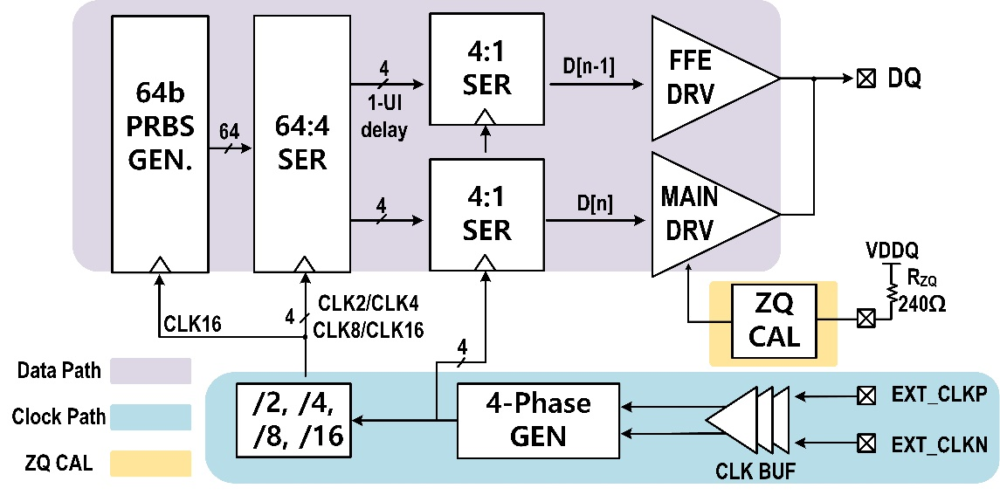
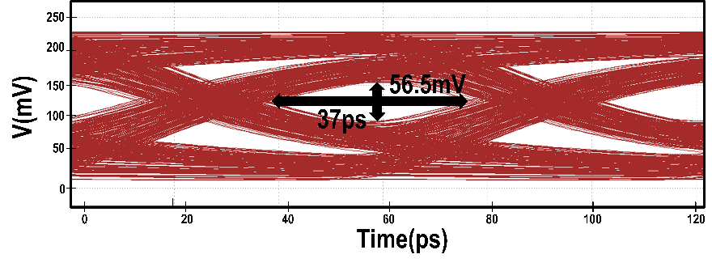
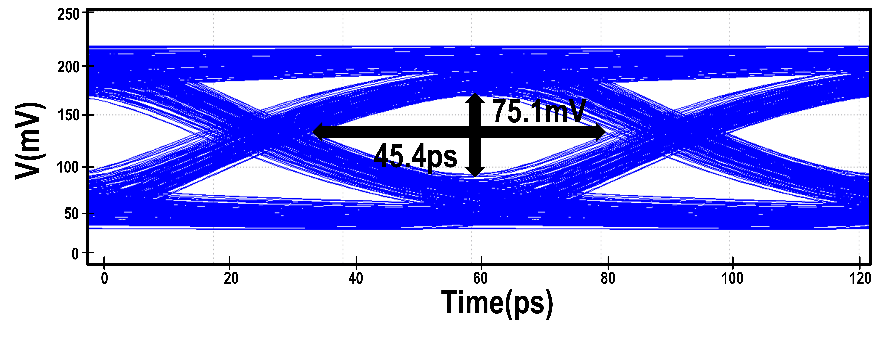
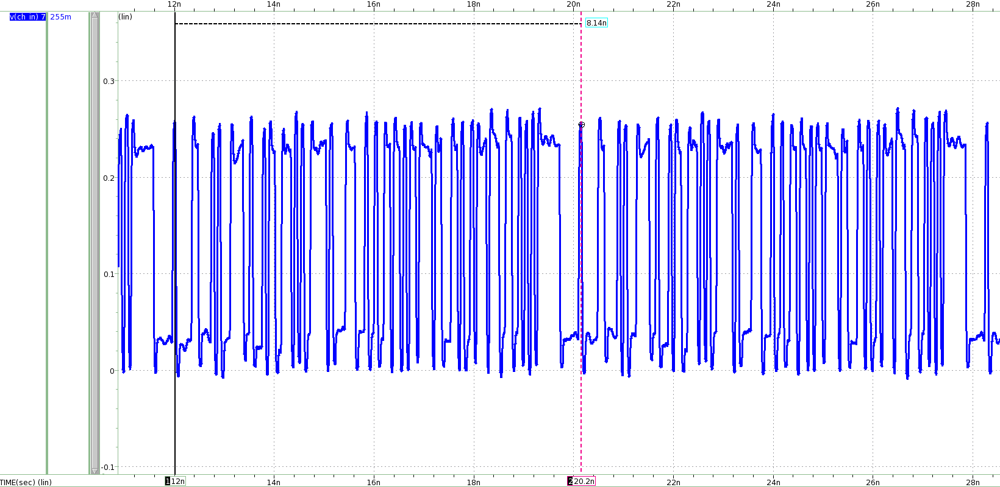
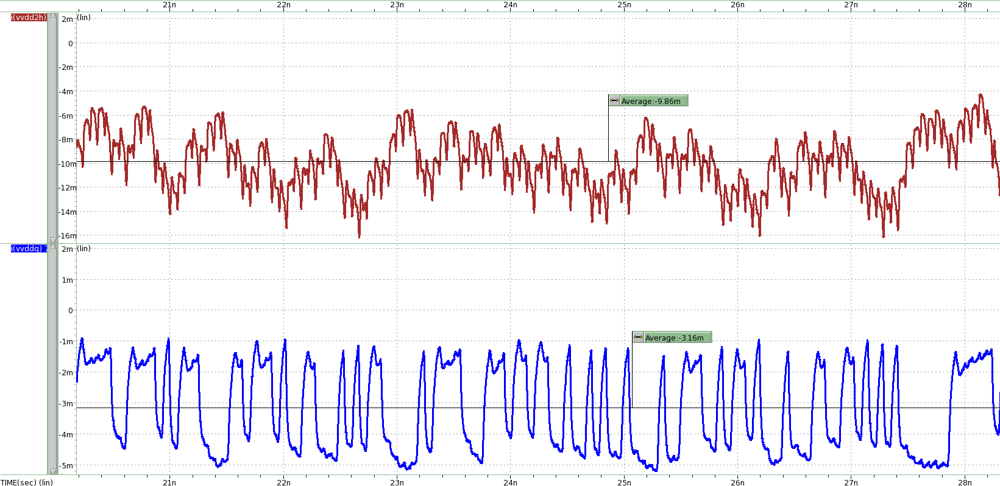
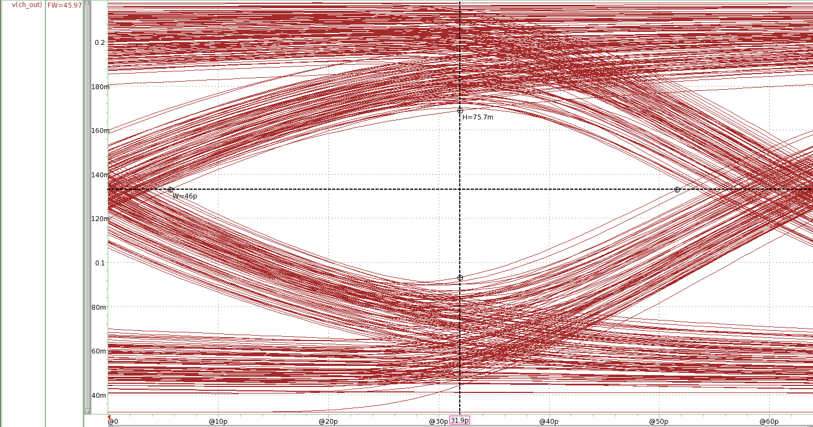

# LPDDR TX 회로 설계·검증: FFE와 PEX 이후 동작 확인

[LPDDR 연구 개요](lpddr.md) · [TX Verilog 모델링](lpddr-tx-modeling.md) · [측정 장비](measurement-equipment.md) · [논문·근거](evidence.md)

**0.5-V 드라이버 전원에서 채널을 통과한 신호의 여유를 확보하고, 배선 기생성분을 반영한 TX의 속도·전력을 확인한 과정입니다.** 개인 담당인 TX 회로 설계와 Schematic·Post-Layout 검증을 구조도와 시뮬레이션 결과로 설명합니다.

이 문서의 결과는 **28-nm CMOS TX의 회로 시뮬레이션**입니다. Controller PHY의 [32:1 TX Verilog 동작 모델](lpddr-tx-modeling.md), 제작된 Combo PHY의 [공동 실리콘 측정](lpddr.md#검증-결과와-조건)은 각각의 구성·조건으로 구분합니다.

## 1. Main 데이터와 1-UI 지연 데이터를 함께 사용하는 TX

낮은 드라이버 전압에서는 출력 레벨과 채널 손실에 따른 신호 왜곡을 함께 다뤄야 했습니다. PI-LVSTL 기반 TX에 main 경로와 1-UI 지연 경로를 두고, 두 경로의 드라이버 세그먼트·FFE 계수를 제어해 de-emphasis를 적용했습니다. FFE의 유효성은 같은 보고서의 적용 전후 Eye를 비교해 판단했습니다. 이 저전압 TX의 구조와 시뮬레이션은 [ICEIC 2025 논문](https://doi.org/10.1109/ICEIC64972.2025.10879746)에 연결됩니다.

TX 데이터·클록·ZQ 경로 구조도 보기

**회로 구성:** 64-bit PRBS에서 64:4·4:1 직렬화로 연결됩니다. Controller PHY Verilog의 32:1 동작 모델과는 다른 구성입니다.

ZQ 경로는 출력 임피던스를 맞추기 위한 제어를 제공합니다. 다만 제공된 시험 입력 설정에는 **외부에서 지정한 ZQ 코드를 선택하는 모드**가 명시되어 있습니다. 아래 Eye·전력 결과만으로 자동 ZQ 보정의 수렴이나 PVT 전 범위의 임피던스 오차를 입증하지는 않습니다. 클록·PRBS·ZQ는 TX 검증 환경의 구성으로 설명하며, 각 공통 블록 전체의 단독 설계 실적을 의미하지 않습니다.

## 2. FFE 적용 전후의 Eye로 보상 효과 확인

출력 파형이 발생하는지만으로는 채널 뒤에서 데이터를 판정할 여유를 알 수 없습니다. 15.6-Gb/s TX 보고서에서는 FFE off/on의 Eye 폭과 높이를 함께 확인했습니다. **Eye 폭은 37 ps에서 45.4 ps로, 높이는 56.5 mV에서 75.1 mV로 증가**했습니다. 아래 수치는 동일 보고서의 두 그림에 표기된 값입니다.

| FFE off | FFE on |
|---|---|
|  |  |

**조건:** 15.6 Gb/s 시뮬레이션. 관련 ICEIC 논문은 1.05-V 내부 전원·0.5-V 드라이버 전원과 8.7-dB 채널 조건을 제시합니다. 이 페이지의 모든 파형에 동일한 채널·PVT 조건이 적용됐는지 확인할 수 있는 전체 설정 파일은 공개 자료에 포함하지 않았습니다.

## 3. PEX 이후 속도와 전력의 산출 근거 확인

Schematic에서 정한 동작을 배선 이후에도 확인하기 위해 레이아웃의 DRC·LVS를 거쳐 기생성분을 추출하고, 추출 netlist를 FineSim에서 시뮬레이션했습니다. TX LVS 결과에는 **CORRECT**가 표시되어 있습니다.

전송속도는 설정한 클록 주파수만 인용하지 않고, 출력 PRBS7의 반복 주기로 확인했습니다. 한 주기의 127 bits가 약 8.14 ns에 출력되어 **127 / 8.14 ns ≈ 15.6 Gb/s**로 계산됩니다. 이는 출력 주기로 확인한 데이터율이며 BER 측정값이 아닙니다.

11월 시험자료의 PRBS7 출력 주기 확인

**속도 확인:** 127-bit 반복 패턴과 8.14-ns 구간을 이용한 PRBS7 출력 데이터율 계산입니다.

전력은 내부 전원과 드라이버 전원의 기여를 각각 계산했습니다. 시험자료에서 선택한 구간의 평균전류 크기는 VDD2H에서 9.86 mA, VDDQ에서 3.16 mA입니다. 두 레일을 합하면 **9.86 mA × 1.05 V + 3.16 mA × 0.5 V ≈ 11.93 mW**, 이를 15.6 Gb/s로 나누면 **약 0.76 pJ/bit**입니다.

두 전원 레일의 평균전류 파형 보기

**전류 판독:** 그래프의 음수 부호는 전압원 전류의 기준 방향에 따른 것으로, 소모 전력 계산에는 전류의 크기를 사용했습니다. 선택한 구간의 평균전류이며, 모든 패턴·코너에서의 최대 전력을 보증하는 값은 아닙니다.

## 4. 시험자료의 갱신값과 논문·공동 측정의 구분

11월 4일 시험 당일 실행한 시뮬레이션에서는 TX Eye가 **46 ps·75.7 mV**로 갱신되었습니다. 앞의 10월 검증값과 별도로 제시하며, 두 버전 사이의 차이를 추가적인 설계 개선량으로 계산하지 않습니다.

11월 갱신자료의 TX Eye 보기

**검증 단계:** 11월 갱신 시뮬레이션의 TX Eye입니다.

| 항목 | 11월 추가자료의 기록 | 해석 범위 |
|---|---|---|
| TX 데이터율 | 15.6 Gb/s | PRBS7 출력 주기로 확인한 시뮬레이션 |
| TX 전원·전력·에너지 | 1.05 V / 0.5 V, 약 11.93 mW·0.76 pJ/bit | 두 전원 레일을 합산한 TX 결과 |
| TX 면적 | 0.0201 mm² | PRBS·데이터·드라이버·ZQ·클록 경로를 포함한 자료상 TX 합계, 드라이버 단독 면적이 아님 |
| TX Eye | 46 ps·75.7 mV | 해당 시뮬레이션 버전의 Eye 폭·높이 |

**버전별 면적:** 초기 검증의 TX 면적 0.0196 mm²·TRX 합계 0.0308 mm²는 11월 검증에서 TX 0.0201 mm²·TRX 합계 0.0334 mm²로 갱신되었습니다. TRX의 0.91 pJ/bit는 TX 0.76과 RX 0.15를 합한 공동 결과이며, 개인 TX 성과에는 TX 값을 사용합니다.

위 결과는 시험 제출용 시뮬레이션 검증입니다. **인증서 발급 여부나 JEDEC/LPDDR6 규격 적합성 판정은 이 페이지의 검증 범위에 포함되지 않습니다.** 실제 Combo PHY의 14-Gb/s/pin TX Eye·RX margin은 별도의 공동 칩 측정 결과로 [LPDDR 개요](lpddr.md#검증-결과와-조건)에 정리했습니다.

## 관련 논문

- [ICEIC 2025: 저전압 NRZ TX](https://doi.org/10.1109/ICEIC64972.2025.10879746) — 저전압 TX 구조와 15.6-Gb/s·0.76-pJ/bit 시뮬레이션.
- [A-SSCC 2026: LPDDR4X/5/5X Combo PHY](https://epapers2.org/asscc2026/ESR/paper_details.php?paper_id=1141) — 개인 설계 TX가 적용된 공동 PHY의 실리콘 평가. 공식 정보 기준 채택·발표 예정.

공개 범위는 담당 역할·구조 설명과 TX 검증 이미지입니다. IP 소스·PDK 및 상세 소자 회로·레이아웃 화면은 포함하지 않습니다.
