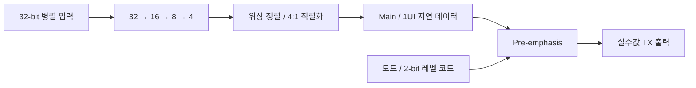
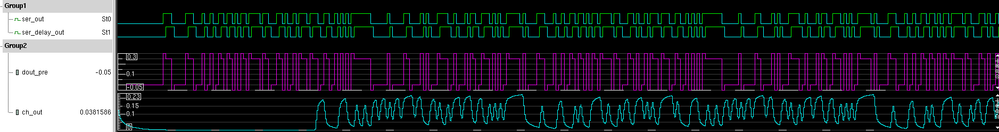
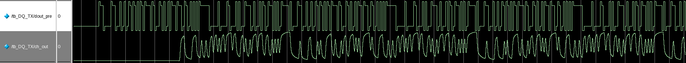
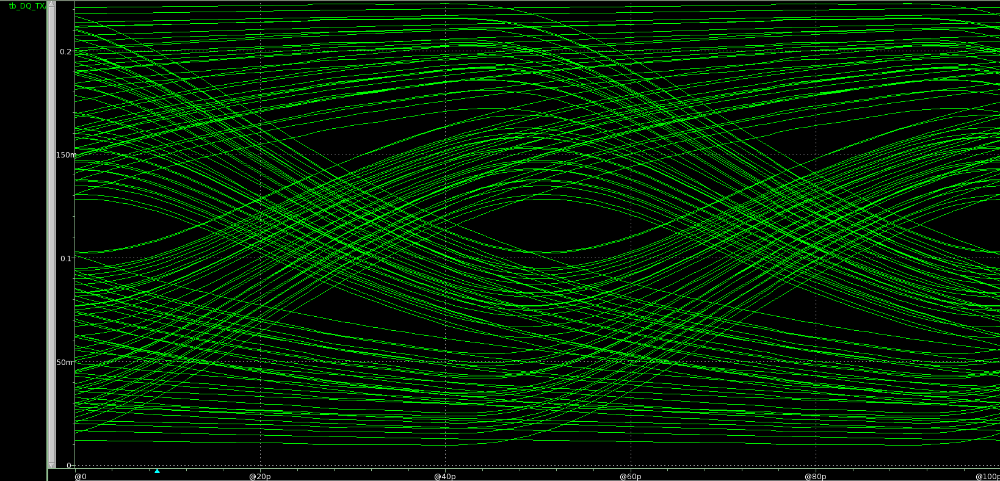
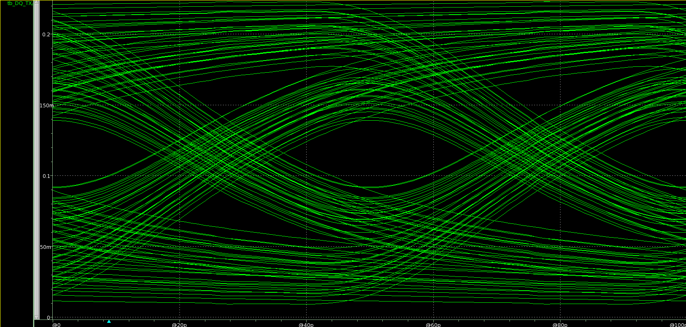
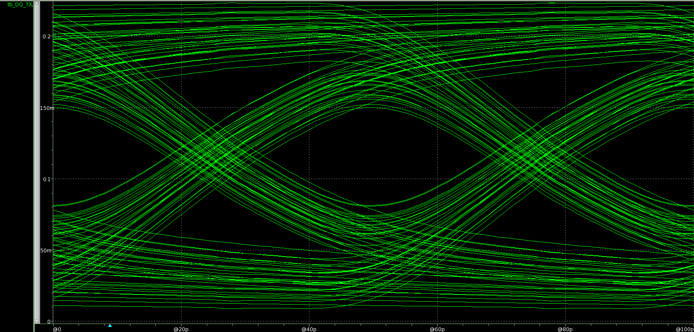
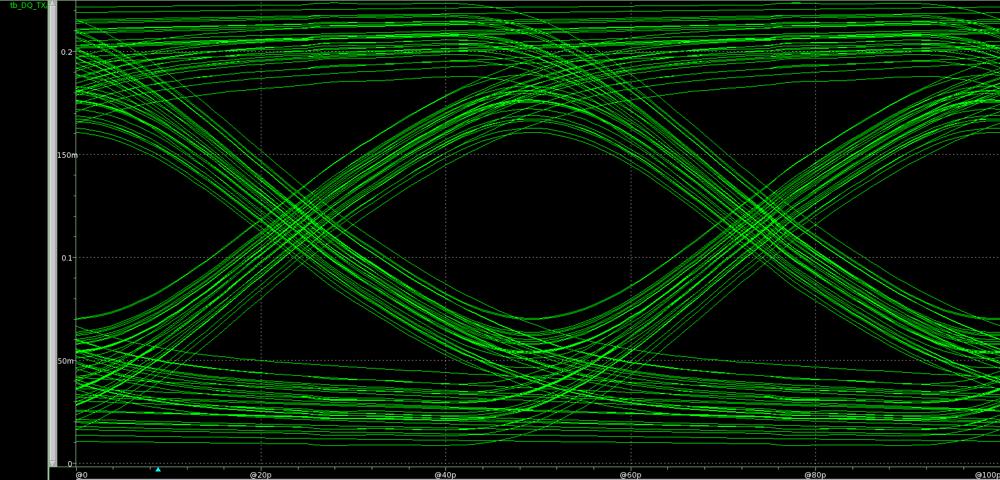
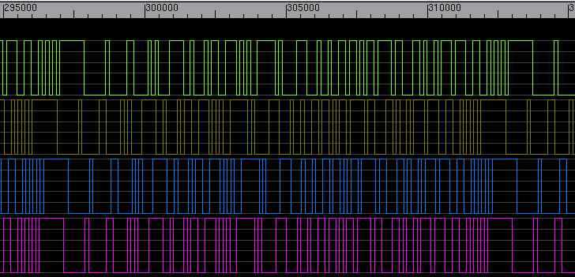

# LPDDR Combo PHY: TX Verilog 모델링과 검증 파형

[LPDDR 회로·실리콘 평가](lpddr.md) · [파트 개요](../README.md) · [검증 그림](verification-figures.md) · [논문·근거](evidence.md)

**개인 담당은 LPDDR Combo Controller PHY의 TX 경로 모델링입니다.** 32-bit 병렬 데이터를 직렬화하고, 클록 위상에 맞춘 데이터와 1UI 지연 데이터를 이용해 pre-emphasis가 적용된 출력을 만드는 경로를 다뤘습니다. 아래 그림은 작성자 제공 자료에 남아 있는 **기존 동작 모델 시뮬레이션 결과**입니다.

## 직렬화와 출력 보상을 연결한 TX 구조

TX에서는 비트 순서뿐 아니라 직렬화에 사용하는 클록 위상과 보상용 지연 데이터의 관계도 확인해야 합니다. 이 모델은 병렬 데이터가 최종 출력까지 전달되는 과정을 단계별로 표현해, 직렬화 결과와 pre-emphasis 적용을 같은 파형에서 살펴볼 수 있도록 구성됐습니다.

| TX 구성 | 역할과 확인 관점 |
|---|---|
| `DQ_TX` | 직렬화 경로와 출력 보상 모델을 연결하고, 모드·레벨 설정을 출력에 반영 |
| `SER_32to1` · `ALIGNER_TX` | 단계별 직렬화와 클록 위상 정렬을 통해 main 데이터와 1UI 지연 데이터를 생성 |
| `EQ_PREEMP_TX` | 두 데이터 사이의 전이를 검출하고, 모드별 swing과 레벨 코드에 따른 pre-emphasis를 실수값 출력으로 표현 |

직렬화에 필요한 클록은 공통 `LOCAL_CLK` 블록에서 공급받습니다. RX·클록 생성·ZQ와 전체 Combo PHY 통합은 공동 프로젝트 구성입니다. 자료에는 `real` 출력과 여러 클록 에지를 사용하는 이벤트 기반 표현이 포함돼 있으므로, 여기서 소개하는 범위는 **Controller PHY 동작 모델**입니다.

## 단일 TX: 직렬화·보상·채널 출력의 관계

TX 테스트벤치는 PRBS7 병렬 입력을 TX 모델에 넣고, 출력이 채널 모델을 통과하는 경로를 구성합니다. 직렬화된 데이터, 1UI 지연 데이터, 보상 출력과 채널 출력을 함께 관찰해 각 단계의 관계를 확인한 자료입니다.

| 원자료의 시뮬레이션 조건 | 설정 |
|---|---|
| 데이터율·입력 패턴 | 20 Gb/s · PRBS7 |
| 동작 모드 | `mode_sel = 0` · LPDDR5/5X |
| 채널 손실 | 12.5 dB @ 10 GHz |
| 결과 화면 | VCS · Questa |

**VCS 파형 — 직렬 데이터부터 채널 출력까지**

위에서부터 `ser_out`, `ser_delay_out`, `dout_pre`, `ch_out`입니다. 주 데이터와 지연 데이터의 관계를 보상 출력에 연결하고, 채널을 통과하며 달라지는 파형을 함께 확인할 수 있습니다.

**Questa 파형 — TX 출력과 채널 출력**

원자료 slide 16의 두 시뮬레이터 화면입니다. 이 이미지는 당시의 동작 관찰 기록이며, 두 시뮬레이터 사이의 자동 정합성 검사를 의미하지는 않습니다.

## Pre-emphasis 코드에 따른 Eye 변화

레벨 코드를 바꾸면 전이 구간의 보상량이 달라집니다. 아래 네 화면은 원자료 slide 17에 제시된 코드별 Eye로, 보상 설정이 출력 파형에 어떻게 반영되는지 비교하는 근거입니다.

| 레벨 코드 `00` | 레벨 코드 `01` |
|---|---|
|  |  |

| 레벨 코드 `10` | 레벨 코드 `11` |
|---|---|
|  |  |

슬라이드에 내장된 원본 이미지의 축과 파형을 그대로 유지했습니다. 슬라이드 위에 별도로 얹힌 화살표·수치 주석은 이미지에 포함하지 않았습니다. 위 조건의 동작 모델 결과로 해석하며, 제작 칩의 Eye 측정값과 구분합니다.

## 4-DQ 통합 환경에서 직렬 출력 확인

원자료 slide 79의 Write 동작 결과입니다. 위에서부터 **DQ0, DQ1, DQ2, DQ3** 출력이며, 자료는 PRBS7 패턴을 갖는 32-bit 병렬 입력을 인가한 뒤 각 DQ의 직렬 출력 패턴을 확인했다고 기록합니다. 개인 담당 TX 모델이 공동 통합 환경에 연결된 사례로 제시합니다. 이 그림만으로 RX 오류율이나 전체 PHY의 모든 조건 통과를 판정하지 않습니다.

## 회로·모델·실리콘 결과의 검증 범위

| 자료 | 검증 단계와 기여 | 근거 |
|---|---|---|
| 이 페이지의 20-Gb/s 파형·Eye | TX 동작 모델의 기존 시뮬레이션; 개인 TX 모델링 담당 | 제공 모델링 자료 slides 9–17, 79 |
| 15.6 Gb/s · 0.76 pJ/bit TX | 개인 TX 회로 설계·측정 전 Schematic/Post-Layout 검증 | [ICEIC 2025](https://doi.org/10.1109/ICEIC64972.2025.10879746) · [회로 결과](lpddr.md#검증-결과와-조건) |
| 14 Gb/s/pin · 4-DQ Combo PHY | 개인 설계 TX가 적용된 공동 칩의 실리콘 측정 | [A-SSCC 2026](https://epapers2.org/asscc2026/ESR/paper_details.php?paper_id=1141) · [실측 그림](verification-figures.md#lpddr-combo-phy-공동-칩의-eye와-rx-shmoo) |

세 결과는 모델·전원·채널·통합 조건이 다릅니다. 20 Gb/s는 동작 모델의 설정이며, 칩 실측 속도나 합성·타이밍 검증 결과로 해석하지 않습니다. 이번 정리에서는 제공 소스와 문서를 검토하고 기존 그림을 추출했으며, 시뮬레이션을 다시 실행하지 않았습니다.

**출처·공개 범위:** 작성자 제공 `LP_Combo_Verilog Modeling_광운대(전달).pptx`와 같은 제목의 PDF, TX 모델 소스의 로컬 검토. 공개 자료는 담당 범위·구조 설명과 작성자가 사용을 허용한 TX 검증 이미지입니다. IP 소스·파일리스트·원본 문서는 배포하지 않습니다. 이미지별 원본 슬라이드·내장 파일·SHA-256은 [추출 기록](../../../docs/figure-sources.json)에 있습니다.
