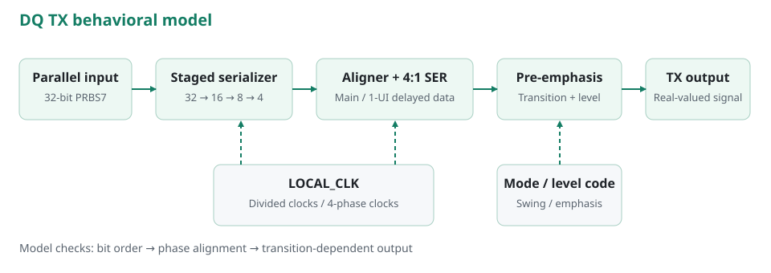
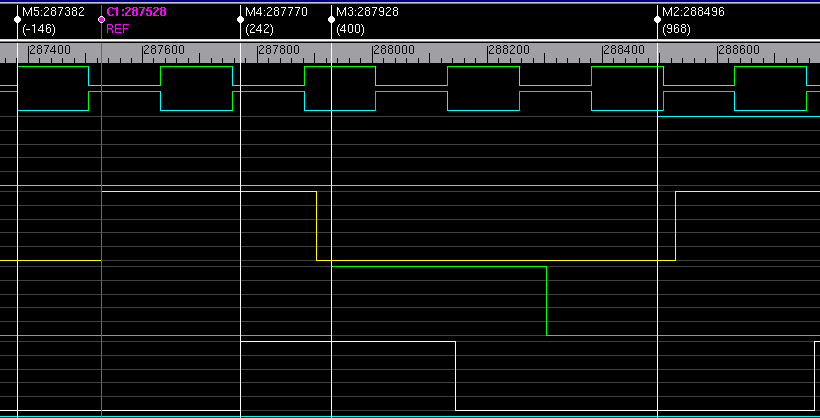

# LPDDR Combo PHY: TX Verilog 모델링과 검증 파형

[Combo PHY 연구 개요](lpddr-combo.md) · [LPDDR 회로·제작 칩 측정](lpddr.md) · [TX 회로 설계·검증](lpddr-tx-circuit-verification.md) · [파트 개요](../README.md) · [논문·담당 역할](evidence.md)

**담당:** TX Verilog 동작 모델링. 32-bit 병렬 입력을 직렬화하고, 위상 정렬된 main/1UI 지연 데이터로 pre-emphasis 출력을 생성했습니다.

TX 출력 보상을 확인하려면 직렬 비트의 순서뿐 아니라 현재 데이터와 이전 데이터가 출력되는 시점도 함께 맞아야 합니다. 직렬화·위상 정렬·pre-emphasis를 하나의 경로로 구성하고, 각 단계의 신호를 채널 출력과 함께 관찰했습니다.

## 직렬화와 출력 보상을 연결한 TX 구조

32→16→8→4 직렬화에서 main·1UI 지연 경로를 생성하고, 위상 정렬·4:1 직렬화 이후 pre-emphasis에 연결했습니다. `real` 출력과 다중 클록 에지를 사용하는 이벤트 기반 동작 모델입니다.

| TX 구성 | 기능 |
|---|---|
| `DQ_TX` | 직렬화 경로와 출력 보상 모델을 연결하고, 모드·레벨 설정을 출력에 반영 |
| `SER_32to1` · `ALIGNER_TX` | 단계별 직렬화와 클록 위상 정렬을 통해 main 데이터와 1UI 지연 데이터를 생성 |
| `EQ_PREEMP_TX` | 두 데이터 사이의 전이를 검출하고, 모드별 swing과 레벨 코드에 따른 pre-emphasis를 실수값 출력으로 표현 |

클록은 공통 `LOCAL_CLK`에서 공급합니다.

`ALIGNER_TX`는 4-bit 데이터를 위상 클록에 맞춰 정렬합니다. 이후 4:1 직렬화가 한 클록 주기 안에서 네 비트를 순서대로 출력하며, main 경로와 1UI 지연 경로를 각각 pre-emphasis의 입력으로 전달합니다.

## 단일 TX: 직렬화·보상·채널 출력의 관계

PRBS7 병렬 입력을 인가하고 직렬 데이터·1UI 지연·pre-emphasis·채널 출력을 관찰했습니다.

| 시뮬레이션 조건 | 설정 |
|---|---|
| 데이터율·입력 패턴 | 20 Gb/s · PRBS7 |
| 동작 모드 | `mode_sel = 0` · LPDDR5/5X |
| 채널 손실 | 12.5 dB @ 10 GHz |
| 결과 화면 | VCS · Questa |

**VCS 파형 — 직렬 데이터부터 채널 출력까지**

**관측 신호:** 위부터 `ser_out`, `ser_delay_out`, `dout_pre`, `ch_out`.

`ser_out`과 `ser_delay_out`에서는 직렬 비트의 순서와 1UI 시간 차이를, `dout_pre`에서는 두 비트의 전이 방향에 대응하는 출력 레벨을 확인했습니다. `ch_out`은 같은 신호가 지정한 손실 채널을 통과한 결과입니다.

Questa의 TX·채널 출력 파형

## Pre-emphasis 코드에 따른 Eye 변화

2-bit 레벨 코드 `00`–`11`에 따른 pre-emphasis 출력 Eye입니다.

현재 비트와 1UI 이전 비트가 다를 때 상승·하강 전이를 구분해 기본 swing에 강조 레벨을 더합니다. 모드에 따른 swing 설정과 레벨 코드에 따른 보상 크기가 출력 Eye에 반영되는지 확인했습니다.

| 레벨 코드 `00` | 레벨 코드 `01` |
|---|---|
|  |  |

| 레벨 코드 `10` | 레벨 코드 `11` |
|---|---|
|  |  |

## 4-DQ 통합 환경에서 직렬 출력 확인

**Write·PRBS7 동작 모델:** 위부터 DQ0–DQ3. 32-bit 병렬 입력을 인가해 네 DQ의 직렬 출력 패턴을 확인했습니다.

단일 TX 파형에서 확인한 직렬화 동작을 공통 클록·모드 설정이 연결된 통합 모델에서도 확인했습니다. 네 DQ의 출력을 함께 관찰해 각 TX에 인가한 PRBS7 패턴이 직렬 출력으로 이어지는지 살폈습니다.

### DQ별 지연 설정과 WCK의 상대 위상

각 DQ에 서로 다른 지연 코드를 적용하고 WCK와 데이터 에지의 상대 위치를 비교했습니다. 데이터 패턴 확인과 함께, 통합 환경에서 지연 설정이 TX 출력 타이밍에 반영되는지 확인한 파형입니다.

위 두 파형은 WCKP·WCKN, 아래 네 파형은 DQ0–DQ3입니다. 이 파형은 통합 모델의 클록·delay line 설정에 따른 TX 출력 관찰 결과입니다.

## 검증 결과

| 자료 | 검증 단계와 기여 | 근거 |
|---|---|---|
| 20-Gb/s 파형·Eye | TX 동작 모델 시뮬레이션 | 위 TX 구조·단일 TX·4-DQ 검증 파형 |
| 15.6 Gb/s · 0.76 pJ/bit TX | TX 회로 설계·Schematic/Post-Layout 검증 | [ICEIC 2025](https://doi.org/10.1109/ICEIC64972.2025.10879746) · [회로 결과](lpddr.md#검증-결과와-조건) |
| 14 Gb/s/pin · 4-DQ Combo PHY | 설계한 TX가 적용된 Combo PHY의 제작 칩 측정 | [A-SSCC 2026](https://epapers2.org/asscc2026/ESR/paper_details.php?paper_id=1141) · [실측 그림](verification-figures.md#lpddr-combo-phy-공동-칩의-eye와-rx-shmoo) |
