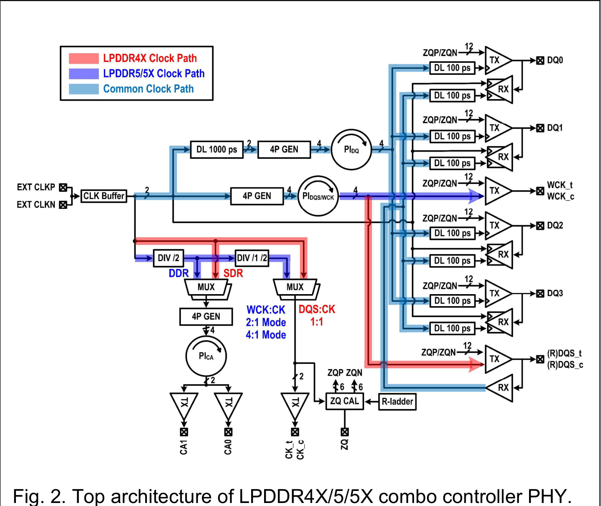

# LPDDR 인터페이스 연구

<!-- page-navigation:top -->

  
  

<!-- /page-navigation:top -->

[USB PAM-3](usb4-pam3.md) · [논문·담당 역할](evidence.md)

LPDDR 연구에서는 **15.6 Gb/s 저전압 TX 회로 설계**와 LPDDR4X/5/5X를 지원하는 **Combo PHY의 DQ TX 설계·모델링**을 담당했습니다.

  
  

## LPDDR 15.6 Gb/s TX

**저전압 TX 회로 설계·검증**

0.5-V VDDQ에서 채널 손실을 보상하기 위해 PI-LVSTL 드라이버에 **2-tap de-emphasis FFE**를 적용했습니다. 28-nm CMOS TX 회로 설계와 Schematic·Post-Layout 검증을 담당했으며, FFE 적용 전후의 Eye와 배선 기생성분을 반영한 출력·전력을 확인했습니다.

위는 FFE off, 아래는 FFE on 시뮬레이션입니다. **Eye 폭 37 → 45.4 ps, 높이 56.5 → 75.1 mV**로 opening이 증가했습니다. 내부 전원 1.05 V·VDDQ 0.5 V, 채널 손실 8.7 dB 조건입니다.

[TX 구조·FFE Eye·LVS/PEX·전력 상세 보기 →](lpddr-tx-circuit-verification.md)

관련 논문: [ICEIC 2025 — 저전압 NRZ TX](https://doi.org/10.1109/ICEIC64972.2025.10879746)

## LPDDR Combo PHY

**TX 회로·Verilog 모델링과 28 nm 칩 검증**

LPDDR4X와 LPDDR5/5X의 클록·위상 조정 자원을 공유하는 Combo Controller PHY입니다. **DQ TX 회로 설계·검증과 TX Verilog 동작 모델링**을 담당했습니다. 세대별 신호 경로를 통합한 환경에서 직렬화·위상 정렬·pre-emphasis 출력과 네 DQ의 동작을 확인했습니다.

빨간색은 LPDDR4X, 보라색은 LPDDR5/5X, 하늘색은 공통 클록 경로입니다. [논문 Fig. 2](https://epapers2.org/asscc2026/ESR/paper_details.php?paper_id=1141)

측정용 PCB 설계·HFSS 분석으로 보드의 전달 특성을 검토하고, 설계한 TX가 적용된 **28-nm Combo PHY의 TX Eye·RX Shmoo 측정에 참여**했습니다. 14 Gb/s/pin·4-DQ 활성 조건에서 출력 Eye와 수신 타이밍·전압 마진을 평가했습니다.

[Combo PHY 구조·TX 모델·제작 칩 검증 상세 보기 →](lpddr-combo.md)

[TX Verilog 모델·코드별 Eye·4-DQ 파형](lpddr-tx-modeling.md) · [SI·PI를 고려한 PCB 설계](lpddr-combo-si-pi.md) · [PCB·HFSS](pcb-hfss-verification.md)

관련 논문: [A-SSCC 2026 — LPDDR4X/5/5X Combo Controller PHY](https://epapers2.org/asscc2026/ESR/paper_details.php?paper_id=1141) · 채택·발표 예정

## 검증 결과와 조건

| 연구·검증 단계 | 조건 | 결과 |
|---|---|---|
| **15.6 Gb/s TX — 회로 시뮬레이션** | 내부 전원 1.05 V·VDDQ 0.5 V, 채널 손실 8.7 dB | TX 에너지 **0.76 pJ/bit**, FFE 적용 시 Eye **45.4 ps·75.1 mV** |
| **Combo PHY — TX 동작 모델** | 20 Gb/s·PRBS7·LPDDR5/5X 모드, 채널 손실 12.5 dB @ 10 GHz | 직렬화·1-UI 지연·코드별 Eye·4-DQ 출력 확인 |
| **Combo PHY — TX Eye 측정** | 28-nm 칩, 14 Gb/s/pin·4-DQ 활성 | **0.41 UI·65.3 mV** |
| **Combo PHY — RX Shmoo 측정** | 같은 칩·속도·4-DQ 활성, TX–RX 연결 | 타이밍·전압 마진 **0.25 UI·25 mV** |

## 측정 장비와 사용 목적

86100D·86118A로 Eye를 관측하고, M8195A·E3631A·MP1800A로 입력·전원 조건과 오류 집계를 제어했습니다. RX Shmoo는 I2C 제어를 전원·BERT와 연동해 전압·타이밍 조건을 바꾸고 오류를 수집했습니다.

[장비·AWG·Shmoo 자동화](measurement-equipment.md) · [TX 시뮬레이션 Eye·Combo PHY Eye·Shmoo](verification-figures.md#lpddr-tx-ffe-적용-전후의-시뮬레이션)

<!-- page-navigation:bottom -->

  
  
  

<!-- /page-navigation:bottom -->
