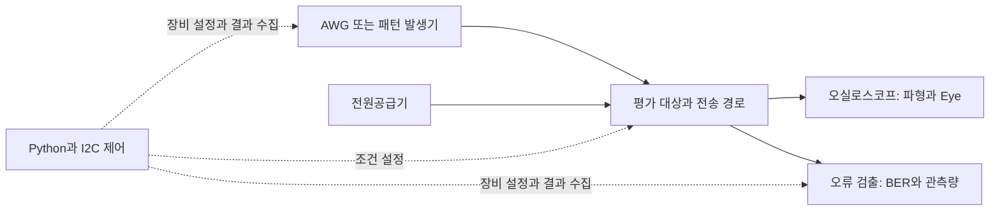

# 측정 장비·PCB·채널 분석과 자동화 활용

[파트 개요](../README.md) · [LPDDR](lpddr.md) · [USB PAM-3](usb4-pam3.md) · [논문·근거](evidence.md)

**측정의 중심은 평가하려는 회로 조건과 실제 장비의 입출력을 맞추는 일이었습니다.** LPDDR와 USB 프로젝트에서 파형 관측, 입력 공급, 전원 설정과 오류 집계 장비를 함께 활용했습니다. 아래 표는 작성자 제공 이력서·측정 활동 자료와 2026-10-07 사용 확인을 바탕으로 정리했습니다.

## 사용 장비와 실제 활용

| 장비·도구 | 역할 | 활용한 내용 |
|---|---|---|
| Keysight **86100D DCA-X + 86118A** | 샘플링 오실로스코프 메인프레임과 원격 샘플링 헤드 모듈 | LPDDR·USB 파형 평가에 사용. USB에서는 차동 PAM-3의 상·하단 Eye 폭·높이와 FFE 설정별 변화 관측 |
| Keysight **M8195A AWG** | 데이터·클록·트리거 파형 공급 | LPDDR·USB 평가에 사용. 위상별 BIN 적용과 파형 파일·샘플레이트 연동, 실제 출력 주파수 확인 |
| Anritsu **MP1800A BERT** | 패턴 발생·오류 검출 모듈을 사용하는 신호 품질 분석 | LPDDR·USB 평가에 사용. 오류 판정 임계값 설정, BER·관측 카운트 수집과 반복 평가 |
| Keysight **E3631A** | 전원·기준전압 조건 인가 | LPDDR·USB 평가에 사용. 전압 조건 변경과 측정 반복문 연동 |
| Keysight **M8049A-003 ISI Channel Board** | 전송 채널의 손실·ISI 조건 부여 | 채널 조건을 부여한 신호 평가에 활용. 실제 손실은 사용 선로·주파수·케이블을 포함한 실험 조건으로 구분 |
| Tektronix **DPO5204B·DSA72004B** 등 실시간 오실로스코프 | 파형·주파수·상대 위상 변화 관측 | 계측 장비 사용 이력 및 AWG 설정 변경 전후의 실제 출력 확인. 실험별 사용 모델·설정을 구분 |
| **Aardvark·I2C** | 칩 레지스터 설정과 제어 | 기존 I2C 코드·API를 활용해 타이밍 변경과 필요한 reset 절차를 측정 흐름에 통합 |
| **Python·PyVISA·SCPI / CSV** | 장비 제어와 결과 수집·기록 | 조건 스윕, 상태·오류 조회, 조건별 저장 및 후처리 시각화 |

86100D와 86118A는 메인프레임·모듈의 조합이며, MP1800A의 기능은 장착한 PPG·ED 모듈과 설정에 따릅니다. M8049A-003은 수동 채널보드입니다. 제조사 기능 설명은 [Keysight DCA 구성 가이드](https://www.keysight.com/mx/en/assets/7018-04520/configuration-guides-archived/5992-0038.pdf), [M8195A 가이드](https://www.keysight.com/us/en/assets/9018-04320/user-manuals/9018-04320.pdf), [Anritsu MP1800A](https://www.anritsu.com/en-au/test-measurement/products/mp1800a), [M8049A](https://www.keysight.com/us/en/product/M8049A/isi-channel-boards.html), [E3631A](https://www.keysight.com/us/en/support/E3631A/80w-triple-output-power-supply-6v-5a--25v-1a.html?rd=1)에서 확인할 수 있습니다.

## 입력 공급·파형 관측·오류 평가의 관계

장비 역할의 개념도입니다. 파형 관측과 오류 평가는 실험 목적에 따라 배선·입력 패턴·계측기 설정이 달라지며, 그림이 두 프로젝트의 단일 실제 배선도를 뜻하지는 않습니다.

## 전원 변화와 오류 판정 조건을 함께 관리

RX 평가에서는 기준전압과 타이밍을 바꿔 수신 동작 여유를 살폈습니다. 평가 대상의 전원 변화가 출력 드라이버 레벨에도 영향을 주기 때문에, BERT의 오류 판정 임계값을 고정하면 계측기의 판정 문제를 수신기 동작 문제와 혼동할 수 있었습니다. 전원 조건에 대응하는 임계값을 측정 반복문에 반영하고, RX의 Vref와 ED의 판정 임계값을 서로 다른 변수로 관리했습니다.

이 판단을 E3631A·MP1800A·I2C 제어와 BER·카운트 수집에 연결했습니다. 장비 연결·루프백 확인 이후 실제 칩에 적용했고, 측정 조건과 결과가 대응하도록 CSV에 기록했습니다. 기존 I2C 코드와 제조사 API를 활용한 부분은 평가 절차·조건 연동을 구현한 기여와 구분합니다.

## AWG 파일 전송 이후의 실제 출력까지 확인

위상이 다른 BIN 파형을 순차 적용해 원하는 입력 조건을 만들었지만, 데이터 속도를 바꿀 때 파일 교체만으로는 실제 출력 주파수가 목표와 맞지 않았습니다. 사용한 BIN 파일에 샘플레이트 정보가 포함되지 않는 점을 확인한 뒤, 파형 파일과 샘플레이트를 함께 설정하도록 수정했습니다. 오실로스코프로 수정 전후의 출력 주파수와 상대 위상을 확인해, 명령 전송과 실제 조건 구현을 구분했습니다.

이 사례의 검증 대상은 M8195A의 실제 출력 주파수와 상대 위상입니다. 칩의 오류 성능은 별도의 BER 관측 조건과 결과로 평가합니다.

[샘플레이트 수정 전후 장비 화면](verification-figures.md#awg-속도-변경-설정값과-실제-입력을-맞추기)을 원본 측정 활동 자료에서 확인할 수 있습니다.

## Shmoo 탐색 목적에 맞게 관측 범위 정리

모든 전압·타이밍 지점을 같은 관측량까지 측정하면 평가 시간이 길어졌습니다. 오류가 확인된 지점의 조기 종료와 양방향 경계 탐색을 적용해 동작 영역의 경계를 먼저 확인했습니다. 경계 내부에서 측정을 생략한 구간과 실제 관측 지점을 구분하고, 조건·카운트·오류 결과를 함께 저장했습니다.

자동화는 반복 설정과 결과 수집을 위한 구현 기여입니다. [LPDDR 공동 실측의 RX 마진](lpddr.md)에 이 코드를 활용한 사실과, 자동화 자체가 수신기의 마진을 개선했다는 주장은 구분합니다. USB의 차동 PAM-3 Eye 관측도 별도 평가이며, 모든 장비·파형 측정을 한 절차로 자동화한 것으로 합치지 않습니다.

## PCB·HFSS로 칩 밖의 신호 경로 확인

LPDDR·PAM-3 측정용 PCB 설계와 HFSS 기반 S-parameter·전자기장 해석을 수행했습니다. 실측 파형에 영향을 줄 수 있는 보드 경로를 분석하고, 특정 주파수 대역의 손실 증가를 검토해 배치·배선을 수정했습니다. COB 실장과 파형 측정까지 연결해 회로 외부의 전달 특성을 함께 살폈습니다.

HFSS는 이 문서에서 시뮬레이션 도구로 분류합니다. M8049A-003의 손실도 하나의 고정된 숫자로 쓰지 않고, 선로 길이·기준 주파수·케이블 포함 여부 등 해당 실험 조건과 함께 해석합니다.
