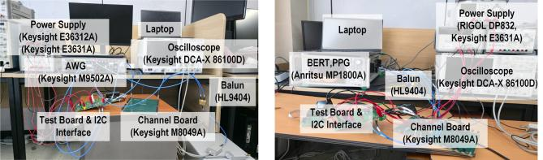
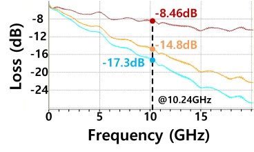
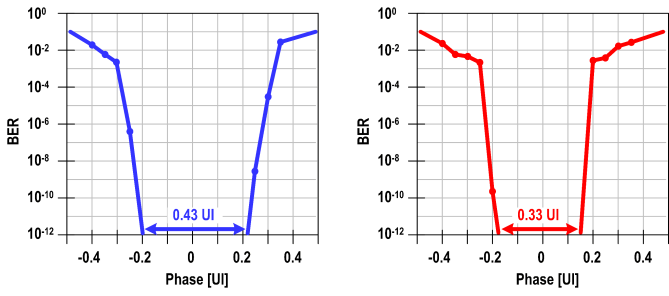

# 차동 PAM-3 측정과 채널별 FFE 효과 검증

<!-- page-navigation:top -->

  
  

<!-- /page-navigation:top -->

[TX 모델링](usb-tx-modeling.md) · [PCB·HFSS](pcb-hfss-verification.md) · [측정 장비](measurement-equipment.md)

제작 TX의 차동 PAM-3 측정에 참여해 채널 손실과 FFE 설정에 따른 출력 Eye를 평가했습니다. 32 Gb/s에서 채널별 프리셋을 바꾸고, 상·하단 Eye의 폭과 높이를 비교했습니다.

## 측정 구성과 관측 경로

왼쪽은 Eye 측정, 오른쪽은 BER 측정 구성입니다. Eye 측정에서는 AWG로 TX 보드에 클록을 인가하고, TXP/TXN의 차동 출력을 채널 보드·케이블·balun을 포함한 경로에서 86100D·86118A로 관측했습니다. BER 측정에서는 MP1800A의 패턴 발생·오류 검출 모듈을 사용했습니다. [논문 Fig. 10(a),(b)](https://doi.org/10.1109/TVLSI.2026.3701343)

| 평가 | 설정·관측 |
|---|---|
| 제작 칩 | 28-nm CMOS, VDD 1.0 V·VTT 1.2 V |
| TX 동작 | 32 Gb/s, 4-tap FFE·150개 프리셋 |
| Eye 측정 | PRBS15·PRBS31, scrambler on |
| 관측 항목 | FFE off/on 파형, 상·하단 Eye 폭·높이 |

## 같은 채널에서 FFE 적용 전후 비교

**조건:** CH#3, 손실 17.3 dB @ 10.24 GHz, 32 Gb/s·PRBS15·scrambler on. 왼쪽은 FFE off, 오른쪽은 FFE on입니다. FFE를 끈 상태에서는 Eye가 닫혀 있으며, main 0.725·post 0.25·2nd pre 0.025의 프리셋을 적용하면 상·하단 Eye가 열립니다. [논문 Fig. 13(a),(b)](https://doi.org/10.1109/TVLSI.2026.3701343)

같은 채널과 프리셋에서 PRBS15·PRBS31의 측정값을 비교했습니다.

| 입력 패턴 | 상단 Eye 폭 | 상단 Eye 높이 | 하단 Eye 폭 | 하단 Eye 높이 |
|---|---:|---:|---:|---:|
| PRBS15 | 11.19 ps | 21.16 mV | 11.67 ps | 19.80 mV |
| PRBS31 | 10.24 ps | 20.94 mV | 9.76 ps | 17.12 mV |

**측정 조건:** 두 행 모두 CH#3·32 Gb/s·scrambler on·동일 FFE 프리셋입니다. PRBS31에서 상·하단 Eye opening이 모두 작아지고, 하단 Eye 높이는 17.12 mV로 관측됩니다. 위 수치는 논문의 측정 결과입니다. [논문 Section V-C·Fig. 13(b),(c)](https://doi.org/10.1109/TVLSI.2026.3701343)

## 채널별 프리셋을 선택한 과정

각 채널에서 150개 FFE 프리셋을 수동으로 스윕하고 출력 Eye를 비교해 최적 프리셋을 선택했습니다. 손실이 작은 CH#1에서는 main 비중을 0.95로 두고 post 0.05를 적용했습니다. CH#3에서는 main을 0.725로 낮추고 post·2nd pre에 가중치를 배분해 채널을 보상했습니다.

| 채널 | 채널 보드 구성 | 전체 경로 손실 @ 10.24 GHz | 2nd pre | 1st pre | Main | Post |
|---|---|---:|---:|---:|---:|---:|
| CH#1 | 채널 보드 없음 | 8.46 dB | 0 | 0 | 0.950 | 0.050 |
| CH#2 | 9.05-inch 채널 | 14.8 dB | 0.025 | 0.050 | 0.725 | 0.200 |
| CH#3 | 13.35-inch 채널 | 17.3 dB | 0.025 | 0 | 0.725 | 0.250 |

**선택한 tap weights:** CH#1은 PRBS15, CH#2·CH#3은 PRBS15·PRBS31 측정에 적용했습니다. 전체 경로 손실에는 채널 보드·케이블·balun의 영향을 포함합니다. [논문 Section V-A·V-C](https://doi.org/10.1109/TVLSI.2026.3701343)

세 채널의 전체 경로 손실 곡선

[논문 Fig. 10(c)](https://doi.org/10.1109/TVLSI.2026.3701343)

## BER bathtub과 timing opening

BER 평가에서는 **32 Gb/s·scrambler off·PRBS7 주기에 해당하는 패턴 길이**를 사용했습니다. BER 10⁻¹² 기준 timing opening은 CH#2에서 **0.43 UI**, CH#3에서 **0.33 UI**입니다. [논문 Section V-D·Fig. 14](https://doi.org/10.1109/TVLSI.2026.3701343)

CH#2·CH#3의 BER bathtub 곡선

왼쪽은 CH#2, 오른쪽은 CH#3입니다.

## 관련 논문

[A 0.0549-pJ/bit/pin/dB PAM-3 Transmitter With Reconfigurable 150-Preset Four-Tap FFE for Various Channel Environments — IEEE TVLSI 2026](https://doi.org/10.1109/TVLSI.2026.3701343)

[TX 모델·RTL 검증](usb-tx-modeling.md) · [RX CTLE 모델링](usb-rx-ctle-modeling.md) · [장비·자동화](measurement-equipment.md)

<!-- page-navigation:bottom -->

  
  
  

<!-- /page-navigation:bottom -->
