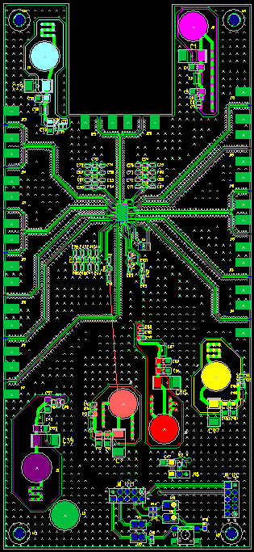
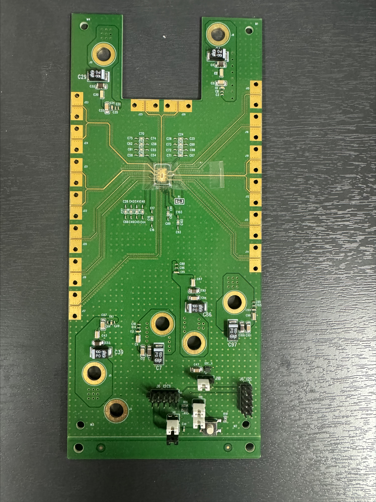
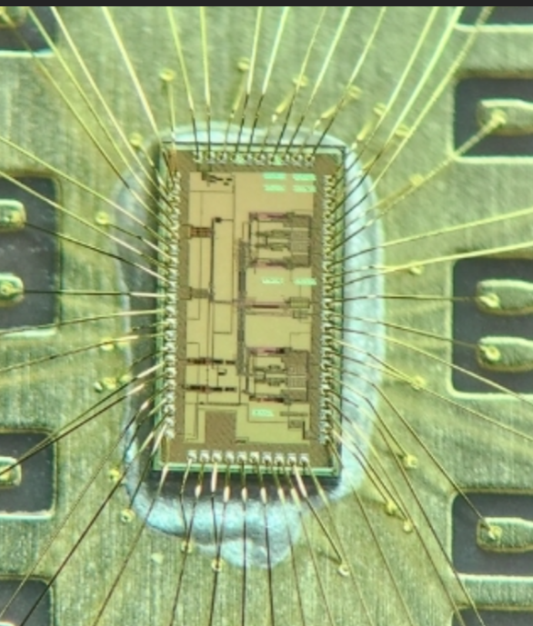
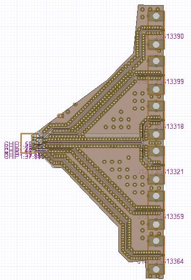
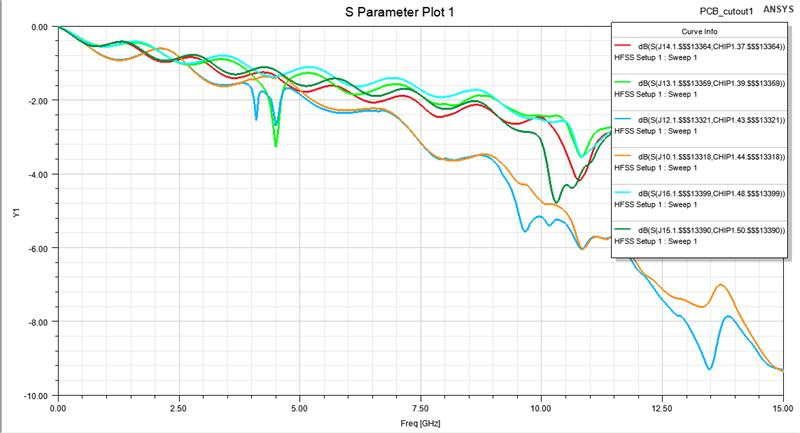
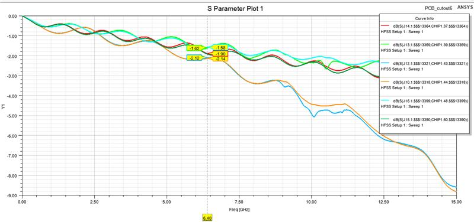
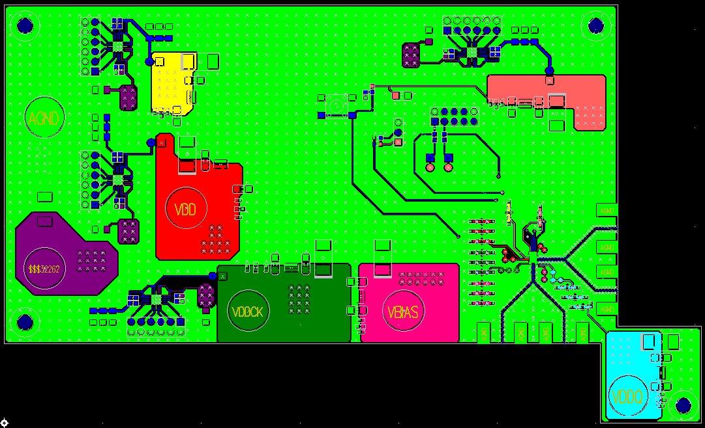
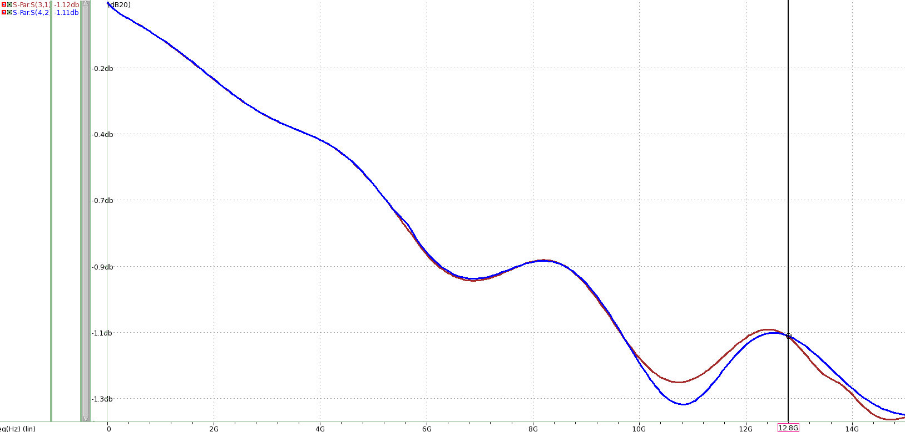
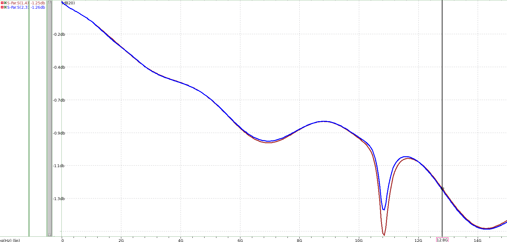
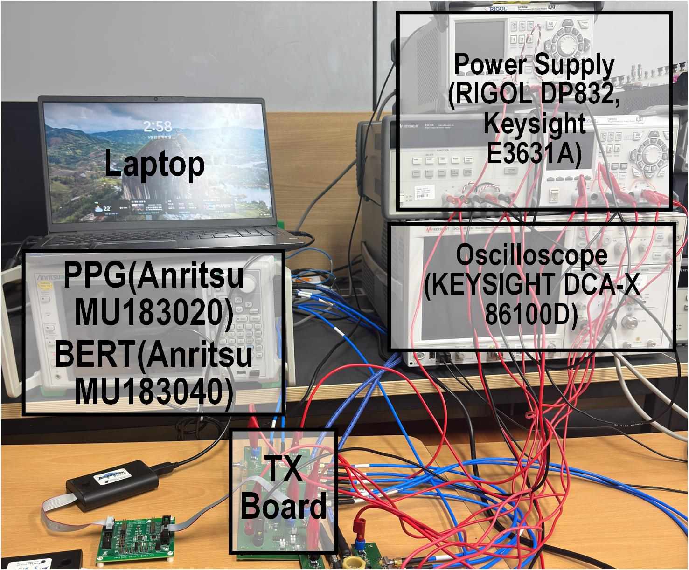

# PCB 설계·HFSS 분석

[파트 개요](../README.md) · [LPDDR](lpddr.md) · [USB PAM-3](usb4-pam3.md) · [측정 장비](measurement-equipment.md) · [논문·근거](evidence.md)

LPDDR 측정용 PCB의 회로·배치·배선을 설계하고 HFSS로 전달 특성을 분석했습니다. 제작 보드의 COB 실장·측정에 참여했으며, USB TX 보드에서는 GND via와 전원 공급 경로를 검토했습니다.

## 1. PCB·COB 실장

고속 데이터·클록, 전원·제어 경로를 배치했습니다. 중앙 칩 실장부에서 외곽 커넥터까지의 배선과 COB 연결입니다.

| PCB 배치·배선 | 제작 보드 | COB·와이어 본딩 |
|---|---|---|
|  |  |  |

## 2. HFSS 모델

칩 패드–커넥터 구간의 배선·접지·via를 HFSS 모델에 반영하고 포트·적층·재료 조건을 설정했습니다.

LPDDR 신호 경로의 HFSS 모델 보기

공통 HFSS 절차는 PADS → ODB++ import → 적층·재료·두께 확인 → 포트·기준 접지 설정 → validation입니다. Validation에서 누락된 재료·두께·포트를 점검합니다.

| 항목 | 설정·검토 |
|---|---|
| 분석 구간 | 칩 패드–커넥터 배선 |
| 적층·재료 | 도체·유전체의 층·두께·재료 |
| 포트·기준 접지 | 신호·접지 위치와 포트 구성 |
| 모델·경계 | 보드·유전체 범위, 커넥터 접촉·연결 |

## 3. LPDDR S-parameter

주파수별 전달 S-parameter를 비교해 완만한 손실과 좁은 대역의 notch를 검토하고 배치·배선을 수정했습니다.

| 일부 경로에 notch가 나타난 해석 결과 | 6.4 GHz 지점에 값이 표시된 해석 결과 |
|---|---|
|  |  |

오른쪽 HFSS 결과의 6.4-GHz 마커에서 여섯 전달 경로는 약 **−1.58~−2.14 dB**입니다.

## 4. USB PCB·전달 특성

USB TX 보드에서 GND via 배치와 전원 공급 경로를 검토했습니다. VDDQ 공급 위치와 VBIAS 연결을 정리하고, SMA 커넥터 주변 공간을 확보했습니다.

USB TX 보드의 배치·배선 화면 보기

**USB TX 보드:** 179.5 × 108 mm, GND via·전원 공급 경로·SMA 공간 배치 검토.

| USB CLK 경로 | USB DATA 경로 |
|---|---|
|  |  |

**HFSS 결과 @ 12.8 GHz:** CLK 손실 약 1.11 dB, DATA 약 1.25 dB. 전달 S-parameter 커서값은 CLK −1.12/−1.11 dB, DATA −1.25/−1.26 dB입니다.

## 5. 측정 연결

PPG·BERT의 입력·오류 검출 경로, 전원공급기와 오실로스코프를 TX 보드에 연결했습니다.

실제 측정 환경 사진 보기

**측정 환경:** 사진에는 Anritsu MU183020·MU183040 PPG·BERT 모듈, RIGOL DP832·Keysight E3631A 전원공급기, Keysight DCA-X 86100D와 TX 보드의 배치가 표시되어 있습니다.

[장비·제어](measurement-equipment.md) · [LPDDR TX Eye·RX Shmoo·USB FFE Eye](verification-figures.md)

## 관련 논문

- [A-SSCC 2026: LPDDR4X/5/5X Combo PHY](https://epapers2.org/asscc2026/ESR/paper_details.php?paper_id=1141) — 제작 칩의 TX Eye·RX margin. 채택·발표 예정.
- [IEEE TVLSI 2026: PAM-3 TX·150-preset FFE](https://doi.org/10.1109/TVLSI.2026.3701343) — USB PAM-3 TX의 제작 칩 측정.
