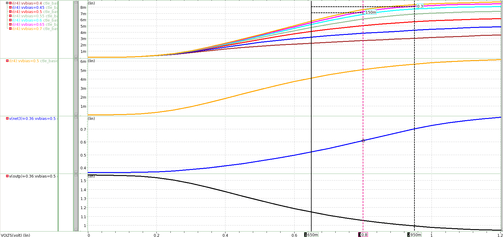
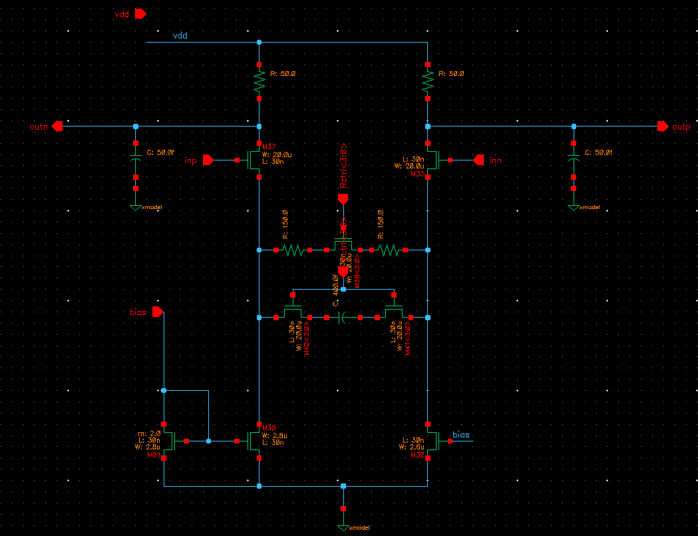
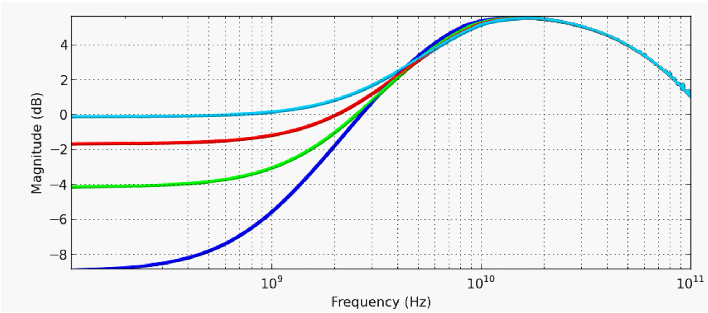
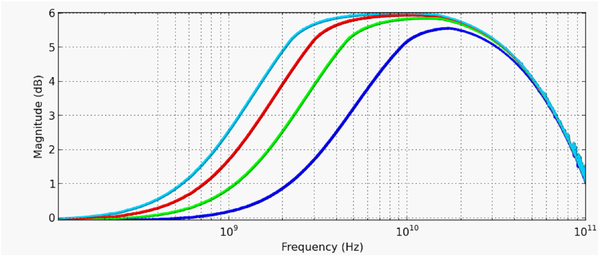
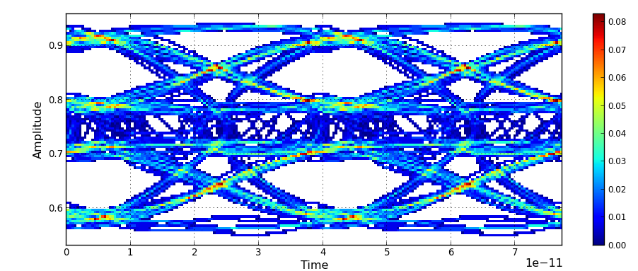
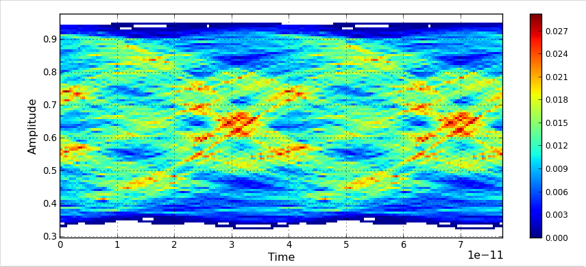
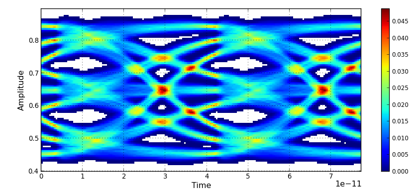
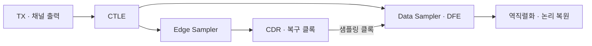

# USB RX CTLE 모델링: 동작점 설정과 보상 조정

[파트 개요](../README.md) · [USB 연구 개요](usb4-pam3.md) · [TX 모델링](usb-tx-modeling.md) · [논문·담당 역할](evidence.md)

**담당:** CTLE 모델링·송수신 통합 검증. 바이어스·입력 공통전압과 R·C 제어를 조정해 채널 보상과 PAM-3 중간 레벨 안정성을 확인했습니다.

**검증:** CTLE 모델·시뮬레이션과 RX 통합 모델의 동작 확인.

## 1. 바이어스·입력 공통전압을 먼저 정한 이유

처음에는 목표 pole·zero에 맞춰 R·C와 필요한 gm을 계산한 뒤, 입력 소자 크기와 전류를 조절했습니다. 그러나 전류와 동작점이 함께 바뀌어 비교할 변수가 많아졌습니다. 먼저 전류원 바이어스와 입력 공통전압을 정하고, 그 동작점에서 R·C에 따른 응답을 확인하는 순서로 바꿨습니다.

초기 DC 모델은 **VBIAS 0.5 V·VCM 0.8 V·목표 전류 5 mA**를 선택했습니다. 300-mV 입력 범위에서 NMOS saturation을 검토했습니다.

동작점을 정한 DC sweep 결과 보기

**DC sweep:** 입력 0–1.2 V·10-mV 간격, VBIAS 0.4–0.7 V·50-mV 간격. 전류·드레인 전압·문턱전압을 관찰했습니다.

## 2. XMODEL의 소자 특성에 맞춰 R·C 제어 모델 구성

Virtuoso에서 사용한 값을 XMODEL에 그대로 옮겼을 때 같은 응답을 얻지 못했습니다. 소자 특성 차이를 고려해 전류와 주파수 응답을 다시 조정하고, conventional CTLE 기반의 RZ·CZ 제어 모델로 구성했습니다. 모델 제어 레벨을 수동으로 바꾸며 응답을 비교했습니다.

Programmable CTLE 모델 회로 보기

**모델:** 저항 부하·입력 차동쌍·RZ/CZ 제어·전류 미러.

AC 테스트에서는 수신 부하를 CL=50 fF로 가정하고 다음 설정을 사용했습니다.

| 항목 | 모델·AC 테스트 설정 |
|---|---|
| RD / CL | 50 Ω / 50 fF |
| RZ / CZ | 제어 레벨 1에서 300 Ω / 400 fF |
| R·C 제어 | `Rctrl_lev`, `Cctrl_lev` 각각 1–4 |
| 전류 미러의 목표 drain current | 5 mA |
| AC 테스트 입력 표기 | swing 300 mV, common-mode 850 mV |

| RZ 제어 레벨에 따른 AC 응답 | CZ 제어 레벨에 따른 AC 응답 |
|---|---|
|  |  |

**AC 응답:** 왼쪽은 R 제어에 따른 저주파 이득·상대적인 부스트의 변화, 오른쪽은 C 제어에 따른 응답 대역의 변화를 보여줍니다. 동일한 CTLE 모델에서 제어 범위를 확인했습니다.

## 3. 높은 부스트와 중간 레벨 안정성을 함께 판단

초기 통합 모델에서 중간 레벨의 흔들림을 관측했습니다. 부스트 설정을 낮춘 후속 모델에서 CTLE 입출력 Eye를 확인했습니다.

보상 조정 전에 관찰한 중간 레벨의 흔들림

**관측:** 초기 통합 모델의 CTLE 출력에서 나타난 중간 레벨의 흔들림.

| 채널을 통과한 CTLE 입력 | 보상 조정 후 CTLE 출력 |
|---|---|
|  |  |

**조건:** TX FFE off·scrambled data에서 선택한 CTLE 설정의 입출력 Eye.

## 4. Sampler에 연결할 때 공통전압·부하 조건 재확인

단품 AC 시험의 입력 common-mode 850 mV를 RX 통합 시 약 700 mV로 변경했습니다. Sampler의 동작·부하에 맞춰 동작점과 보상 설정을 조정했습니다.

**통합 구조:** CDR는 샘플링 클록을 제어합니다. 전체 RX 모델에서 PLL은 실제 PLL 회로 대신 등가 모델로 가정했습니다.

## 관련 논문

[SMACD 2025](https://doi.org/10.1109/SMACD65553.2025.11092233): CTLE·DFE·CDR를 포함한 25.6-GBaud/lane RX 모델. [32-Gb/s 제작 TX 측정](usb4-pam3.md#모델과-실리콘-결과의-구분)
