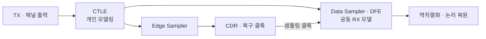

# USB RX CTLE 모델링: 동작점 설정과 보상 조정

[파트 개요](../README.md) · [USB 연구 개요](usb4-pam3.md) · [TX 모델링](usb-tx-modeling.md) · [논문·근거](evidence.md)

**채널 손실을 보상하면서 PAM-3의 중간 레벨이 과도하게 흔들리지 않도록 CTLE 모델을 조정한 과정입니다.** 바이어스·입력 공통전압으로 동작점을 먼저 정한 뒤 R·C에 따른 주파수 응답을 확인하고, 채널을 통과한 데이터의 입력·출력 Eye로 보상 정도를 판단했습니다.

CTLE 모델링을 담당하고 송수신 모델 통합 검증에 참여했습니다. Sampler·DFE·CDR 등 나머지 RX 블록은 공동 연구 범위이며, 아래 그림은 **모델·시뮬레이션 결과**입니다.

## 1. 바이어스·입력 공통전압을 먼저 정한 이유

처음에는 목표 pole·zero에 맞춰 R·C와 필요한 gm을 계산한 뒤, 입력 소자 크기와 전류를 조절했습니다. 그러나 전류와 동작점이 함께 바뀌어 비교할 변수가 많아졌습니다. 먼저 전류원 바이어스와 입력 공통전압을 정하고, 그 동작점에서 R·C에 따른 응답을 확인하는 순서로 바꿨습니다.

초기 DC 검증에서는 입력 전압과 바이어스를 함께 sweep했습니다. 해당 버전은 **VBIAS=0.5 V, VCM=0.8 V, 목표 전류 5 mA**를 선택하고, 300-mV 입력 범위에서 NMOS의 saturation 유지 여부를 검토했습니다. 이 값은 해당 모델의 동작점이며 USB의 규격값이 아닙니다.

동작점을 정한 DC sweep 결과 보기

**DC sweep 조건:** 입력 전압은 0–1.2 V를 10-mV 간격으로, VBIAS는 0.4–0.7 V를 50-mV 간격으로 sweep했습니다. 전류와 드레인 전압·문턱전압을 함께 확인했습니다. 뒤의 XMODEL 통합 버전은 소자·부하·공통전압 조건이 달라 같은 설정으로 취급하지 않습니다.

## 2. XMODEL의 소자 특성에 맞춰 R·C 제어 모델 구성

Virtuoso에서 사용한 값을 XMODEL에 그대로 옮겼을 때 같은 응답을 얻지 못했습니다. 소자 특성 차이를 고려해 전류와 주파수 응답을 다시 조정하고, conventional CTLE 기반의 RZ·CZ 제어 모델로 구성했습니다. 모델 제어 레벨을 수동으로 바꾸며 응답을 비교했습니다.

Programmable CTLE 모델 회로 보기

**모델 구조:** 개인 담당 CTLE 모델입니다. 제작된 RX 회로의 레이아웃이나 측정 결과는 포함하지 않습니다.

아래는 초기 모델·AC 테스트 설정입니다. CL=50 fF는 당시 수신 부하를 가정해 둔 값입니다.

| 항목 | 해당 버전의 설정 |
|---|---|
| RD / CL | 50 Ω / 50 fF |
| RZ / CZ | 제어 레벨 1에서 300 Ω / 400 fF |
| R·C 제어 | `Rctrl_lev`, `Cctrl_lev` 각각 1–4 |
| 전류 미러의 목표 drain current | 5 mA |
| AC 테스트 입력 표기 | swing 300 mV, common-mode 850 mV |

| RZ 제어 레벨에 따른 AC 응답 | CZ 제어 레벨에 따른 AC 응답 |
|---|---|
|  |  |

**AC 응답:** 왼쪽은 R 제어에 따른 저주파 이득·상대적인 부스트의 변화, 오른쪽은 C 제어에 따른 응답 대역의 변화를 보여줍니다. 동일한 CTLE 모델에서 제어 범위를 확인했습니다.

## 3. 높은 부스트와 중간 레벨 안정성을 함께 판단

CTLE를 채널 뒤에 연결했을 때 Eye가 열리는 것과 중간 레벨이 안정되는 것을 함께 확인했습니다. 초기 통합 검증에서 중간 레벨의 흔들림이 관찰되어, 후속 모델에서는 **boosting을 완화해 해당 현상을 줄였습니다.** 주파수 응답과 수신 데이터의 레벨 분포를 함께 확인한 사례입니다.

보상 조정 전에 관찰한 중간 레벨의 흔들림

**비교 범위:** 개발 중 CTLE 출력입니다. 아래 보상 조정 후 그림과는 개발 시점·입력 조건이 달라 정량적인 전후 개선율을 계산하지 않습니다. 잡음 성분의 원인을 분리하거나 잡음 스펙트럼을 검증한 결과는 아닙니다.

| 채널을 통과한 CTLE 입력 | 보상 조정 후 CTLE 출력 |
|---|---|
|  |  |

**조건:** **TX FFE off, scrambled data** 조건에서 관찰한 입력·출력 쌍입니다. RX 검증을 위해 선택한 best-case parameter이며, 최종 R·C 제어 코드 전체는 기록되어 있지 않습니다. 두 그림의 세로축 범위·색상 밀도 척도가 달라 화면상 크기나 색만으로 수치를 비교하지 않습니다.

## 4. Sampler에 연결할 때 공통전압·부하 조건 재확인

단품 CTLE 테스트의 입력 common-mode는 850 mV였지만, 공동 수신 모델에 연결한 환경은 약 700 mV였습니다. CTLE의 동작 조건을 다시 맞추고, 뒤에 연결되는 Sampler의 동작과 부하를 고려해 보상 설정을 조정했습니다. 단품의 AC 응답과 통합 모델의 동작을 같은 조건으로 가정하지 않았습니다.

**통합 구조:** CDR는 샘플링 클록을 제어합니다. 전체 RX 모델에서 PLL은 실제 PLL 회로 대신 등가 모델로 가정했습니다.

## 논문과 검증 범위

[SMACD 2025 RX 모델 논문](https://doi.org/10.1109/SMACD65553.2025.11092233)은 **25.6-GBaud/lane PAM-3 수신 모델**의 성과입니다. CTLE·DFE·CDR 등을 포함한 전체 RX 결과를 이 페이지의 CTLE 단독 성과로 옮기지 않습니다. 제작된 32-Gb/s PAM-3 TX의 공동 실리콘 측정은 [USB 연구 개요](usb4-pam3.md#모델과-실리콘-결과의-구분)에서 별도로 확인할 수 있습니다.

공개 범위는 CTLE 구조와 DC·AC·Eye 검증 이미지입니다. IP 소스와 PDK 경로는 포함하지 않습니다.
