# USB TX 모델링: 논리 데이터에서 전기 계층까지

[파트 개요](../README.md) · [USB 연구·제작 칩 측정](usb4-pam3.md) · [RX CTLE 모델링](usb-rx-ctle-modeling.md) · [측정 그림](verification-figures.md) · [논문·담당 역할](evidence.md)

**담당:** TX 논리 RTL·XMODEL 모델링·통합, Serializer 검증, 합성·P&R 후 전기 계층 연결. **검증:** 모델·시뮬레이션.

## 1. 인코더와 드라이버 사이의 데이터 형식 정의

11B7S 인코더는 11-bit 입력을 7개의 PAM-3 심볼로 바꿉니다. 이 구현에서는 심볼 하나를 2-bit 코드로 표현하므로, 인코더 한 개의 출력은 14 bit입니다. 16개 인코더의 224-bit 출력은 112개 심볼에 해당하며, 스크램블링 이후 MSB·LSB를 각각 112 bit로 분리해 전기 계층에 전달합니다. **모델 내부 표현: 112심볼 × 2 bit = 224 bit.**

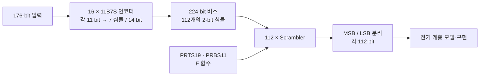

인코더 출력 순서·Scrambler 심볼 코드·드라이버 비트 순서를 각 모델의 코드 매핑에 맞췄습니다. [논리 구현 블록](usb4-pam3.md#논리-경로를-제작-tx에-연결)

## 2. 직접 계산한 기대값으로 RTL 출력 확인

인코더의 `A=11` 분기에서 중간값 계산과 출력 선택 시점이 맞지 않아 지연·unknown 출력이 발생했습니다. 해당 분기의 계산을 분리하고 선택 타이밍을 조정한 뒤, 직접 계산한 기대값과 Vivado·DVE 시뮬레이션 출력을 비교했습니다.

스크램블러는 복원 경로를 연결하는 테스트와 별도로 `Data → F_out → Scramble_out`을 직접 계산해 비교했습니다. 아래는 **8개 입력 예시의 첫 14 bit를 7개 심볼로 나누어 계산한 결과**입니다. 이후에는 224-bit 버스의 기대 출력과 RTL 파형을 대조했습니다.

입력·F 함수로 계산한 스크램블러 기대값

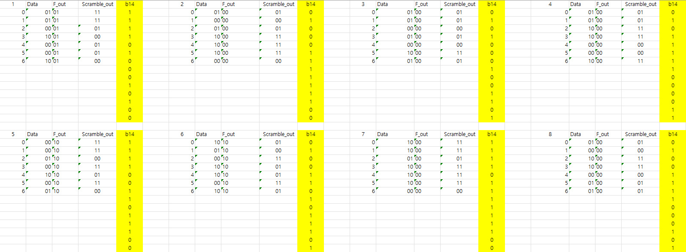

PRBS11·PRTS19 발생기는 seed별 리셋 후 100개 출력을 참조 수열과 비교했습니다.

PRTS19·PRBS11 조합별 스크램블·복원 예시

| PRTS19 / PRBS11 | 입력 → 스크램블 → 복원 데이터, 10진 표시 |
|---|---|
| 0t / 0b | 70 → 49 → 70 |
| 0t / 1b | 26 → 31 → 26 |
| 1t / 0b | 98 → 196 → 98 |
| 1t / 1b | 134 → 28 → 134 |
| 2t / 0b | 18 → 19 → 18 |
| 2t / 1b | 144 → 79 → 144 |

**비교 단위:** 각 행은 특정 시점의 8-bit 데이터·4심볼입니다.

## 3. 단일 심볼 복원에서 XMODEL 통합으로 확장

하위 Verilog 모듈을 각각 import해 XMODEL primitive로 연결했습니다. 2-bit Scrambler·Descrambler 한 쌍에서 복원을 확인하고, 112개를 연결해 224-bit 경로로 확장했습니다.

후속 모델에서는 **Descrambler 112개와 Decoder 16개**를 연결해 원래 데이터로 돌아오는 검증 경로를 구성했습니다. 원입력 비교 경로에 `4/f_clk` 지연을 두어 복원 경로의 지연과 맞춘 뒤, 입력과 복원 데이터의 차이를 관찰했습니다.

복원 데이터의 비교 신호와 클록 파형

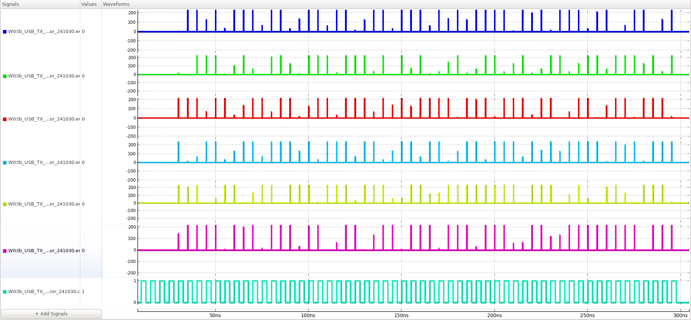

**관측:** 위부터 `err0`–`err5`, 맨 아래는 클록. 비교 신호는 하위 11 bit이며, 안정 구간에서 0·클록 전이에서 스파이크가 관측됩니다.

## 4. Scrambler 우회·활성 모드의 출력 확인

우회 경로를 추가해 인코더 출력과 스크램블 출력을 선택할 수 있도록 했습니다. `sel/rst_sel=1/1`에서는 스크램블 블록 출력을 0으로 두고 인코더 데이터를 전달하며, `0/0`에서는 스크램블 데이터를 전달합니다. 같은 관측점에서 입력·중간값·최종 출력을 함께 보아 제어 신호가 실제 데이터 경로에 반영되는지 확인했습니다.

| Scrambler off · 인코더 데이터 전달 | Scrambler on · 스크램블 데이터 전달 |
|---|---|
| 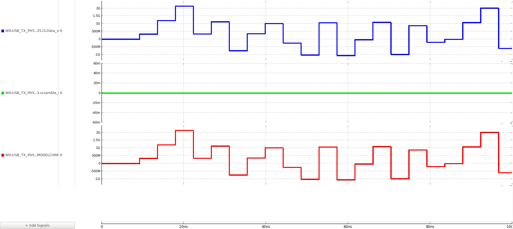 | 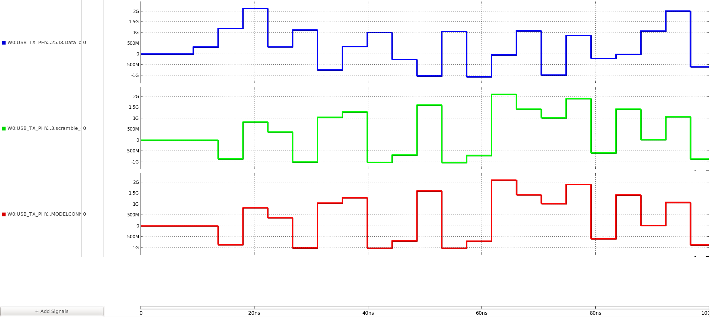 |

**파형 설명:** 두 그림 모두 위부터 Encoder Data, Scramble Data, Data_out입니다. 우회·활성 모드의 출력 경로를 확인했습니다.

후속 on/off 검증에서는 DC·반복 패턴과 PRBS31을 넣어 관측 구간을 500 ns·2 µs로 늘렸습니다.

## 5. 병렬 데이터의 순서를 Serializer 단계별로 추적

112:1 Serializer를 112→16→4→1로 나눠 입력 비트·출력 순서를 대조했습니다. 아래는 첫 단계의 7:1 경로입니다.

7:1 Serializer의 입력·출력 순서 확인

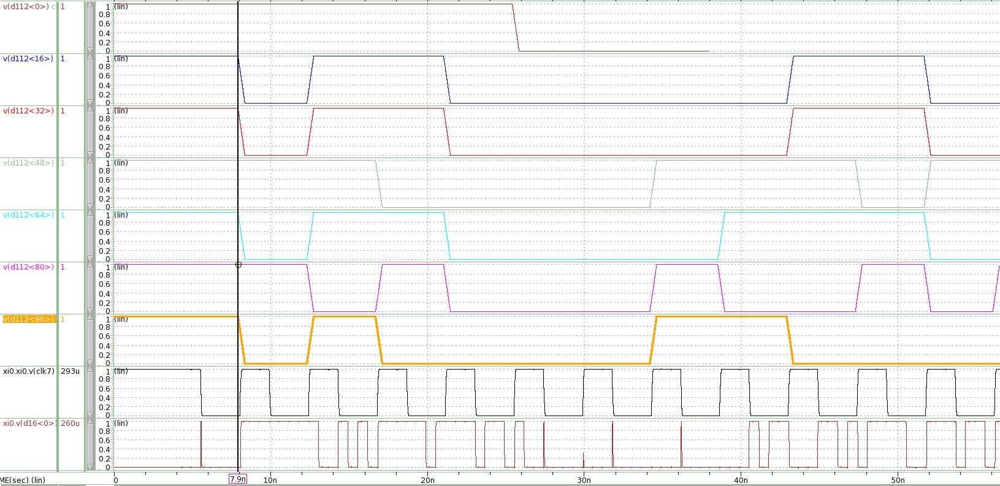

**관측:** `D[0], D[16], …, D[96]`, 클록과 7:1 출력. 단계별로 112→16 블록 16개·16→4 블록 4개·4→1 블록 1개의 출력을 확인했습니다.

## 6. 논리 출력을 FFE 드라이버·채널 모델에 연결

MSB·LSB Serializer와 aligner를 4-tap FFE 드라이버에 연결했습니다. 최종 직렬화 단계에서 1–3 UI 지연 신호를 생성합니다.

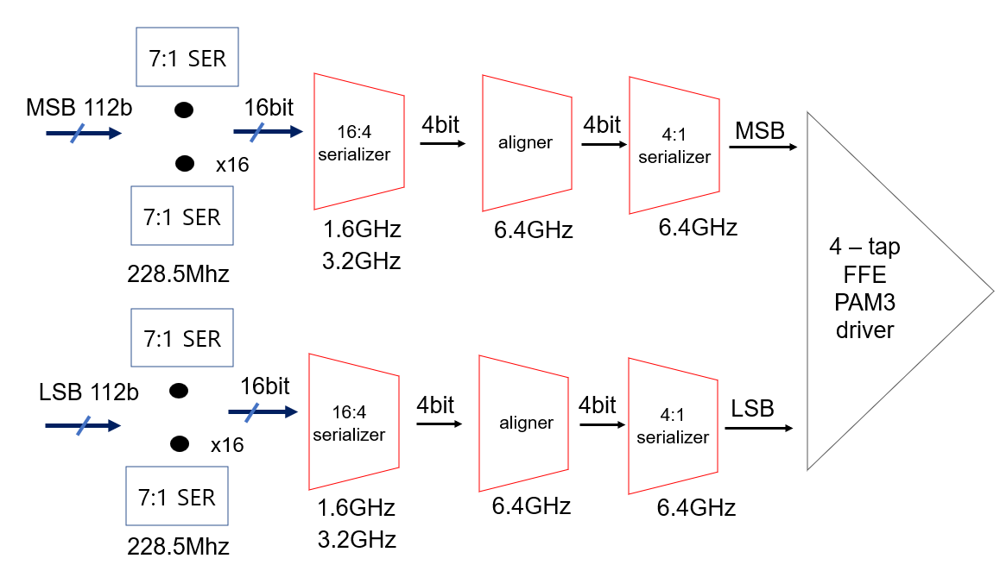

**전기 계층 연결:** MSB·LSB Serializer → aligner → 4-tap FFE 드라이버.

초기 FFE 모델에서는 음수 계수를 전류원의 음수 값으로 표현했습니다. 회로에서 구현할 수 있도록 **전류 크기는 양수로 두고 해당 차동 입력의 극성을 반전**하는 방식으로 수정했으며, 같은 계수에서 수정 전후 Eye를 비교했습니다.

채널 보상은 같은 모델·채널에서 계수를 바꾸어 확인했습니다. 아래 두 그림은 25.6 GBaud, 1 UI=39.0625 ps, VDD=1 V, tail-current 설정 5 mA의 모델 결과입니다. 사용한 채널의 손실 곡선은 **12.8 GHz에서 9.89 dB**를 표시합니다.

| FFE off · Preset 0 | FFE on · Preset 7 |
|---|---|
| 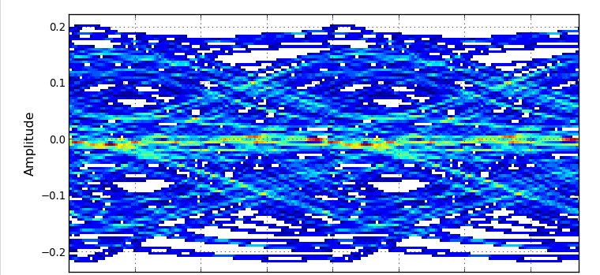 | 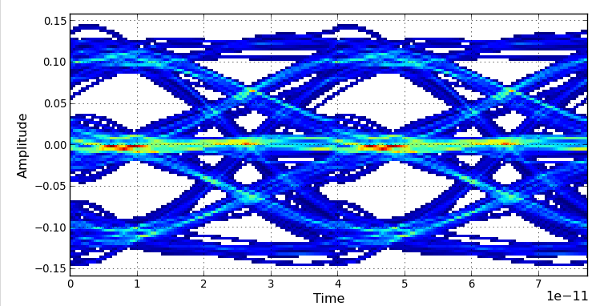 |
| `C[-2], C[-1], C[0], C[1] = 0, 0, 1, 0` | `0, -0.05, 0.8, -0.15` |

**조건:** 채널 포함 XMODEL 시뮬레이션, 이상적 전류원·수동 FFE 계수.

## 7. 구현 후 MSB·LSB를 VCS와 POSIM에서 교차 확인

RTL과 P&R Verilog netlist를 VCS에서 비교하고 전기 계층을 포함한 POSIM 출력과 대조했습니다. 아래는 2025-06-19 MSB·LSB 결과입니다.

**조건:** ideal power labeling의 MSB·LSB 비트열 기능 비교.

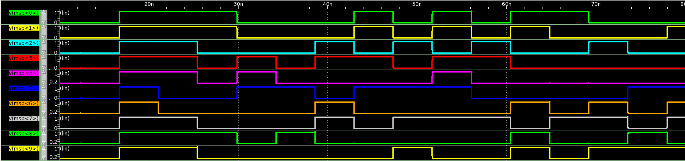

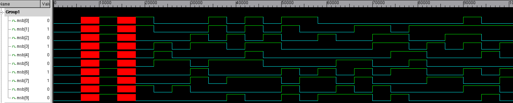

**관측:** POSIM·VCS의 MSB[0:9], 리셋·초기화 후 비트열.

LSB[0:9]의 POSIM·VCS 비교 보기

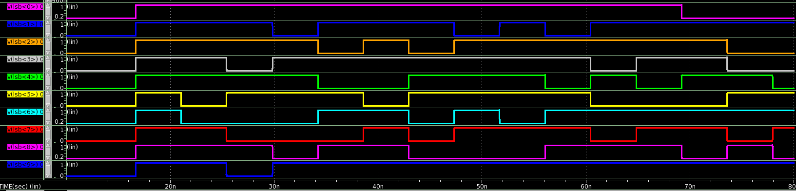

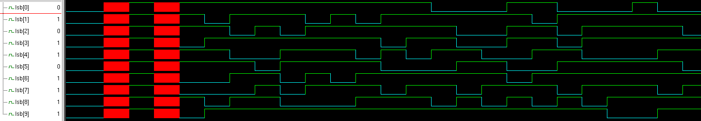

**파형 설명:** 위는 POSIM, 아래는 VCS입니다. MSB 비교와 동일하게 이상적인 power labeling 조건의 기능 검증입니다.

## 관련 논문

[SMACD 2025](https://doi.org/10.1109/SMACD65553.2025.11092283): 40 Gb/s/lane TX 모델·시뮬레이션. [IEEE TVLSI 2026](usb4-pam3.md#모델과-실리콘-결과의-구분): 32-Gb/s 제작 TX 측정.
