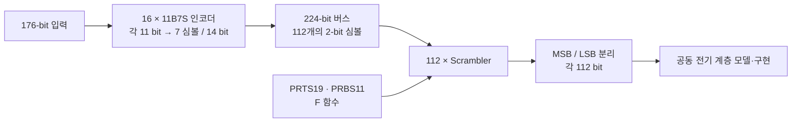

# USB TX 모델링: 논리 데이터에서 전기 계층까지

[파트 개요](../README.md) · [USB 연구·실리콘 평가](usb4-pam3.md) · [측정 그림](verification-figures.md) · [논문·근거](evidence.md)

**TX 논리 RTL의 기대값을 확인하고, 그 출력을 XMODEL과 전기 계층 구현에 연결한 과정입니다.** 인코더·스크램블러의 데이터 형식을 맞추는 데서 시작해, 직접 계산한 값과의 비교, 모델 통합, 구현 후 시뮬레이터 간 출력 확인으로 검증 범위를 넓혔습니다.

TX 논리 RTL과 XMODEL 모델링·통합을 담당하고, Serializer의 동작을 검증했습니다. 합성·P&R 이후에는 전기 계층과의 연결을 확인했습니다. 전체 아날로그 TX와 제작 칩 성능은 공동 연구 결과로 구분합니다. 아래 그림은 기존 랩미팅 자료에서 선별한 **모델·시뮬레이션 기록**입니다.

## 1. 인코더와 드라이버 사이의 데이터 형식 정의

11B7S 인코더는 11-bit 입력을 7개의 PAM-3 심볼로 바꿉니다. 이 구현에서는 심볼 하나를 2-bit 코드로 표현하므로, 인코더 한 개의 출력은 14 bit입니다. 16개 인코더의 224-bit 출력은 112개 심볼에 해당하며, 스크램블링 이후 MSB·LSB를 각각 112 bit로 분리해 전기 계층에 전달합니다. **224 bit는 모델 내부 표현의 폭**이며 224개의 PAM-3 심볼을 뜻하지 않습니다.

이 구조를 기준으로 인코더의 출력 순서, 스크램블러의 심볼 코드, 드라이버 입력의 비트 순서를 맞췄습니다. 자료의 버전별 코드 매핑을 하나의 고정된 규격으로 취급하지 않고, 연결하는 모델의 표현과 함께 확인했습니다. 논리 구현에서 제외한 RS-FEC·precoder의 범위는 [USB 개요](usb4-pam3.md#논리-경로를-제작-tx에-연결)에 명시했습니다.

## 2. 직접 계산한 기대값으로 RTL 출력 확인

인코더에서는 `A=11` 분기의 중간값 처리와 출력 선택 시점 때문에 지연·unknown 출력이 관찰됐습니다. 해당 분기의 계산을 분리하고 선택 타이밍을 조정한 뒤, 계산표와 시뮬레이션 출력을 다시 비교했습니다. 같은 코드의 Vivado·DVE 출력 비교도 함께 기록했습니다.

스크램블러는 복원 경로를 연결하는 테스트와 별도로 `Data → F_out → Scramble_out`을 직접 계산해 비교했습니다. 아래 표는 **8개 데이터 예시의 첫 14 bit를 7개 심볼로 나누어 계산한 기록**입니다. 이후에는 224-bit 버스의 기대 출력과 RTL 파형을 대조했습니다.

**출처:** `1017_Logical_Layer_진행상황.pptx`, slides 33–36. 직접 작성한 계산표이며, 규격 문서의 표를 복사한 그림이 아닙니다.

**검증 범위:** 같은 자료 slides 35–37에는 계산값과 Vivado·DVE 출력의 대조 기록이 있습니다. 자료에 남은 데이터·구간에 대한 확인이며, 전 입력·전 시간의 등가성 증명은 아닙니다.

PRBS11·PRTS19 발생기는 자료에 제시된 seed별 리셋 후 100개 출력과 참조 수열을 비교했습니다. 별도로 PRTS19 3가지·PRBS11 2가지·입력 심볼 3가지의 **18조합을 비교 기준으로 삼는 검증 계획**도 기록했습니다. 이 계획과 위에 남아 있는 실제 계산·파형 근거는 구분합니다.

추가 자료에 남은 6가지 PRTS19·PRBS11 조건의 비교 예시

| PRTS19 / PRBS11 | 입력 → 스크램블 → 복원 데이터, 10진 표시 |
|---|---|
| 0t / 0b | 70 → 49 → 70 |
| 0t / 1b | 26 → 31 → 26 |
| 1t / 0b | 98 → 196 → 98 |
| 1t / 1b | 134 → 28 → 134 |
| 2t / 0b | 18 → 19 → 18 |
| 2t / 1b | 144 → 79 → 144 |

**출처·범위:** `241017 XMODEL import_Scrambler verification.pptx`, slides 4–9. 각 행은 특정 시점의 **8-bit 데이터, 즉 4개 심볼** 비교입니다. 해당 예시의 입력과 복원 값이 같음을 보여주며, 전체 시퀀스·버스의 무오류 판정은 아닙니다.

## 3. 단일 심볼 복원에서 XMODEL 통합으로 확장

당시 환경에서는 상위 Verilog 모듈을 바로 import할 때 하위 모듈을 찾지 못했습니다. 하위 모듈을 각각 import하고 XMODEL primitive로 연결하는 방식으로 통합했습니다. 먼저 2-bit 입력을 갖는 스크램블러·디스크램블러 한 쌍으로 복원 경로를 확인하고, 스크램블러 112개를 연결해 224-bit 경로로 확장했습니다.

후속 모델에서는 **Descrambler 112개와 Decoder 16개**를 연결해 원래 데이터로 돌아오는 검증 경로를 구성했습니다. 원입력 비교 경로에 `4/f_clk` 지연을 두어 복원 경로의 지연과 맞춘 뒤, 입력과 복원 데이터의 차이를 관찰했습니다.

**출처·판독:** `241105 XMODEL TX Logical Layer Modeling&verification.pptx`, slides 7–10. 위부터 `err0`–`err5`, 맨 아래가 클록입니다. 표시한 오류 신호는 각 비교 결과의 **하위 11 bit**입니다. 원자료는 클록 엣지의 글리치를 제외한 구간에서 0을 확인했다고 기록하며, 그림에도 전이 시점의 스파이크가 남아 있습니다. 전체 데이터 폭의 자동 등가성 검사로 확대 해석하지 않습니다.

## 4. Scrambler on/off는 출력 경로와 관측 조건을 함께 확인

우회 경로를 추가해 인코더 출력과 스크램블 출력을 선택할 수 있도록 했습니다. `sel/rst_sel=1/1`에서는 스크램블 블록 출력을 0으로 두고 인코더 데이터를 전달하며, `0/0`에서는 스크램블 데이터를 전달합니다. 같은 관측점에서 입력·중간값·최종 출력을 함께 보아 제어 신호가 실제 데이터 경로에 반영되는지 확인했습니다.

| Scrambler off · 인코더 데이터 전달 | Scrambler on · 스크램블 데이터 전달 |
|---|---|
|  |  |

**출처:** `1023_Scrambler_on_off 추가자료.pptx`, slides 3·6·8. 두 그림 모두 위부터 Encoder Data, Scramble Data, Data_out입니다. 출력 경로의 기능 확인 자료입니다.

후속 검증에서는 짧은 PRBS7·50-ns 관측만으로 on/off 차이를 판단하기 어려웠습니다. DC·반복 성분을 넣은 외부 패턴과 PRBS31로 조건을 바꾸고, 각각 500 ns·2 µs로 관측을 늘렸습니다. 다만 `241210_검증.pptx`에는 **XMODEL과 SPICE 결과의 차이가 미해결 상태로 남아 있습니다.** 따라서 이 자료에서 스크램블러의 Eye·지터·BER 개선 수치를 확정하지 않습니다.

## 5. 병렬 데이터의 순서를 Serializer 단계별로 추적

논리 출력이 맞더라도 직렬화 순서가 달라지면 드라이버에는 다른 심볼이 전달됩니다. 112:1 Serializer를 **112→16→4→1** 단계로 나누어 확인하고, 각 단계의 입력 비트와 출력 순서를 대조했습니다. 아래는 첫 112→16 단계에 포함된 한 7:1 경로의 검증 파형입니다.

**출처·조건:** `241119 USB TX Serializer_112to1 verification.pptx`, slide 2. 위 7개 신호는 `D[0], D[16], …, D[96]`, 그 아래는 클록과 해당 7:1 출력입니다. 자료는 112→16 블록 16개, 16→4 블록 4개, 4→1 블록 1개의 출력을 확인했다고 기록합니다. 이 그림은 한 경로의 직렬화 확인이며, 제작 TX의 최대 데이터율 측정 결과는 아닙니다.

## 6. 논리 출력을 FFE 드라이버·채널 모델에 연결

직렬화된 MSB·LSB가 실제 PAM-3 레벨을 만드는 경로까지 연결해야 논리 데이터와 채널 출력의 관계를 확인할 수 있습니다. 공동 TX의 전기 계층은 MSB·LSB 각각의 Serializer와 aligner를 거쳐 4-tap FFE 드라이버로 이어집니다. 최종 직렬화 단계에서는 FFE에 필요한 1–3 UI 지연 신호도 함께 만듭니다.

**출처·범위:** 공동 정리 자료 `250218_USB_TX_정리_V3.pptx`, slides 2–3·6–9. 그림은 해당 버전의 전기 계층 구성입니다. 논리계층 연결·검증의 맥락을 보여주며, 전체 아날로그 회로의 개인 설계 범위를 뜻하지 않습니다.

초기 FFE 모델에서는 음수 계수를 전류원의 음수 값으로 표현했습니다. 이를 회로에서 구현할 수 있는 형태로 옮기기 위해 **전류 크기는 양수로 두고 해당 차동 입력의 극성을 반전**하는 방식으로 수정했으며, 같은 계수에서 수정 전후 Eye를 비교했습니다. 이 과정은 모델의 수학적 표현과 실제 회로의 제어 방식을 함께 확인한 사례입니다. (`1029_랩미팅_유용규.pptx`, slides 2–4)

채널 보상은 같은 모델·채널에서 계수를 바꾸어 확인했습니다. 아래 두 그림은 25.6 GBaud, 1 UI=39.0625 ps, VDD=1 V, tail-current 설정 5 mA의 모델 결과입니다. 사용한 채널의 손실 곡선은 **12.8 GHz에서 9.89 dB**를 표시합니다.

| FFE off · Preset 0 | FFE on · Preset 7 |
|---|---|
|  |  |
| `C[-2], C[-1], C[0], C[1] = 0, 0, 1, 0` | `0, -0.05, 0.8, -0.15` |

**출처·판독:** `1008_랩미팅_유용규_v2.pptx`, slides 2–3·5–7. 채널을 포함한 **XMODEL 시뮬레이션**의 설정 비교입니다. 두 그림의 세로축 범위가 다르므로 파형의 화면상 크기만 비교하지 않습니다. 당시 모델은 이상적인 전류원·FFE 계수 설정을 포함하며, 이 결과를 트랜지스터 수준의 모든 비이상성이나 제작 칩 실측으로 확대하지 않습니다.

## 7. 구현 후 MSB·LSB를 VCS와 POSIM에서 교차 확인

모델 단계에서 맞춘 논리 데이터가 구현 후에도 유지되는지 확인하기 위해 RTL과 P&R 이후 Verilog netlist를 VCS에서 비교하고, 전기 계층이 포함된 POSIM 출력과도 대조했습니다. 아래는 2025-06-19 자료의 MSB 비교이며, LSB도 같은 방식으로 확인했습니다.

**이 비교는 데이터 검증을 위해 power labeling을 이상적으로 배치한 조건입니다.** 자료는 선택한 MSB·LSB 비트의 출력 일치를 기록합니다. 실제 전원·접지 배치를 반영한 시뮬레이션은 당시 진행 중이었으므로, 이 그림으로 전원 무결성이나 최종 signoff까지 완료됐다고 판단하지 않습니다.

**출처·판독:** `250619_USB_TX_MPW 진행상황.pptx`, slides 2–3. 위는 POSIM, 아래는 VCS의 MSB[0:9]입니다. 리셋·초기화 이후의 비트열을 비교한 기록이며, 서로 다른 표시 시간축의 파형을 정밀 지연 측정으로 사용하지 않습니다.

LSB[0:9]의 POSIM·VCS 비교 보기

**출처:** 같은 자료 slide 4. 위는 POSIM, 아래는 VCS입니다. MSB 비교와 동일하게 이상적인 power labeling 조건의 기능 검증으로 읽습니다.

## 논문과 자료를 읽는 범위

[SMACD 2025 TX 모델 논문](https://doi.org/10.1109/SMACD65553.2025.11092283)은 40 Gb/s/lane 모델·시뮬레이션 성과입니다. 위 랩미팅 기록은 개발 중 논리 검증과 구현 연결 과정을 설명하며, 모든 그림을 논문의 최종 속도·조건으로 표시하지 않습니다. 32-Gb/s 제작 TX의 공동 측정 성과는 [USB 실리콘 평가와 TVLSI 논문](usb4-pam3.md#모델과-실리콘-결과의-구분)에서 별도로 확인할 수 있습니다.

세 폴더에서 USB 연구와 직접 관련된 PPTX **126개·1,508장**을 검토해 구조도·계산표·검증 파형 **12개**를 선별했습니다. 별도 Linear Driver 연구·선행문헌, RX CTLE·CDR 전용 자료, 반복된 진행 보고, 규격·타 논문 발췌, PDK·라이브러리 경로와 오류 로그, 소스 코드 화면, PAD 배치·미확정 원인 가설은 이 설명에서 제외했습니다. 원본 자료는 수정하거나 삭제하지 않았습니다.

[자료별 선별 기록](../reports/usb_tx_modeling_selection_20261007.json) · [그림 출처·원본 파일 및 이미지 해시](../../../docs/figure-sources.json)

**정리 기준:** 2026-10-07 제공 자료의 정적 검토와 기존 이미지 추출. 이번 문서 추가에서 모델·VCS·POSIM 시뮬레이션, P&R이나 칩 측정을 재실행하지 않았습니다. 원본 PPTX와 IP 소스는 업로드하지 않았습니다.
