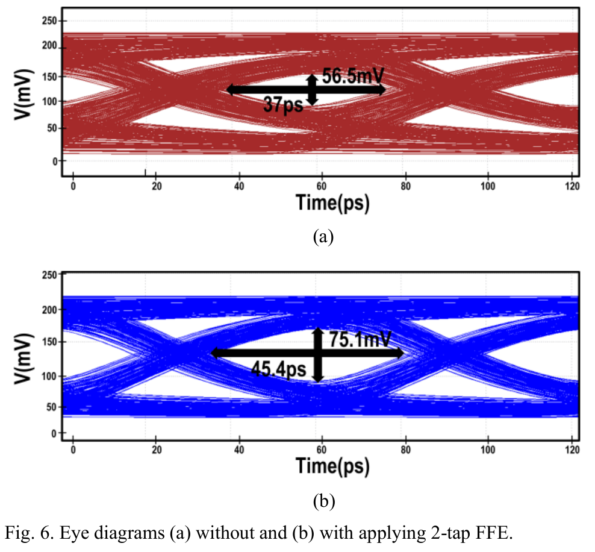
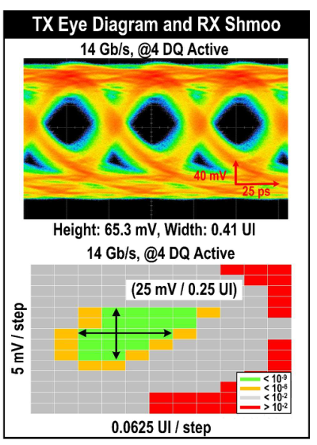
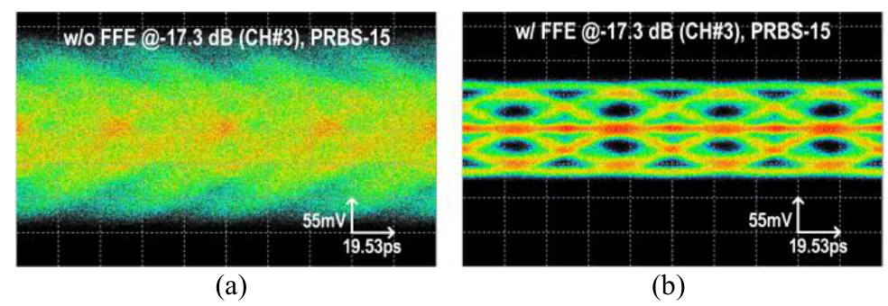
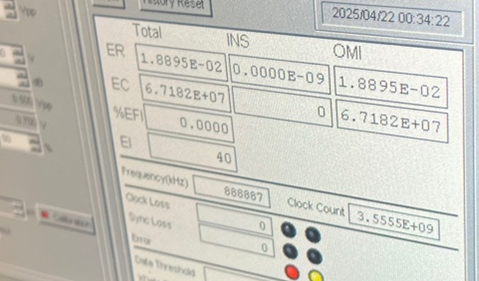
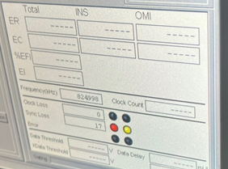

# LPDDR·USB 검증 그림과 해석

<!-- page-navigation:top -->

  
  

<!-- /page-navigation:top -->

[LPDDR](lpddr.md) · [USB PAM-3](usb4-pam3.md) · [장비 활용](measurement-equipment.md)

[PCB·HFSS](pcb-hfss-verification.md) · [LPDDR TX 모델](lpddr-tx-modeling.md) · [LPDDR TX 회로](lpddr-tx-circuit-verification.md) · [USB TX 모델](usb-tx-modeling.md) · [RX CTLE](usb-rx-ctle-modeling.md)

## LPDDR TX: FFE 적용 전후의 시뮬레이션

**조건·관련 논문:** 28-nm TX, 15.6 Gb/s, 내부 전원 1.05 V·드라이버 전원 0.5 V, 8.7-dB 채널 조건. [ICEIC 2025 논문](https://doi.org/10.1109/ICEIC64972.2025.10879746), p. 3 Fig. 6. 위 (a)는 FFE 적용 전, 아래 (b)는 2-tap FFE 적용 후의 **시뮬레이션**입니다.

**TX 시뮬레이션 결과:** Eye 폭 37 → 45.4 ps, 높이 56.5 → 75.1 mV.

## LPDDR Combo PHY: 제작 칩의 Eye와 RX Shmoo

**측정 조건·관련 논문:** 14 Gb/s/pin, 4-DQ 활성. [A-SSCC 2026 Combo PHY 논문](https://epapers2.org/asscc2026/ESR/paper_details.php?paper_id=1141), p. 2 Fig. 5의 TX Eye·RX Shmoo.

**제작 칩 측정 결과:** TX Eye 0.41 UI·65.3 mV, RX Shmoo 마진 0.25 UI·25 mV. [TX 설계·검증과 측정 역할](lpddr.md)

## USB PAM-3: 같은 채널·패턴에서 FFE 효과 확인

**측정 조건·관련 논문:** 32 Gb/s, CH#3, PRBS15, scrambler enabled. 채널 손실은 10.24 GHz에서 17.3 dB입니다. [TVLSI 관련 논문](https://doi.org/10.1109/TVLSI.2026.3701343), p. 7 Fig. 13(a),(b).

**제작 TX 측정 결과:** 왼쪽 FFE off, 오른쪽 FFE on. 동일 CH#3·PRBS15의 상·하단 Eye 비교. [모델링·RTL 검증과 측정 역할](usb4-pam3.md)

FFE 적용 후 상단 Eye는 **11.19 ps·21.16 mV**, 하단 Eye는 **11.67 ps·19.80 mV**입니다. [측정 구성·PRBS15/31 비교·채널별 FFE 설정](pam3-differential-measurement.md)

## AWG 속도 변경: 설정값과 실제 입력을 맞추기

| 샘플레이트 연동 수정 전 | 샘플레이트 연동 수정 후 |
|---|---|
|  |  |

**입력 조건:** 데이터 13.2 Gb/s에 대응하는 825-MHz AUX 입력을 목표로 설정했습니다. 두 화면은 **계측기 입력 주파수 확인** 결과입니다.

BIN 파일 교체 시 목표와 다른 주파수가 관측되어 파일·샘플레이트를 함께 설정하도록 수정했습니다. **검증:** 실제 AWG 출력 주파수. [제어 수정](measurement-equipment.md#awg-파일-전송-이후의-실제-출력까지-확인)

825 MHz와 데이터 속도의 1/16 관계는 이 사례의 설정입니다.

<!-- page-navigation:bottom -->

  
  
  

<!-- /page-navigation:bottom -->
