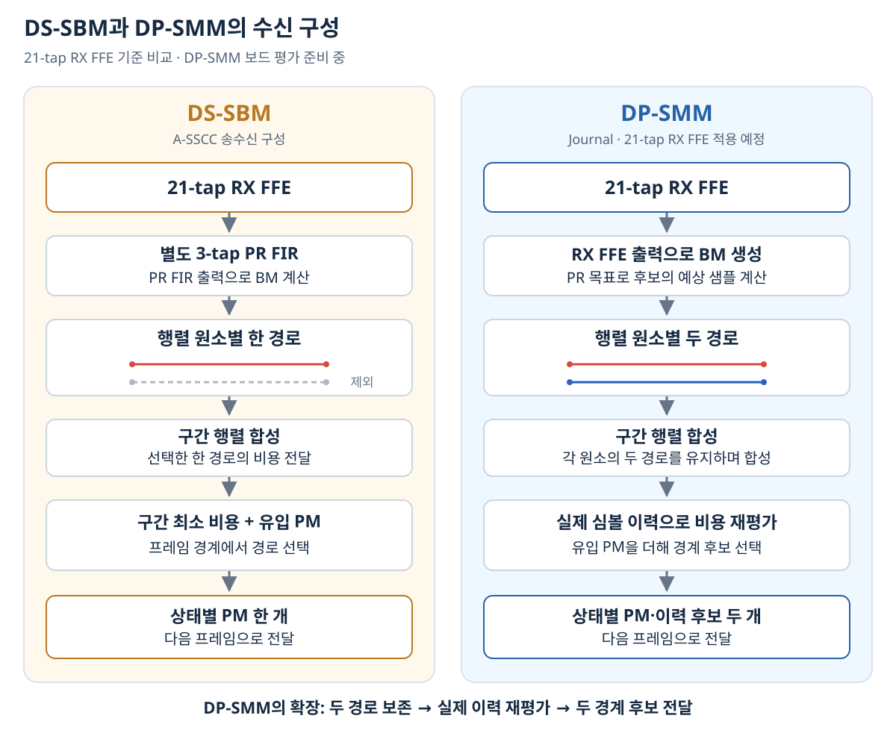
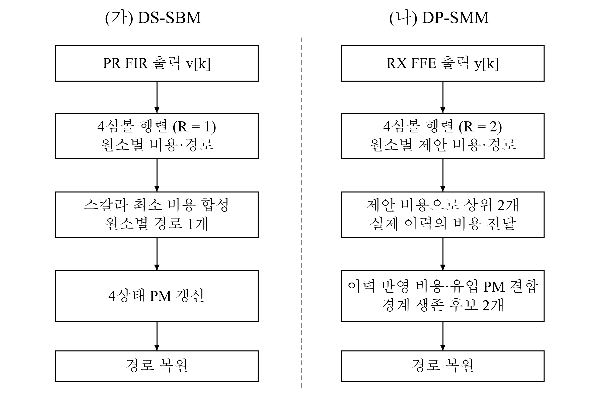

# DS-SBM과 DP-SMM의 구조 비교

<!-- page-navigation:top -->

  
  

<!-- /page-navigation:top -->

[모델·RTL 비교 결과](validation.md) · [DS-SBM 설계 판단](../../zcu208-pam4-dsp-portfolio/docs/design-decisions.md) · [DP-SMM 상세 구조](../../dp-smm-journal/docs/architecture.md)

## 관측 신호와 PR 목표

DS-SBM은 21-tap RX FFE 뒤에 별도 3-tap PR FIR을 두고 그 출력을 관측합니다. DP-SMM도 **21-tap RX FFE**를 사용하는 수신 구성으로 진행하며, FFE 출력을 직접 관측하고 세 탭 PR 목표를 후보 심볼열의 예상 샘플 계산에 사용합니다.

이 차이를 포함한 수신기 전체 비교와, 같은 FFE 출력에서 후보 수만 바꾸는 코어 비교는 평가 대상이 다릅니다.

## 경로 정보를 보존하는 위치

| 항목 | DS-SBM | DP-SMM |
|---|---|---|
| Visible state | 4개 | 4개 |
| 분기·BM 처리 | 상태별 두 survivor branch, 총 8개 전파 | 심볼당 64개 memory-2 BM 가설 생성 |
| 기초 행렬 | 여덟 개의 4심볼 행렬 | 여덟 개의 4심볼 행렬 |
| 원소별 경로 수 R | 최대 1개 | 최대 2개 |
| 상위 합성 | 스칼라 비용의 min-plus 합성 | 제안 비용으로 두 경로 선택·이력 반영 비용 정보 전달 |
| 프레임 경계 PM | visible state별 한 개 | visible state별 두 개, 경계 후보 수 K_H=2 |
| 경로 복원 | 선택된 구간의 복원 정보 이용 | 하위 행렬의 상태·순위 정보를 따라 현재 32심볼 복원 |

DS-SBM의 8개는 선택 후 전파하는 활성 분기 수이고, DP-SMM의 64개는 생성하는 BM 가설 수입니다.

## 동일 조건에서 후보 보존 효과 확인

DP-SMM 코어의 경계 후보 수 K_H=2, BM ROM, 입력 샘플, 초기 상태와 tie-break 규칙을 고정했습니다. 행렬 원소별 경로 수 R만 1과 2로 바꾸어 합성 신호의 오류와 RTL 동작을 비교했습니다.

R=1 비교 코어는 DP-SMM의 PR 처리·BM 생성·경계 후보 수를 유지하면서 행렬 원소별 경로 수만 하나로 제한한 구조입니다. [동일 입력 비교 결과](validation.md)

<!-- page-navigation:bottom -->

  
  
  

<!-- /page-navigation:bottom -->
