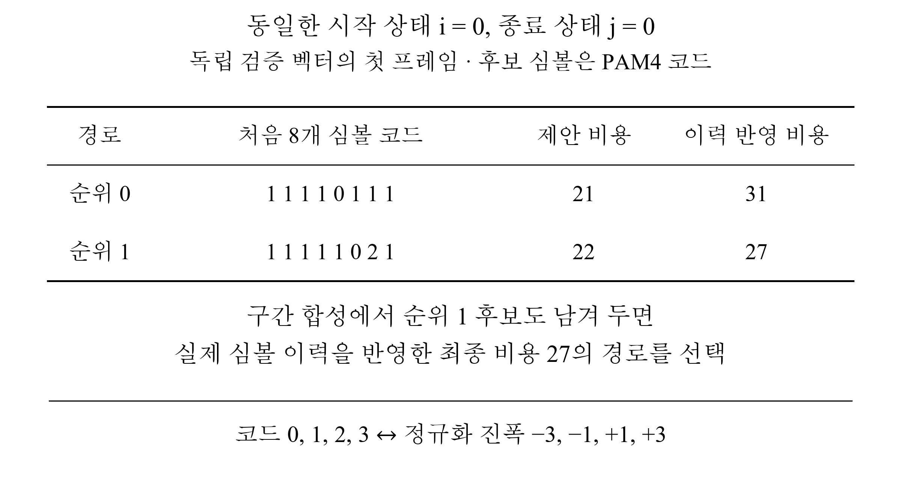

# 학위논문의 구조 비교와 검증 결과

[프로젝트](../README.md) · [DS-SBM·DP-SMM 구조 비교](architecture.md) · [Journal DP-SMM 검증](../../dp-smm-journal/docs/validation.md)

## 동일 입력에서의 후보 보존 효과

DP-SMM의 경계 후보 수 K_H=2를 고정하고, 행렬 원소별 경로 수 R만 바꿨습니다. 두 코어는 BM ROM, 초기 상태와 동률 규칙을 공유합니다. memory-2 응답 A·B, SNR 16·20·24 dB에서 같은 샘플을 입력했습니다.

조건마다 세 난수 시드로 각각 512프레임을 생성하고 초기 16프레임을 제외했습니다. 같은 Gray 매핑으로 비트 오류를 집계했으며, 조건당 평가 비트 수는 **95,232비트**입니다.

| 응답·SNR | R=1 오류 수 | R=1 BER | R=2 오류 수 | R=2 BER |
|---|---:|---:|---:|---:|
| A·16 dB | 1,525 | 1.60×10⁻² | 963 | 1.01×10⁻² |
| A·20 dB | 120 | 1.26×10⁻³ | 11 | 1.16×10⁻⁴ |
| A·24 dB | 2 | 2.10×10⁻⁵ | 0 | 관측 오류 없음 |
| B·16 dB | 679 | 7.13×10⁻³ | 366 | 3.84×10⁻³ |
| B·20 dB | 88 | 9.24×10⁻⁴ | 12 | 1.26×10⁻⁴ |
| B·24 dB | 5 | 5.25×10⁻⁵ | 0 | 관측 오류 없음 |

합성 입력의 16-dB 조건에서 R=2의 오류 수는 R=1보다 응답 A에서 36.9%, B에서 46.1% 감소했습니다. 24 dB에서는 위 평가 비트 범위에서 R=2의 오류가 관측되지 않았습니다.

## 내부 상태와 경로 복원의 RTL 검증

Vivado XSim 2022.2에서 각 코어에 9,728개 고유 입력 프레임을 연속·공백 입력으로 반복해 **19,456프레임씩** 검사했습니다. 공백 입력 반복은 데이터 정렬 시험이며, BER 표본으로 중복 집계하지 않았습니다.

| 검사 | 범위 | 결과 |
|---|---|---|
| BM ROM·구현 BM 계산식 | 512주소 × 64 BM | 일치 |
| 독립 경로 열거 | 1,024개 4심볼 행렬 | 일치 |
| 독립 합성·경계 갱신 | 128프레임·3,072경로 레코드 | 일치 |
| R=1 코어 출력·내부 정보 | 19,456프레임 | PASS |
| R=2 코어 출력·내부 정보 | 19,456프레임 | PASS |
| 연속·공백 입력의 복원 지연 | 두 코어 23클록 | PASS |
| 연속 입력 간격 | 두 코어 II=1 | PASS |
| 처리 중 리셋·재시작 | 초기 상태·복원 출력 | PASS |

출력 32심볼과 함께 제안 비용, 이력 반영 비용, 정규화 PM, 유효 이력과 선택 출처를 대조했습니다. 기대 메트릭 한 비트를 바꾼 대조 시험에서는 첫 프레임의 불일치를 검출했습니다. 8 ns TB 클록의 II=1은 기능 스케줄 검증 결과입니다.

## 두 번째 후보가 최종 선택에 사용된 예

같은 시작·종료 상태에서 제안 비용은 순위 0이 21, 순위 1이 22였습니다. 실제 내부 심볼 이력을 반영하면 비용은 31과 27로 바뀌어 순위 1 경로가 선택됩니다. 이 벡터의 유입 PM은 0이므로, 순위 변화는 내부 이력을 반영한 비용에서 발생합니다. 저장한 선택 정보로 복원한 32심볼은 RTL 출력과 일치했습니다.

## 시스템 측정과 후속 평가

DS-SBM은 추정 손실 41 dB·4 GS/s의 DAC-to-ADC 물리 경로에서 PRBS7 BER < 10⁻⁷·PRBS15 BER < 2×10⁻⁶을 보고했습니다. [DS-SBM 측정 구성·컨투어](../../zcu208-pam4-dsp-portfolio/docs/validation.md)

**DP-SMM 실측은 아직 수행하지 않았습니다.** 학위논문에서는 AWG → XM655 ADC → RX FFE → DP-SMM → PRBS 검사기 경로에서 PRBS7·PRBS15 BER와 PR 등고선을 평가할 예정입니다. 측정용 수신기의 구현 자원·실제 클록·연속 처리율도 해당 빌드로 확인합니다.

Journal 초안의 개정 K=2 코어 검증·구현 집계는 [별도 프로젝트](../../dp-smm-journal/docs/validation.md)에 정리했습니다. 이전 기준 RTL의 사전 회귀는 [부록 기록](baseline-rtl-validation.md)에 남겼습니다.
