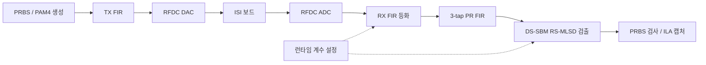
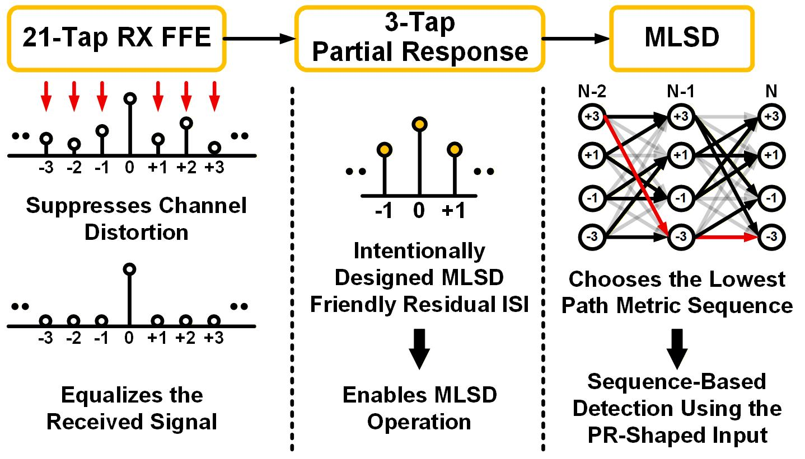

# A-SSCC 2026 | DS-SBM 기반 PAM4 송수신 DSP 설계·검증

[첫 화면](../../README.md) · [설계 구조](docs/architecture.md) · [MLSD 설계 판단](docs/design-decisions.md) · [Vitis·FPGA 구동](docs/vitis-bringup.md) · [측정·구현 결과](docs/validation.md)

ZCU208 RFSoC의 4-GS/s 설정 ADC·DAC에 **[32-lane 병렬 DSP](docs/architecture.md)**를 연결했습니다. TX FIR, RX 21-tap FIR와 [DS-SBM RS-MLSD](docs/design-decisions.md)를 구현하고, [런타임 계수 제어](docs/vitis-bringup.md#계수-적용과-캡처-수집)·PRBS 검사·ILA 디버깅 경로를 통합했습니다.

DS-SBM 검출기 구조와 RFSoC 시스템의 [BER·자원·타이밍 결과](docs/validation.md)를 정리했습니다. 후속 DP-SMM 설계는 [Journal 준비 프로젝트](../dp-smm-journal/), 두 구조의 비교는 [학위논문](../pam4-mlsd-thesis/)에서 다룹니다.

## 설계·구현

| 영역 | 구현 |
|---|---|
| 병렬 데이터 경로 | 32-lane 연산, 고정소수점·파이프라인, 데이터·valid 지연 정렬 |
| 채널 보상 | TX 8-tap FIR, RX 21-tap FIR, Q 형식·포화 연산 |
| MLSD | DS-SBM RS-MLSD, 구간별 메트릭 결합·경로 복원 |
| 보드 통합 | RFDC·FIFO, BRAM 계수 로더, GPIO 제어, PRBS 검사·ILA |
| PS 제어 | Vitis A53 Standalone 앱, CLK104·RFDC 초기화, 계수 commit·캡처 수집 |

## 송수신 경로

측정 파형은 **ISI 보드를 통과한 신호를 ADC로 캡처한 결과**입니다. 캡처 재생·통계 분석의 입력과 계산 조건은 [측정·검증 결과](docs/validation.md)에 표시했습니다.

## RX FFE와 PR 필터의 역할

RX FFE로 채널 왜곡을 보상한 뒤, 별도 3-tap PR 필터로 MLSD에 사용할 잔류 ISI 응답을 만듭니다. 채널 등화 계수와 PR 계수를 독립적으로 바꾸면서 검출 성능을 평가하도록 구성했습니다. [전체 설계 구조](docs/architecture.md)

## Vitis 기반 보드 구동

Vivado에서 내보낸 XSA를 Vitis의 Cortex-A53 Standalone 앱과 연결했습니다. JTAG 로드 순서를 구성하고, PS에서 CLK104·RFDC 초기화와 RX 계수 쓰기·commit을 제어하도록 통합했습니다. 수신 디버그 데이터는 BRAM에서 읽어 UART CSV로 수집합니다. [구동 순서·PS–PL 제어 경로](docs/vitis-bringup.md)

## 시스템 측정·FPGA 구현 결과

| 항목 | 결과 | 조건·출처 |
|---|---|---|
| RFSoC 시스템 BER | PRBS7 < 10⁻⁷·PRBS15 < 2×10⁻⁶ | A-SSCC 2026 Fig. 5, 41-dB 손실·ISI 보드 측정 |
| 전체 TRX 자원 | LUT 189,108·FF 188,846·DSP 950·BRAM 24.5 | 2026-06-14 placed 요약, 논문 반올림 수치와 일치 |
| FPGA 타이밍 | WNS +0.083 ns·WHS +0.010 ns·TNS/THS 0 | 2026-06-29 post-route physopt 보고서 |

[상세 결과·검증 조건](docs/validation.md)

## 관련 논문

[A-SSCC 2026 — FPGA-Verified PAM4 Transceiver with DS-SBM RS-MLSD](https://epapers2.org/asscc2026/ESR/paper_details.php?paper_id=1351), 채택·발표 예정(2026-10-07 기준).

[학위논문 비교 연구 (진행 중)](../pam4-mlsd-thesis/) · [Journal DP-SMM](../dp-smm-journal/) · [전체 논문](../../docs/publications.md)

**도구:** Verilog / SystemVerilog · Vivado·Vitis 2022.2 · XSim · ZCU208 RFSoC · Python
