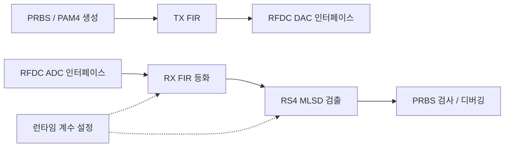

# ZCU208 기반 PAM4 송수신 DSP 설계·검증

**고속 신호의 왜곡을 보상하고 데이터를 복원하는 디지털 회로를 설계한 FPGA 프로젝트입니다.**
4 GS/s로 설정한 ZCU208 RFSoC의 ADC·DAC 입출력에 32-lane 병렬 DSP를 연결하고, 송수신 FIR 필터와 PAM4 MLSD 검출기, PRBS 오류 검사 및 디버깅 경로를 구성했습니다. 알고리즘을 RTL로 구현하는 과정부터 시뮬레이션과 FPGA 구현 보고서 분석까지 살펴볼 수 있습니다.

## 프로젝트에서 다룬 문제와 구현

| 설계 과제 | 구현 내용 | 확인할 수 있는 역량 |
|---|---|---|
| 고속 데이터의 병렬 처리 | 32-lane 데이터 경로와 파이프라인 구성 | RTL 구조 설계, 데이터·지연 정렬 |
| 채널 왜곡 보상과 데이터 복원 | TX FIR, RX 21-tap FIR, PAM4 reduced-state MLSD | 고정소수점 신호처리의 하드웨어 구현 |
| 보드 통합 및 오류 분석 | RFDC 인터페이스, 계수 로더, PRBS 검사, ILA 디버깅 경로 | 인터페이스 통합과 검증 구조 설계 |
| 구조 변경 후 기능 확인 | 기준 FIR과 변경 FIR의 지연을 맞춘 출력 비교 | 테스트벤치 작성과 정합성 검증 |

## 검증 자료

- **FIR 테스트 3종 PASS:** 이 폴더에 담긴 RTL과 기존 테스트벤치를 Vivado XSim 2022.2에서 2026-09-09 다시 실행했습니다. [실행 결과](reports/fir_validation_20260909.json)
- **FPGA 구현 이력:** 2026-06-29의 기존 post-route physopt 보고서에서 WNS **+0.083 ns**, TNS **0.000 ns**를 확인했습니다. 해당 실행의 적용된 타이밍 제약을 만족한 결과이며, 현재 소스 복사본을 새로 합성·배치배선한 결과는 아닙니다. [검증 범위와 수치](docs/validation.md)
- **보드 검증 지원:** ADC/ILA 캡처와 재생 시뮬레이션을 위한 원 프로젝트의 인터페이스·디버깅 구조를 소스에서 확인할 수 있습니다. 이 공개 묶음에 최종 실측 BER 성과를 부여하지 않습니다.

## 구성

논리적 데이터 흐름을 요약한 그림입니다. ADC·DAC 사이의 실제 측정 배선은 실험 구성에 따라 달라집니다.

## 자료 보기

- [설계 구조와 대표 소스 안내](docs/architecture.md)
- [검증 결과·환경·해석 범위](docs/validation.md)
- [RTL 소스 26개](rtl/) · [기존 FIR 테스트벤치 3개](tb/)
- [FIR 시뮬레이션 재현 방법](docs/reproduce.md)
- [원본과의 SHA-256 대조 목록](reports/source_manifest.json)

**공개 범위:** 원 Vivado 프로젝트에서 선별한 RTL·테스트벤치·구현 보고서와 설명입니다. RFDC 등 AMD/Xilinx IP의 생성물, 전체 Vivado 프로젝트, 비트스트림, 원시 측정 데이터는 포함하지 않습니다. 따라서 이 폴더만으로 전체 보드 프로젝트를 재구성하거나 실측을 재현할 수는 없습니다.

도구: **Verilog / SystemVerilog · Vivado 2022.2 · XSim · ZCU208 RFSoC · Python**
