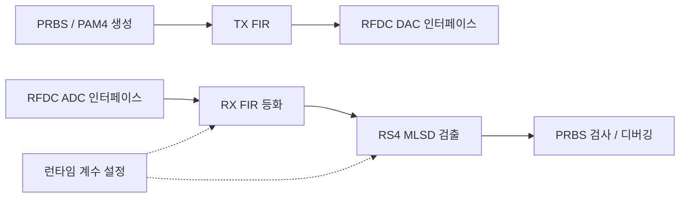

# ZCU208 기반 PAM4 송수신 DSP 설계·검증

**고속 신호의 왜곡을 보상하고 데이터를 복원하는 디지털 회로를 설계한 FPGA 프로젝트입니다.**
4 GS/s로 설정한 ZCU208 RFSoC의 ADC·DAC 입출력에 32-lane 병렬 DSP를 연결하고, 송수신 FIR 필터와 PAM4 MLSD 검출기, PRBS 오류 검사 및 디버깅 경로를 구성했습니다. 알고리즘을 RTL로 구현하는 과정부터 시뮬레이션과 FPGA 구현 보고서 분석까지 살펴볼 수 있습니다.

## 프로젝트에서 다룬 문제와 구현

| 설계 과제 | 구현 내용 | 확인할 수 있는 역량 |
|---|---|---|
| 고속 데이터의 병렬 처리 | 32-lane 데이터 경로와 파이프라인 구성 | RTL 구조 설계, 데이터·지연 정렬 |
| 채널 왜곡 보상과 데이터 복원 | TX FIR, RX 21-tap FIR, PAM4 reduced-state MLSD | 고정소수점 신호처리의 하드웨어 구현 |
| 보드 통합 및 오류 분석 | RFDC 인터페이스, 계수 로더, PRBS 검사, ILA 디버깅 경로 | 인터페이스 통합과 검증 구조 설계 |
| 구조 변경 후 기능 확인 | 기준 FIR과 변경 FIR의 지연을 맞춘 출력 비교 | 테스트벤치 작성과 정합성 검증 |

## MLSD·RTL 설계

메트릭 계산, 32-lane 변환 결합, 경로 복원을 나누어 구현한 소스를 [설계 구조와 대표 RTL 안내](docs/architecture.md)에서 확인할 수 있습니다. 이 공개본의 branch 후보 유지 방식과 후속 Rank-2 연구의 구분도 해당 문서에 설명합니다.

[설계 판단](docs/design-decisions.md)은 잔여 ISI를 검출에 활용한 이유와 ACS 의존성을 분할·행렬 결합으로 다룬 과정을 설명합니다. [최소 실행 예제](examples/mlsd_minimal/)에서는 합성 입력·독립 기준값·고정소수점 조건과 실제 메트릭 RTL의 출력으로 심볼을 복원하는 절차를 제공합니다.

## FPGA 구현·보드 구동

RTL의 출력이 맞더라도 보드에서 데이터를 얻으려면 RFDC와 병렬 데이터 경로의 클록·리셋·유효 신호, 런타임 설정이 함께 맞아야 합니다. [Vivado 구현·JTAG 다운로드](docs/fpga-bringup.md)와 [Vitis·PS 제어·초기화](docs/vitis-bringup.md)는 하드웨어 구현부터 제어 앱 실행까지 연결해 설명합니다.

- Vivado 프로젝트·BD·제약·IP와 합성·배치배선 결과의 관계
- 비트스트림과 ILA probes 파일의 준비, Hardware Manager의 JTAG 다운로드
- XSA 기반 Vitis 플랫폼·Standalone 앱, A53 실행과 CLK104·RFDC 초기화
- RFDC·제어 설정 이후 데이터 유효 신호·계수 반영·PRBS 검사 확인

2026-10-07 원 프로젝트의 `.bit`, `.ltx`, `.xsa` 등 파일 존재와 해시를 기록했습니다. 이 확인에서 합성·배치배선이나 보드 다운로드를 다시 실행하지 않았습니다. [산출물 확인 기록](reports/fpga_artifact_inventory_20261007.json)

Vitis 앱 소스·ELF·FSBL·PMUFW와 로드 순서도 별도로 검토했습니다. Vitis의 bitstream은 XSA 내부 파일과 일치하지만 위 Vivado `impl_1`의 bitstream과는 해시가 달라, 실행 파일 조합과 검증 범위를 [Vitis 확인 기록](reports/vitis_artifact_inventory_20261007.json)에 구분했습니다.

## 검증 자료

- **관련 연구 논문:** [A-SSCC 2026 — FPGA-Verified PAM4 Transceiver with DS-SBM RS-MLSD](https://epapers2.org/asscc2026/ESR/paper_details.php?paper_id=1351), 채택·발표 예정(2026-10-07 공식 정보). 논문에 보고한 시스템 검증과 이 공개본의 검증 범위는 [논문과 공개 소스의 관계](docs/architecture.md#관련-논문과-공개-소스의-관계)에 설명합니다.
- **FIR 테스트 3종 PASS:** 이 폴더에 담긴 RTL과 기존 테스트벤치를 Vivado XSim 2022.2에서 2026-09-09 다시 실행했습니다. [실행 결과](reports/fir_validation_20260909.json)
- **MLSD 메트릭 모듈 PASS:** 2026-10-07 두 합성 벡터에서 branch 산술·8심볼 min-plus 결합을 확인하고 실제 RTL 행렬의 Python traceback으로 각 512개 레벨을 복원했습니다. 전체 어댑터 테스트는 출력 불일치로 FAIL이며, [결과·실패 재현](examples/mlsd_minimal/)을 함께 제공합니다.
- **FPGA 구현 이력:** 2026-06-29의 기존 post-route physopt 보고서에서 WNS **+0.083 ns**, TNS **0.000 ns**를 확인했습니다. 해당 실행의 적용된 타이밍 제약을 만족한 결과이며, 현재 소스 복사본을 새로 합성·배치배선한 결과는 아닙니다. [검증 범위와 수치](docs/validation.md)
- **보드 검증 지원:** ADC/ILA 캡처와 재생 시뮬레이션을 위한 원 프로젝트의 인터페이스·디버깅 구조를 소스에서 확인할 수 있습니다. 논문 버전의 시스템 측정과 공개 RTL의 보드 BER 재현 범위는 [검증 문서](docs/validation.md#관련-논문의-시스템-검증)에 설명했습니다.

## 구성

논리적 데이터 흐름을 요약한 그림입니다. ADC·DAC 사이의 실제 측정 배선은 실험 구성에 따라 달라집니다.

## 자료 보기

- [설계 구조와 대표 소스 안내](docs/architecture.md)
- [잔여 ISI·후보 보존·병렬화의 설계 판단](docs/design-decisions.md)
- [FPGA 구현·JTAG 다운로드·초기 동작 확인](docs/fpga-bringup.md)
- [검증 결과·환경·해석 범위](docs/validation.md)
- [전체 연구 성과 논문](../../docs/publications.md)
- [원본 RTL 소스 26개](rtl/) · [기존 FIR TB 3개와 추가 MLSD TB 2개](tb/)
- [FIR 시뮬레이션 재현 방법](docs/reproduce.md)
- [MLSD 메트릭 예제·전체 어댑터 회귀 테스트](examples/mlsd_minimal/)
- [원본과의 SHA-256 대조 목록](reports/source_manifest.json)

**공개 범위:** 원 Vivado 프로젝트에서 선별한 RTL·테스트벤치·구현 보고서와 설명입니다. RFDC 등 AMD/Xilinx IP의 생성물, 전체 Vivado 프로젝트, 비트스트림, 원시 측정 데이터는 포함하지 않습니다. 따라서 이 폴더만으로 전체 보드 프로젝트를 재구성하거나 실측을 재현할 수는 없습니다.

도구: **Verilog / SystemVerilog · Vivado 2022.2 · XSim · ZCU208 RFSoC · Python**
