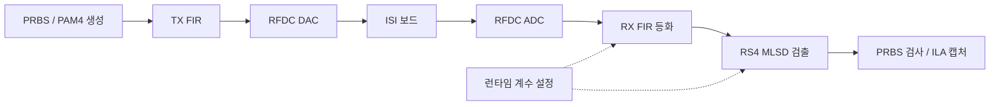

# ZCU208 기반 PAM4 송수신 DSP 설계·검증

ZCU208 RFSoC의 4-GS/s 설정 ADC·DAC에 **32-lane 병렬 DSP**를 연결했습니다. TX FIR, RX 21-tap FIR와 reduced-state MLSD를 구현하고, 런타임 계수 제어·PRBS 검사·ILA 디버깅 경로를 통합했습니다.

## 설계·구현

| 영역 | 구현 |
|---|---|
| 병렬 데이터 경로 | 32-lane 연산, 고정소수점·파이프라인, 데이터·valid 지연 정렬 |
| 채널 보상 | TX 8-tap FIR, RX 21-tap FIR, Q 형식·포화 연산 |
| MLSD | 8-lane 메트릭 타일, min-plus 변환 결합, 경로 복원 |
| 보드 통합 | RFDC·FIFO, BRAM 계수 로더, GPIO 제어, PRBS 검사·ILA |
| PS 제어 | Vitis A53 Standalone 앱, CLK104·RFDC 초기화, 계수 commit·캡처 수집 |

[설계 구조](docs/architecture.md) · [MLSD 설계 판단](docs/design-decisions.md)

## 송수신 경로

측정 파형은 **ISI 보드를 통과한 신호를 ADC로 캡처한 결과**입니다. 캡처 재생·통계 분석의 입력과 계산 조건은 [측정·검증 결과](docs/validation.md)에 표시했습니다.

## 결과

| 항목 | 결과 | 조건·출처 |
|---|---|---|
| RFSoC 시스템 BER | PRBS7 < 10⁻⁷·PRBS15 < 2×10⁻⁶ | A-SSCC 2026 Fig. 5, 41-dB 손실·ISI 보드 측정 |
| 전체 TRX 자원 | LUT 189,108·FF 188,846·DSP 950·BRAM 24.5 | 2026-06-14 placed 요약, 논문 반올림 수치와 일치 |
| 기존 FPGA 타이밍 | WNS +0.083 ns·WHS +0.010 ns·TNS/THS 0 | 2026-06-29 post-route physopt 보고서 |
| FIR 테스트 3종 | PASS | 2026-09-09, Vivado XSim 2022.2 |
| MLSD 메트릭 | 두 조건 PASS, 각각 512레벨 복원 | 2026-10-07, 합성 입력·RTL 행렬·Python traceback |
| 전체 MLSD 어댑터 | 두 조건 FAIL | 2026-10-07, 첫 검사 word lane 1 기대 32 / 실제 −32 |

[상세 결과·검증 조건](docs/validation.md)

## 관련 논문

[A-SSCC 2026 — FPGA-Verified PAM4 Transceiver with DS-SBM RS-MLSD](https://epapers2.org/asscc2026/ESR/paper_details.php?paper_id=1351), 채택·발표 예정(2026-10-07 기준).

[논문·RTL 버전](docs/architecture.md#논문rtl-버전) · [전체 논문](../../docs/publications.md)

**도구:** Verilog / SystemVerilog · Vivado 2022.2 · XSim · ZCU208 RFSoC · Python
