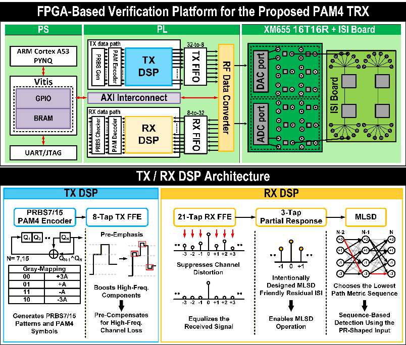

# A-SSCC DS-SBM PAM4 DSP 설계 구조

<!-- page-navigation:top -->

  
  

<!-- /page-navigation:top -->

[MLSD 설계 판단](design-decisions.md) · [Vitis·FPGA 구동](vitis-bringup.md) · [측정·검증 결과](validation.md)

## 논문 전체 구조

A-SSCC 2026, p. 2 Fig. 2. [논문 정보](https://epapers2.org/asscc2026/ESR/paper_details.php?paper_id=1351)

상단은 PS 제어, PL의 TX·RX 데이터 경로, RF Data Converter와 ISI 보드의 연결을 보여줍니다. 하단의 송신 DSP는 PRBS7/15·PAM4 인코더와 8-tap TX FFE로 구성됩니다. 수신 DSP는 21-tap RX FFE → 3-tap partial response → DS-SBM RS-MLSD 순서로 채널 왜곡을 보상하고 심볼을 복원합니다.

## 병렬 데이터 경로

ZCU208의 XCZU48DR-FSVG1517-2-E에서 ADC·DAC를 각각 4 GS/s로 설정했습니다. 기존 구현 보고서의 ADC 클록은 125 MHz, DAC 클록은 500 MHz입니다. ADC 병렬 경로의 설계 처리량은 **32 samples × 125 MHz = 4 Gsamples/s**입니다.

| 블록 | 역할 | 설계 항목 |
|---|---|---|
| PRBS·PAM4 생성 | 송신 패턴·심볼 레벨 생성 | 병렬 패턴 순서·레벨 매핑 |
| TX FIR | 송신 파형 보상 | 8-tap 고정소수점 연산·파이프라인 |
| RFDC·FIFO | DAC 송신·ADC 수신과 병렬 데이터 연결 | valid·ready·레인 순서 |
| RX FIR | 수신 채널 등화 | 21-tap·포화 연산·지연 정렬 |
| 메트릭 계산 | 심볼 후보의 거리·상태 변환 계산 | 논문의 네 visible state·상태별 두 survivor branch |
| min-plus 결합 | 구간별 상태 변환 연결 | 논문의 8개 4-symbol 구간·계층적 결합 |
| 경로 복원 | 상태 이력으로 수신 심볼 결정 | metric·survivor·valid 정렬 |
| 런타임 제어 | FIR·검출기 설정 적용 | BRAM 계수 로딩·GPIO·PS 제어 |
| PRBS·ILA | 데이터·오류·내부 상태 관측 | lock 이후 오류 집계·캡처 |

## DS-SBM 메트릭

논문의 DS-SBM RS-MLSD는 네 visible state와 상태별 두 survivor branch를 사용합니다. 구간별 branch metric 행렬을 계층적으로 결합해 심볼 간 ACS 의존성을 다룹니다. [후보 보존·행렬 결합의 설계 판단](design-decisions.md)

[관련 논문](https://epapers2.org/asscc2026/ESR/paper_details.php?paper_id=1351) · [검증 결과](validation.md)

<!-- page-navigation:bottom -->

  
  
  

<!-- /page-navigation:bottom -->
