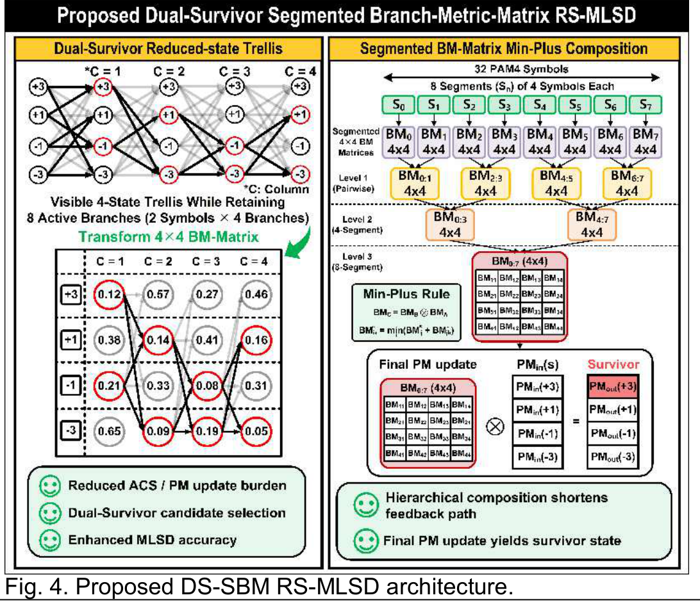

# MLSD를 병렬 RTL로 구현하기 위한 설계 판단

[프로젝트 요약](../README.md) · [설계 구조](architecture.md) · [검증 결과](validation.md) · [관련 논문](https://epapers2.org/asscc2026/ESR/paper_details.php?paper_id=1351)

## 등화 이후 남은 ISI를 검출에 활용

채널 손실을 보상해도 이전 심볼의 영향이 남으면 같은 수신 레벨을 여러 심볼 조합으로 설명할 수 있습니다. 한 샘플의 크기만으로 판단하는 slicer에 비해, 연속된 심볼의 예상 응답을 비교하는 MLSD는 이 정보를 판정에 활용할 수 있습니다. DSP 기반 송수신기 연구에서는 RX FFE와 3-tap partial-response(PR) 구성을 이용해 잔여 ISI를 다루고, 그 응답에 맞는 시퀀스를 검출하는 구조를 연구했습니다.

검출기가 사용하는 기대 샘플은 다음과 같이 표현할 수 있습니다.

$$\hat y_k = g_0 a_k + g_1 a_{k-1} + g_2 a_{k-2},\qquad BM_k = d(y_k,\hat y_k).$$

여기서 계수는 검출기 입력에서의 유효 응답을 설명합니다. 물리 채널의 손실 수치와는 다른 값입니다. 거리 함수와 고정소수점 표현도 구현 조건의 일부입니다. L1 메트릭을 사용한 10월 RTL 검사는 [학위논문 검증 결과](../../pam4-mlsd-thesis/docs/validation.md)에 정리했습니다.

## 상태 수를 줄이되 유력한 후보를 보존

Memory-2 PAM4를 전체 상태로 표현하면 이전 심볼 두 개의 조합으로 16개 상태가 필요합니다. 상태·분기를 모두 유지하면 연산량뿐 아니라 survivor 정보를 저장하고 전달하는 비용도 커집니다. A-SSCC 논문의 DS-SBM RS-MLSD는 네 개의 visible state와 상태별 두 survivor branch를 이용해 유력한 후보를 남기는 방향을 제안합니다.

후보 수를 줄이면 연산·survivor 저장 비용이 감소합니다. 검출 품질은 채널 조건별 오류 관측으로 평가합니다. 논문은 8 active branches/symbol을 사용합니다.

## ACS의 심볼 간 의존성을 분할·행렬 결합으로 다루기

심볼마다 이전 path metric을 받아 다음 metric을 갱신하는 ACS에는 순차적인 의존성이 있습니다. 한 클록에 여러 심볼을 처리하려고 이 연산을 단순히 이어 붙이면 조합 경로가 길어집니다. 논문은 구간의 branch metric을 행렬로 표현하고, 구간별 계산을 계층적으로 결합하는 방식을 사용합니다.

행을 도착 상태, 열을 시작 상태로 정의하면 뒤 구간 B와 앞 구간 A의 결합은 다음과 같습니다.

$$M_{B:A}[d,s] = \min_m\{M_B[d,m]+M_A[m,s]\}.$$

구간 내부 계산과 구간 사이의 결합을 나누면 RTL의 병렬 계산·파이프라인 경계를 정할 수 있습니다. 최종 path metric 갱신, survivor 선택과 이력 처리는 여전히 필요하며, 분할 구조와 함께 데이터·valid·trace 정보의 지연을 맞춰야 합니다.

출처: A-SSCC 2026, p. 2 Fig. 4. [논문 구조](https://epapers2.org/asscc2026/ESR/paper_details.php?paper_id=1351)

## 자원·정확도·지연을 함께 판단

| 설계 선택 | 해결하려는 제약 | 함께 확인할 항목 |
|---|---|---|
| Reduced-state와 후보 보존 | 전체 상태·분기의 연산·저장 비용 | 후보 제거가 오류 성능에 미치는 영향, 이력의 정의 |
| 구간별 메트릭과 min-plus 결합 | 심볼별 ACS 의존성과 긴 조합 경로 | 구간 경계의 상태 연결, metric·survivor 전달 |
| 고정소수점·파이프라인 | 자원 비용과 클록 주기 | 양자화·포화, 데이터와 valid의 정렬, 입력–출력 지연 |

**논문 detector 비교:** RS-ACS 대비 LUT 35.7%·FF 22.5% 감소. [구조·버전](architecture.md#논문rtl-버전)

## 학위논문 프로젝트의 기준 RTL

2026-09-09 RTL의 구간·후보 유지 방식과 10월 추가 검증은 [학위논문 프로젝트](../../pam4-mlsd-thesis/)에서 다룹니다. [논문·RTL 구조 비교](../../pam4-mlsd-thesis/docs/architecture.md)

[RTL 구조](architecture.md) · [검증 결과](validation.md)
