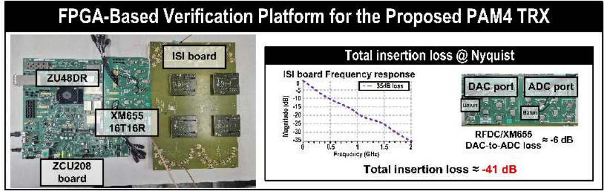
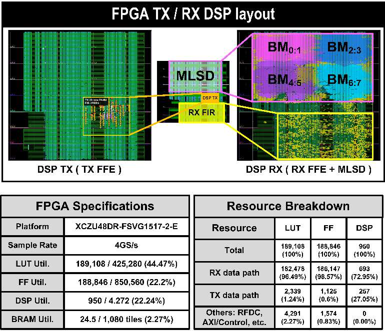
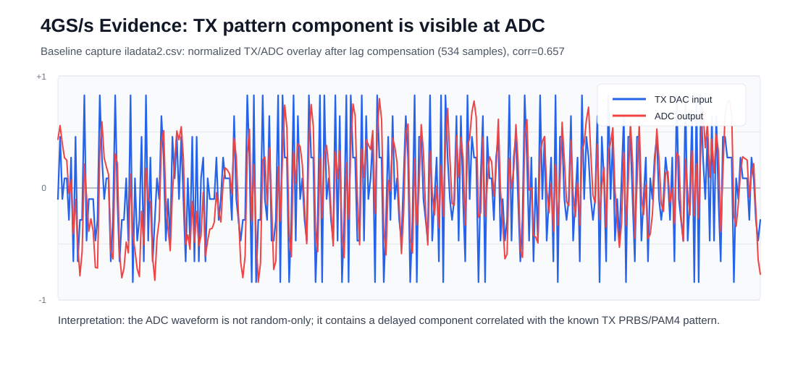
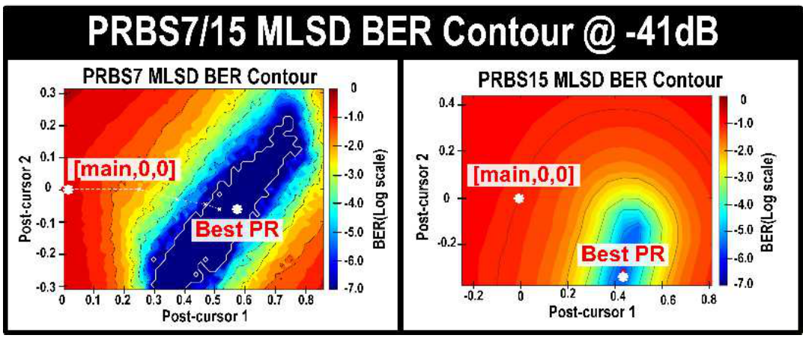

# A-SSCC DS-SBM PAM4 DSP 측정·검증 결과

<!-- page-navigation:top -->

  
  

<!-- /page-navigation:top -->

[설계 구조](architecture.md) · [MLSD 설계 판단](design-decisions.md) · [보드 초기화·제어 (Vitis)](vitis-bringup.md) · [논문](../../../docs/publications.md)

기준일: **2026-10-07**.

## ISI 보드를 통한 RFSoC 측정

측정 신호 경로는 **ZCU208 DAC → ISI 보드 → ADC 캡처**입니다.

A-SSCC 2026, p. 2 Fig. 6 상단. 왼쪽은 ZCU208·XM655와 ISI 보드의 실제 측정 구성, 오른쪽은 ISI 보드와 DAC–ADC 경로를 포함한 약 41-dB 손실 조건입니다. [논문 정보](https://epapers2.org/asscc2026/ESR/paper_details.php?paper_id=1351)

| 항목 | 결과 | 출처 |
|---|---|---|
| 채널 손실 | 41 dB | A-SSCC 2026, p. 2 Fig. 5 |
| PRBS7 BER | < 10⁻⁷ | 동일 그림의 RFSoC 시스템 결과 |
| PRBS15 BER | < 2×10⁻⁶ | 동일 그림의 RFSoC 시스템 결과 |

[논문 공식 정보](https://epapers2.org/asscc2026/ESR/paper_details.php?paper_id=1351)

## FPGA 자원·타이밍

A-SSCC 2026, p. 3 Fig. 7. 상단은 TX FFE와 RX FFE·MLSD의 배치, 하단은 전체 자원 사용량과 경로별 구성입니다. RX 데이터 경로가 전체 LUT의 96.49%·FF의 98.57%를 차지합니다. [논문 정보](https://epapers2.org/asscc2026/ESR/paper_details.php?paper_id=1351)

전체 TRX의 FPGA 자원입니다. 논문 집계의 구현 단계는 2026-06-14 배치(placed) 결과입니다.

| LUT | FF | DSP | BRAM tiles |
|---:|---:|---:|---:|
| 189,108 | 188,846 | 950 | 24.5 |

TX·RX FFE와 PR 필터를 전치형 FIR로 구현해, 직접형 FIR 대비 LUT 79.93%·CARRY8 70.96%를 줄였습니다. [관련 논문](https://epapers2.org/asscc2026/ESR/paper_details.php?paper_id=1351)

2026-06-29 배치배선 후 최적화(post-route physopt) 보고서의 타이밍 결과입니다.

| 항목 | 값 | 단계 |
|---|---:|---|
| Setup WNS / TNS | +0.083 ns / 0 ns | Post-route physopt |
| Hold WHS / THS | +0.010 ns / 0 ns | Post-route physopt |
| Fully routed / routable nets | 419,666 / 419,666 | Route status |
| Routing errors | 0 | Route status |

2026-06-29 구현 보고서의 자원 집계

| 자원 | 값 | 단계 |
|---|---:|---|
| LUT / FF | 204,436 / 217,999 | Placed utilization |
| DSP / BRAM tiles | 940 / 24.5 | Placed utilization |

## ADC 캡처 파형·채널 응답

TX–ADC 파형 비교와 SBR·TX FFE 후보 분석

2026-06-10 RFDC ILA에서 DAC 입력과 ADC 출력을 비교했습니다. 두 slot의 valid/ready는 각각 1,024/1,024였고, ADC peak는 5,700 counts(약 17.4% FS)였습니다. 지연을 맞춘 TX–ADC 정규화 상관계수는 0.657, 지연은 534샘플입니다.

**분석 조건:** 2026-06-10 RFDC ILA 캡처의 지연 보상·정규화 비교.

2026-06-11 SBR 캡처는 256개 펄스 중 240개 유효 창을 사용했습니다. baseline은 −544 counts, 주응답은 baseline 대비 약 6,782 counts였고, 주응답으로 정규화한 이전·다음 응답은 0.559·0.744였습니다. 인접 심볼에 걸친 ISI를 관측했습니다.

| TX FFE 후보 캡처 | 값 |
|---|---:|
| ADC peak | 5,884 counts, 약 18.0% FS |
| TX–ADC 상관계수 | 0.731 |
| 최소제곱 채널 적합 상관계수 | 0.932 |
| TX rail hit 비율 | 9.41% |
| EQ 출력 범위 | −74 ~ +96 |

**분석 조건:** 2026-06-11 SBR·TX FFE 후보 캡처의 채널 적합 결과.

## ADC 캡처 재생·통계 분석

저장 ADC 입력의 PRBS7 시뮬레이션 재생

### PRBS7 캡처 재생

2026-06-13 저장 ADC 입력을 시뮬레이션에서 재생했습니다. 각 경로에 1,024프레임을 입력했고 유효 출력 행은 1,023개였습니다. PR 계수는 [256, 140, 0], 레벨은 [−22, −7, 7, 22], 임계값은 [−14, 0, 14]입니다.

| 경로 | Checker lock | 평가 비트 | 오류 | BER |
|---|---:|---:|---:|---:|
| EQ-only | 0 | 0 | 0 | 평가 미성립 |
| MLSD | 1 | 64,384 | 794 | 0.0123323 |

**출처:** 2026-06-13 캡처 재생 결과. 관측 비트 65,536개 중 lock 이후 64,384개를 BER 분모로 사용했습니다.

### 21-tap FFE·3-tap PR 통계 컨투어

A-SSCC 2026, p. 2 Fig. 5. 21-tap RX FFE와 3-tap PR 조건에서 PR 계수에 따른 PRBS7·PRBS15의 BER 분포를 보여줍니다. [논문 정보](https://epapers2.org/asscc2026/ESR/paper_details.php?paper_id=1351)

EQ 잔차 통계로 계산한 기대 BER·분석 조건

2026-06-14 분석은 EQ 잔차의 평균·표준편차와 심볼 문맥별 횟수로 기대 BER를 계산했습니다. PRBS7은 ADC 캡처 입력, PRBS15는 IL40-dB 등가 입력에 결정적 AWGN을 더한 SNR 22-dB 조건입니다.

| 항목 | PRBS7 | PRBS15 |
|---|---:|---:|
| 최적 PR 계수 | [256, 148, −16] | [256, 112, −80] |
| 정규화된 post1, post2 | (0.578125, −0.0625) | (0.4375, −0.3125) |
| 기대 BER | 5.071389105066×10⁻¹² | 2.243856315445×10⁻⁶ |
| 10⁷비트 기준 기대 오류 | 0.000050714 | 22.438563154 |
| 10⁷비트 기준 표시 | 10⁻⁷ 하한 | 2.2×10⁻⁶ |

기대 오류는 계산한 BER에 평가 비트 수를 곱한 값입니다. 표의 10⁷비트 기준 표시는 기대 BER에 10⁻⁷의 표시 하한을 적용했습니다.

## 관련 연구

[학위논문 DS-SBM·DP-SMM 비교 (진행 중)](https://github.com/yunjuhyeong0916-glitch/pam4-mlsd-research/blob/main/projects/pam4-mlsd-thesis/README.md) · [Journal DP-SMM 설계·검증](https://github.com/yunjuhyeong0916-glitch/pam4-mlsd-research/blob/main/projects/dp-smm-journal/README.md)

<!-- page-navigation:bottom -->

  
  
  

<!-- /page-navigation:bottom -->
