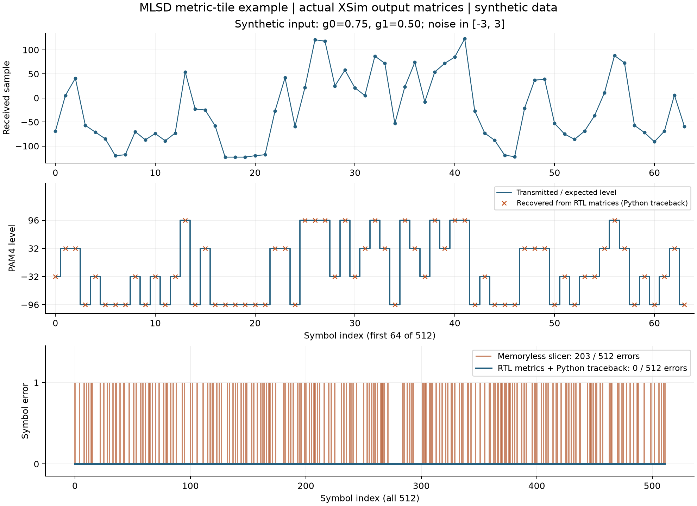

# PAM4 DSP 측정·검증 결과

[프로젝트](../README.md) · [설계 구조](architecture.md) · [MLSD 설계 판단](design-decisions.md) · [논문](../../../docs/publications.md)

기준일: **2026-10-07**.

## ISI 보드를 통한 RFSoC 측정

측정 신호 경로는 **ZCU208 DAC → ISI 보드 → ADC 캡처**입니다. 아래는 A-SSCC 2026에 보고한 RFSoC 시스템 결과입니다.

| 항목 | 결과 | 출처 |
|---|---|---|
| 채널 손실 | 41 dB | A-SSCC 2026, p. 2 Fig. 5 |
| PRBS7 BER | < 10⁻⁷ | 동일 그림의 RFSoC 시스템 결과 |
| PRBS15 BER | < 2×10⁻⁶ | 동일 그림의 RFSoC 시스템 결과 |

[논문 공식 정보](https://epapers2.org/asscc2026/ESR/paper_details.php?paper_id=1351). 최종 41-dB 온칩 checker 원 로그와 후처리 CSV의 직접 대응은 미확인입니다.

## FPGA 자원·타이밍

2026-06-14 placed 자원 요약은 논문의 전체 TRX 자원 수치와 일치합니다.

| 자원 | 저장 요약 | 논문 표기 |
|---|---:|---:|
| LUT | 189,108 | 189k |
| FF | 188,846 | 189k |
| DSP | 950 | 950 |
| BRAM tiles | 24.5 | 24.5 |

논문의 FIR 자원 절감률은 LUT 79.93%·CARRY8 70.96%입니다. 별도 저장된 direct/transposed 비교는 80.63%·91.86%이며, 논문과 같은 원본 비교표는 미확인입니다.

2026-06-29의 기존 구현 보고서는 다음과 같습니다.

| 항목 | 값 | 단계 |
|---|---:|---|
| Setup WNS / TNS | +0.083 ns / 0 ns | Post-route physopt |
| Hold WHS / THS | +0.010 ns / 0 ns | Post-route physopt |
| Fully routed / routable nets | 419,666 / 419,666 | Route status |
| Routing errors | 0 | Route status |
| LUT / FF | 204,436 / 217,999 | Placed utilization |
| DSP / BRAM tiles | 940 / 24.5 | Placed utilization |

외부 출력 지연 미지정 2개와 CDC·리셋·동기화 경고의 검토가 남아 있습니다. 2026-09-09 RTL과 측정 당시 bitstream의 빌드 대응은 미확인입니다.

## ADC 캡처 파형·채널 응답

2026-06-10 RFDC ILA에서 DAC 입력과 ADC 출력을 비교했습니다. 두 slot의 valid/ready는 각각 1,024/1,024였고, ADC peak는 5,700 counts(약 17.4% FS)였습니다. 지연을 맞춘 TX–ADC 정규화 상관계수는 0.657, 지연은 534샘플입니다.

**출처:** 2026-06-10 저장 캡처 분석. 이 초기 구동 구간에서는 안정적인 checker lock·복원이 확인되지 않았습니다.

2026-06-11 SBR 캡처는 256개 펄스 중 240개 유효 창을 사용했습니다. baseline은 −544 counts, 주응답은 baseline 대비 약 6,782 counts였고, 주응답으로 정규화한 이전·다음 응답은 0.559·0.744였습니다. 인접 심볼에 걸친 ISI를 관측했습니다.

| TX FFE 후보 캡처 | 값 |
|---|---:|
| ADC peak | 5,884 counts, 약 18.0% FS |
| TX–ADC 상관계수 | 0.731 |
| 최소제곱 채널 적합 상관계수 | 0.932 |
| TX rail hit 비율 | 9.41% |
| EQ 출력 범위 | −74 ~ +96 |

**출처:** 2026-06-11 SBR·TX FFE 후보 분석. 6월 10일과 별도 캡처이므로 상관계수 차이만으로 개선량을 확정하지 않습니다. 같은 날 UART 상태 수집에서는 route 불일치와 일부 valid 0%가 관측되어 BER를 산출하지 않았습니다.

## ADC 캡처 재생·통계 분석

### PRBS7 캡처 재생

2026-06-13 저장 ADC 입력을 시뮬레이션에서 재생했습니다. 각 경로에 1,024프레임을 입력했고 유효 출력 행은 1,023개였습니다. PR 계수는 [256, 140, 0], 레벨은 [−22, −7, 7, 22], 임계값은 [−14, 0, 14]입니다.

| 경로 | Checker lock | 평가 비트 | 오류 | BER |
|---|---:|---:|---:|---:|
| EQ-only | 0 | 0 | 0 | 평가 미성립 |
| MLSD | 1 | 64,384 | 794 | 0.0123323 |

**출처:** 2026-06-13 캡처 재생 결과. 관측 비트 65,536개 중 lock 이후 64,384개를 BER 분모로 사용했습니다.

### 21-tap FFE·3-tap PR 통계 컨투어

2026-06-14 분석은 EQ 잔차의 평균·표준편차와 심볼 문맥별 횟수로 기대 BER를 계산했습니다. PRBS7은 ADC 캡처 입력, PRBS15는 IL40-dB 등가 입력에 결정적 AWGN을 더한 SNR 22-dB 조건입니다.

| 항목 | PRBS7 | PRBS15 |
|---|---:|---:|
| 최적 PR 계수 | [256, 148, −16] | [256, 112, −80] |
| 정규화된 post1, post2 | (0.578125, −0.0625) | (0.4375, −0.3125) |
| 기대 BER | 5.071389105066×10⁻¹² | 2.243856315445×10⁻⁶ |
| 10⁷비트 기준 기대 오류 | 0.000050714 | 22.438563154 |
| 10⁷비트 기준 표시 | 10⁻⁷ 하한 | 2.2×10⁻⁶ |

10⁷비트는 계산·표시 기준이며 실제 온칩 검사 비트 수를 뜻하지 않습니다. PRBS15의 10⁶비트 기준 표시는 기대 오류를 정수 2로 반올림한 2×10⁻⁶입니다. 최적점은 논문 Fig. 5와 시각적으로 대응하나, 그림과 CSV의 생성 연결은 미확인입니다.

## FIR 출력 정합성

**실행:** 2026-09-09, Vivado XSim 2022.2. 기준·비교 회로의 지연을 정렬한 뒤 32-lane 고정소수점 출력을 비교했습니다.

| 검사 | 결과 | 전체 반복 수 | 지연 정렬 |
|---|---|---:|---|
| TX FIR systolic equivalence | PASS | 800 | 추가 지연 7 cycles |
| RX EQ21 segmented/transposed equivalence | PASS | 900 | 비교 지연 7 cycles |
| RX EQ21 old/segmented equivalence | PASS | 900 | 회로 간 지연 차이 3 cycles |

출력 비교는 초기 대기 이후 시작했습니다. 입력은 테스트벤치의 의사난수·계수 조건입니다.

## MLSD 메트릭·전체 어댑터

**실행:** 2026-10-07, Vivado XSim 2022.2. g₂=0인 memory-0/1 합성 채널 두 조건, PAM4 레벨 [−96, −32, 32, 96], signed 8-bit·Q8·L1 메트릭입니다.

| 검사 | 결과 | 확인 범위 |
|---|---|---|
| Branch 산술·후보 보존·목적 상태 도달 | 두 조건 PASS | 조건별 512심볼 × 16원소 |
| 8심볼 block min-plus 결합 | 두 조건 PASS | 조건별 block 행렬 1,024원소 |
| RTL 행렬의 Python traceback | 두 조건 PASS | 조건별 512레벨 모두 기준값 일치 |
| 기대값 변조 검출 | PASS | 기대 심볼 한 개 변경을 오류로 검출 |
| 32-lane 전체 보드 어댑터 | 두 조건 FAIL | 첫 검사 word lane 1 기대 32 / 실제 −32 |

**합성 입력 결과:** 잔류 ISI 벡터에서 slicer 오류 203/512, RTL 행렬·Python 복원 오류 0/512. 메트릭 지연은 6 cycles, 테스트벤치 클록 주기는 8 ns입니다. 전체 RTL traceback, memory-2 이력과 overflow·포화 경계는 미검증입니다.

## 검증 상태

| 항목 | 상태 |
|---|---|
| FIR·메트릭 모듈 회귀 | PASS |
| 전체 MLSD 어댑터 | FAIL·출력 불일치, 데이터·valid 정렬 원인 검토 필요 |
| 2026-09-09 RTL의 보드 BER·무오류 관측 시간 | 미재현 |
| 전체 MLSD 알고리즘 동등성·ASIC PPA·물리 signoff | 미검증 |
