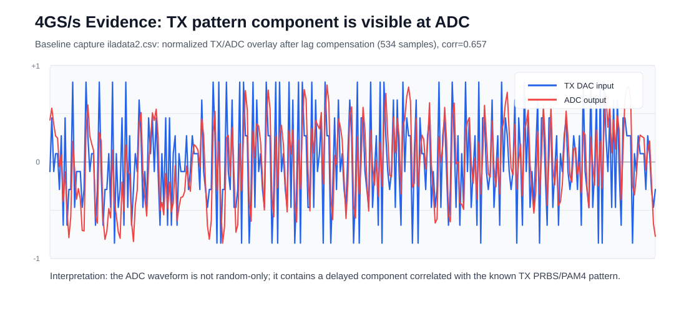

# 2026년 6월 측정과 논문 수치 대조

[프로젝트 요약](../README.md) · [설계 구조](architecture.md) · [Vivado 보드 구동](fpga-bringup.md) · [Vitis 초기화](vitis-bringup.md)

이 PC에 저장된 2026년 6월의 **ZCU208 보드 캡처·분석 기록과 FPGA 구현 요약**을 정리했습니다. 재탐색에서 찾은 **6월 14일 전체 TRX 자원은 A-SSCC 2026 논문 수치와 네 항목 모두 일치**합니다. BER 자료는 원래 계산값과 그림의 표시값을 함께 대조했습니다. 초기 보드 구동·디버깅 기록과 이후 공개 RTL 회귀 결과도 각 조건에 연결합니다.

**기록 확인일: 2026-10-07.** 아래 6월 날짜는 당시 저장된 측정·분석 기록의 날짜입니다. UART의 취득 시각은 로그에 직접 남아 있으며, 나머지 원시 캡처의 정확한 취득 시각은 별도 확정하지 않았습니다. [원본 기록·조건·SHA-256](../reports/june2026/measurement_review_20261007.json)

## A-SSCC 2026과 6월 14일 FPGA 자원 수치 대조

[A-SSCC 2026 공식 초록](https://epapers2.org/asscc2026/ESR/paper_details.php?paper_id=1351)의 4-GS/s TRX 자원을 **2026-06-14 08:54:02 +09:00**에 작성된 [저장 요약](../reports/june2026/utilization_summary_4gs_opt_20260614_085335.txt)과 대조했습니다. 프로젝트는 `DSP_based_TRX_32lane_PAM4_4GS_OPT`, 디바이스는 `XCZU48DR-FSVG1517-2-E`입니다.

| 항목 | 논문 초록 | PC의 6월 14일 저장 요약 | 확인 결과 |
|---|---:|---:|---|
| LUT | 189k | **189,108** | 논문의 반올림 표기와 일치 |
| FF | 189k | **188,846** | 논문의 반올림 표기와 일치 |
| DSP | 950 | **950** | 정확히 일치 |
| BRAM tiles | 24.5 | **24.5** | 정확히 일치 |

요약에는 전체 자원을 `impl_1` placed utilization에서 가져왔다고 기록되어 있습니다. 다운로드 폴더의 요약과 6월 24일 portable 프로젝트가 담긴 ZIP 내부 요약의 SHA-256도 일치합니다. 따라서 **논문 자원 수치에 대응하는 6월 결과가 이 PC에 보관되어 있음**을 확인했습니다. 현재 공개 RTL을 새로 구현하거나 당시 비트스트림과의 동일성을 검증한 결과는 아닙니다. [출처·최적 행·SHA-256](../reports/june2026/asscc2026_result_match_20261007.json)

논문의 FIR LUT **79.93%**, CARRY8 **70.96%** 절감과 정확히 같은 원본 비교표는 찾지 못했습니다. [6월 14일 별도 비교 요약](../reports/june2026/direct_vs_transposed_util_compare_20260614_092706.txt)의 fabric-heavy direct 대비 transposed 절감률은 **80.63% / 91.86%**이므로 논문 값의 근거로 치환하지 않습니다.

## 6월 보드 캡처와 분석 기록

| 기록일 | 진행한 내용 | 확인한 결과 |
|---|---|---|
| 6월 10일 | RFDC ILA에서 DAC 입력과 ADC 출력 비교 | valid/ready 각각 1,024/1,024, TX–ADC 상관계수 0.657, 지연 534샘플 |
| 6월 11일 | SBR 응답 분석과 TX FFE 후보 확인 | SBR 주응답 약 6,782 counts, FFE 후보 캡처의 상관계수 0.731 |
| 6월 11일 | COM6 UART로 BRAM·EQ·MLSD 상태 수집 | 4개 설정 구간의 데이터 확보, route 상태와 valid 차이 관측 |
| 6월 13일 | 캡처 입력의 PRBS7 수신 경로 재생 비교 | MLSD lock=1, 64,384비트 중 794오류; EQ-only는 lock=0으로 BER 평가 미성립 |
| 6월 14일 | 전체 TRX 자원 요약, PRBS7·PRBS15 컨투어 분석 | LUT 189,108·FF 188,846·DSP 950·BRAM 24.5로 논문 자원 일치; BER 통계 계산·표시 기준 확인 |
| 6월 29일 | 원 프로젝트 FPGA 구현 보고서 | Post-route physopt WNS +0.083 ns, WHS +0.010 ns |

## RFDC ILA로 송신 패턴의 ADC 전달 확인

4 GS/s로 설정한 RFSoC에서 ILA slot0의 DAC 입력과 slot1의 ADC 출력을 비교했습니다. 6월 10일 요약 기록에서 두 slot의 valid/ready는 각각 1,024/1,024였고, DAC 입력은 상수값이 아닌 10개 이산 레벨을 보였습니다. ADC peak는 **5,700 counts(약 17.4% FS)**, 지연을 맞춘 TX–ADC 정규화 상관계수는 **0.657**, 지연은 **534샘플**로 기록되었습니다.

당시 저장한 SVG를 그대로 사용했습니다. 두 파형은 지연 보상 후 각각 정규화한 값이므로 절대 전압이나 삽입손실을 나타내지 않습니다. [당시 요약 기록](../reports/june2026/4gs_prbs_correlation_professor_brief.md)

이 결과로 TX 패턴 성분이 ADC까지 전달되는 신호 경로를 확인했습니다. 같은 기록에서 MLSD hard output은 −5 레벨에 약 50.8% 치우쳐 있었고, 안정적인 PRBS checker lock과 데이터 복원은 확인되지 않았습니다.

## SBR 채널 응답과 TX FFE 계수 확인

6월 11일에는 `ILADATA/ISI_V2/iladata2.csv`의 SBR(single-bit response) 캡처를 분석했습니다. 256개 펄스 중 240개 유효 창을 사용한 응답에서 baseline은 −544 counts, 주응답은 baseline 대비 약 **6,782 counts**였습니다. 주응답으로 정규화한 인접 응답은 이전 샘플 **0.559**, 다음 샘플 **0.744**로, 인접 심볼에 걸친 ISI를 관측했습니다. 이 SBR 캡처의 TX–ADC 상관계수는 **0.646**, 지연은 **434샘플**입니다. [SBR 수치와 응답](../reports/june2026/loss40_recovery_assessment.json)

이 응답으로 도출한 TX FFE 후보 `[-75, 112, 27, 2, 0, -1, 2, 0]`(packed `0x0002FF00021B70B5`)를 `ISI_V2/iladata22.csv`·`iladata33.csv`에서 검토했습니다. 해당 분석은 캡처에 적용된 구성을 추정한 기록입니다.

| 후보 캡처의 관측값 | 결과 |
|---|---:|
| ADC peak | 5,884 counts, 약 18.0% FS |
| TX–ADC 상관계수 | 0.731 |
| 최소제곱 채널 적합 상관계수 | 0.932 |
| TX8 rail hit 비율 | 9.41% |
| EQ8 범위 | −74 ~ +96 |

ADC 포화 여부와 채널 응답, TX 내부 rail hit를 함께 확인해 TX 계수를 검토한 단계입니다. 6월 10일 baseline과는 서로 다른 캡처이므로 두 상관계수의 차이를 동일 조건의 개선율로 해석하지 않습니다. [TX FFE 후보의 당시 분석](../reports/june2026/prbs_txffe_sbrls_analysis_ISI_V2_22_33.md)

## UART로 BRAM·EQ·MLSD 상태 관측

직렬 로그에는 **2026-06-11 11:56:57 +09:00, COM6, 115200 baud**의 캡처 시작 시각이 남아 있습니다. 같은 세션에서 고정 frontend 설정을 바꾸며 BRAM 데이터와 EQ·MLSD 상태를 수집했습니다. [시작 시각 원문](../reports/june2026/uart_capture_start.txt) · [설정별 분석 JSON](../reports/june2026/bram_uart_fixed_frontend_20260611_115656.json)

| 기록 순서·설정 | 프레임 / BRAM words | EQ8 RMS / 범위 | 요청 route → 관측 status route | MLSD out valid |
|---|---:|---|---|---:|
| 1 · fixed_eq8_frontend | 44 / 1,320 | 56.11 / −98 ~ +127 | 1 → 0 | 100% |
| 2 · fixed_np8_level4 | 55 / 1,650 | 20.49 / −44 ~ +48 | 3 → 7 | 100% |
| 3 · fixed_eq8_frontend | 20 / 600 | 20.28 / −41 ~ +46 | 1 → 3 | 100% |
| 4 · fixed_np8_level4 | 26 / 780 | 20.44 / −41 ~ +46 | 3 → 7 | 0% |

데이터 취득과 출력 분포는 확인했지만, 요청한 route와 status에서 해석한 route가 달랐고 마지막 구간은 MLSD valid가 0%였습니다. 당시 `rough_prbs7_from_eq8`도 모두 `null`이어서 이 세션의 데이터를 BER 측정치로 사용하지 않습니다.

## 캡처를 재생한 PRBS7 수신 경로 비교

6월 13일 저장한 재생 결과는 기존 `iladata3` probe0 캡처 입력을 사용한 시뮬레이션입니다. 각 경로에 1,024프레임을 로드·재생했고 유효 출력 행은 1,023개였습니다. 공통 PR 계수는 `[256, 140, 0]`, 레벨은 `[-22, -7, 7, 22]`, 임계값은 `[-14, 0, 14]`입니다.

| 재생 경로 | checker lock | 평가 비트 | 오류 | BER |
|---|---:|---:|---:|---:|
| EQ-only, route 1 | 0 | 0 | 0 | 평가 미성립 |
| MLSD, route 4 | 1 | 64,384 | 794 | 0.0123323 (약 1.233%) |

두 경로 모두 `seen_bits=65,536`이지만 실제 평가 비트는 `bits` 필드로 구분했습니다. EQ-only 행의 `ber=1`은 lock 없이 기록된 값이므로 100% BER 또는 무오류 결과로 사용하지 않습니다. MLSD 값은 **794 / 64,384**의 캡처 재생 오류율이며, 실시간 보드에서 새로 취득한 BER와 구분합니다. [원본 재생 요약 CSV](../reports/june2026/prbs7_capture_replay_summary.csv)

## 6월 BER 컨투어와 논문 표시 수치 대조

6월 14일의 컨투어는 EQ 잔차의 평균·표준편차와 심볼 문맥별 발생 횟수로 **기대 오류 수와 기대 BER**를 계산한 분석입니다. `TOTAL_BITS=10_000_000`은 계산 기준이며, 독립적인 1,000만 비트의 온칩 누적 측정을 뜻하지 않습니다. 초기 분석은 [컨투어 요약 CSV](../reports/june2026/statistical_contour_summary.csv)에, 후속 21-tap 후보의 원래 행과 계산 스크립트 해시는 [수치 대조 기록](../reports/june2026/asscc2026_result_match_20261007.json)에 보관했습니다.

후속 후보는 논문과 같은 **21-tap FFE와 3-tap PR** 구성을 사용합니다. PRBS7은 ADC 캡처 기반이고, PRBS15는 `slot1_channel_output_signed16_IL40dB_equiv` 등가 입력에 결정적 AWGN을 더한 SNR 22-dB 조건입니다.

| 항목 | PRBS7 | PRBS15 |
|---|---:|---:|
| 최적 PR 계수 | [256,148,−16] | [256,112,−80] |
| 정규화된 post1, post2 | (0.578125,−0.0625) | (0.4375,−0.3125) |
| 원래 기대 BER | **5.071389105066×10⁻¹²** | **2.243856315445×10⁻⁶** |
| 10⁷비트 기준 기대 오류 | 0.000050714 | 22.438563154 |
| 10⁷비트 기준 반올림 오류 | 0 | 22 |
| 10⁷비트 기준 그림 표시 | **10⁻⁷ 하한** | **2.2×10⁻⁶** |

원본 CSV: [PRBS7 21-tap 컨투어](../reports/june2026/prbs7_constrained_joint_eq_pr_contour_1e7_count_limited.csv) · [PRBS15 21-tap 컨투어](../reports/june2026/prbs15_il40_noisy_snr22_21tap_constrained_eq_delta12_ridge0p05_1e7.csv)

두 최적점은 논문 Fig. 5의 Best PR 표식 위치와 시각적으로 대응합니다. 이 비교만으로 논문 그림이 해당 CSV에서 생성되었다고 확정하지는 않습니다.

PRBS15의 후속 [10⁶비트 기준 표시 CSV](../reports/june2026/prbs15_il40_noisy_snr22_21tap_constrained_eq_delta12_ridge0p05_1e6_count_limited.csv)에는 **2×10⁻⁶**이 나옵니다. 이는 기존 계산값에 10⁶을 곱한 2.243856315를 정수 2로 반올림한 `round(BER × 10⁶) / 10⁶`의 결과입니다. 원래 기대 BER는 여전히 약 2.244×10⁻⁶이며 새 측정이 추가된 것이 아닙니다.

따라서 **10⁻⁷·2×10⁻⁶ 표시를 만드는 6월 후처리 자료는 확인했지만, 논문의 41-dB 조건에서 PRBS7 BER < 10⁻⁷ 및 PRBS15 BER < 2×10⁻⁶을 기록한 최종 온칩 PRBS checker 로그와의 직접 대응은 확인하지 못했습니다.**

## 기존 FPGA 구현과 공개 RTL의 추가 검증

6월 보드 측정 원 프로젝트, 6월 재생 프로젝트와 9월에 정리한 공개 RTL 스냅샷은 각 기록의 버전을 따릅니다. 공개 소스와 6월 측정 당시 비트스트림의 정확한 대응은 확보된 해시로 확정하지 못했습니다. 아래 구현 수치와 회귀 결과는 각각의 실행 범위에 적용됩니다.

### 원 프로젝트의 기존 FPGA 구현 기록

아래 값은 2026-06-29 생성된 `impl_1` 보고서를 2026-09-09에 읽어 확인한 것입니다. 이번 RTL 복사본으로 합성·배치배선을 다시 실행하지 않았으며, 당시 구현 입력과 이번 소스 사이의 일치를 보증할 소스 해시 기록도 없습니다.

| 항목 | 값 | 구현 단계 |
|---|---:|---|
| Setup WNS | +0.083 ns | Post-route physopt |
| Setup TNS | 0.000 ns | Post-route physopt |
| Hold WHS | +0.010 ns | Post-route physopt |
| Hold THS | 0.000 ns | Post-route physopt |
| Fully routed / routable nets | 419,666 / 419,666 | Route status |
| Routing errors | 0 | Route status |
| CLB LUTs | 204,436 / 425,280 (48.07%) | Placed utilization |
| CLB Registers | 217,999 / 850,560 (25.63%) | Placed utilization |
| DSPs | 940 / 4,272 (22.00%) | Placed utilization |
| Block RAM Tile | 24.5 / 1,080 (2.27%) | Placed utilization |

자원 값은 전체 설계의 **placed** 보고서에서 가져왔으며, MLSD 단독 자원 또는 post-route physopt 단계의 자원으로 표시하지 않습니다. `.bit` 파일의 존재도 원 프로젝트에서 확인했지만 배포하지 않습니다.

원 보고서는 적용된 사용자 타이밍 제약을 만족한다고 기록합니다. 동시에 `no_output_delay (2)`와 CDC·리셋·동기화 관련 methodology warning을 포함합니다. 따라서 모든 I/O 제약과 CDC 검토까지 완료한 signoff로 표현하지 않습니다. 포함된 methodology 표 자체에도 이전 분석 결과일 수 있다는 도구 안내가 있습니다.

보고서 근거:

- [Post-route physopt timing summary 발췌](../reports/design_1_wrapper_timing_summary_postroute_physopted_excerpt.txt)
- [Placed utilization](../reports/design_1_wrapper_utilization_placed.txt)
- [Route status](../reports/design_1_wrapper_route_status.txt)
- [원 보고서 해시와 경로](../reports/report_provenance.json)

### 기존 FIR 테스트 재실행: 2026-09-09

환경: Windows, Vivado XSim 2022.2. 실행일: 2026-09-09. RTL과 테스트벤치는 원본 그대로 복사했습니다.

| 기존 테스트벤치 | 결과 | TB의 실행 주기 설정 | 정렬 기준 |
|---|---|---:|---|
| TX FIR systolic equivalence | PASS | 800 | 기준 회로 대비 추가 지연 7 cycles |
| RX EQ21 segmented/transposed equivalence | PASS | 900 | 비교 지연 7 cycles |
| RX EQ21 old/segmented equivalence | PASS | 900 | 회로 간 지연 차이 3 cycles |

근거: [재실행 결과 JSON](../reports/fir_validation_20260909.json), [테스트벤치](../tb/), [실행 스크립트](../scripts/run_fir_tests.py).

TB 출력의 `checked=800/900`은 TB의 전체 반복 횟수입니다. 실제 출력 비교는 각 TB가 정한 초기 대기 구간 이후에 수행하므로 800/900개 출력 전체를 비교했다는 뜻으로 사용하지 않습니다. 입력은 TB에 구현된 의사난수·계수 조건이며, 이 결과는 모든 입력에 대한 형식적 동등성 증명이 아닙니다. MLSD 전체 검출기 정합성과 보드 실측은 이번 재실행 범위에 포함되지 않습니다.

### MLSD 메트릭 최소 예제와 어댑터 회귀: 2026-10-07

Windows·Vivado XSim 2022.2에서 새 테스트벤치로 원본 RTL을 실행했습니다. 합성 채널 두 조건 모두 메트릭 모듈 검사는 통과했고, 전체 어댑터는 출력 불일치가 발생했습니다.

| 검사 | 결과 | 확인 범위 |
|---|---|---|
| 8-lane branch 산술·후보 보존·목적 상태 도달 | 두 조건 PASS | 조건별 512심볼 × 16원소, signed 8-bit·Q8·L1 |
| 8심볼 block min-plus 결합 | 두 조건 PASS | 조건별 block 행렬 1,024원소 |
| 실제 RTL 행렬의 Python traceback | 두 조건 PASS | 조건별 512레벨 모두 기준값 일치; RTL traceback 제외 |
| 변조한 기대값의 불일치 검출 | PASS | 기대 심볼 한 개 변경을 오류로 검출 |
| 32-lane 전체 보드 어댑터 | 두 조건 FAIL | 첫 검사 word lane 1: 기대 32, 실제 -32 |

메트릭 타일의 관측 지연은 6 cycles(8-ns TB 클록)입니다. 단순 slicer는 잔류 ISI 벡터에서 203/512심볼 오류, RTL 행렬을 이용한 Python 복원은 0/512심볼 오류였습니다. 이는 결정적 예제의 심볼 비교이며, BER·일반 알고리즘 동등성·FPGA 타이밍 성과로 해석하지 않습니다. `g2=0`인 memory-0/1 입력이므로 memory-2 reduced-state 이력 동작도 검증하지 않습니다.

[예제·실행 명령·상세 조건](../examples/mlsd_minimal/) · [메트릭 PASS 기록](../reports/mlsd_metric_example_20261007/summary.json) · [어댑터 FAIL 기록](../reports/mlsd_adapter_audit_20261007/summary.json)

## 관련 논문의 시스템 검증

[A-SSCC 2026 관련 논문 공식 정보](https://epapers2.org/asscc2026/ESR/paper_details.php?paper_id=1351)에는 DS-SBM RS-MLSD를 포함한 PAM4 송수신기의 ZCU208 RFSoC 시스템 검증이 보고되어 있습니다. 논문의 결과는 해당 논문 버전과 측정 조건에 연결됩니다. 이 폴더의 FIR 재실행 결과·기존 구현 보고서와의 관계는 [논문과 공개 소스의 관계](architecture.md#관련-논문과-공개-소스의-관계)에서 확인할 수 있습니다.

**조건·관련 논문:** A-SSCC 2026 논문 p. 2 Fig. 5의 BER contour 영역. 논문에 보고된 41-dB 손실 조건에서 PRBS7 BER < 10⁻⁷, PRBS15 BER < 2 × 10⁻⁶의 결과입니다. 논문 버전의 시스템 측정이며, 위 합성 벡터 검사나 공개 어댑터의 새 보드 실행 결과와 구분합니다. [공식 정보](https://epapers2.org/asscc2026/ESR/paper_details.php?paper_id=1351)

6월 14일 전체 TRX 자원 수치는 논문과 일치하며, BER 컨투어에는 최적 PR 위치와 표시 수치가 대응하는 후보가 있습니다. 최종 41-dB 온칩 오류 계수의 원본 로그는 이번 탐색에서 찾지 못했으므로, 후처리 CSV를 그 실측 로그로 표시하지 않습니다.

## 공개 RTL의 검증 범위

공개 RTL 스냅샷으로 논문의 보드 BER와 무오류 수신 시간을 재현한 결과는 아직 포함하지 않았습니다. 이는 위 논문 버전의 시스템 측정과 별개 항목입니다. 전체 MLSD의 엄밀한 알고리즘 동등성, ASIC PPA와 물리설계 signoff도 공개본의 검증 범위에 포함되지 않습니다. 기존 ADC replay 후보별 score는 최종 BER와 구분합니다.
