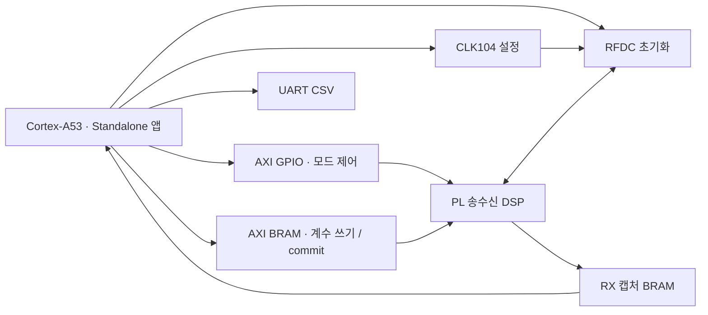

# Vitis 기반 ZCU208 구동·PS 제어

<!-- page-navigation:top -->

  
  

<!-- /page-navigation:top -->

[DSP 설계 구조](architecture.md) · [FPGA 자원·타이밍 결과](validation.md#fpga-자원타이밍) · [RFSoC 실측·BER](validation.md#isi-보드를-통한-rfsoc-측정)

PL에 구현한 송수신 DSP를 제어하기 위해 Cortex-A53 Standalone 앱을 구성했습니다. Vitis에서 JTAG 실행, CLK104·RFDC 초기화, 계수 적용과 수신 디버그 데이터 수집을 연결했습니다.

## PS 제어와 PL 데이터 경로

PS가 GPIO·BRAM으로 모드와 계수를 설정하고, PL이 병렬 송수신 연산을 수행합니다. 수신 디버그 데이터는 별도 캡처 BRAM을 통해 PS로 전달합니다.

Vivado의 `design_1_wrapper.xsa`를 Vitis 2022.2 플랫폼으로 가져와 하드웨어 주소와 BSP를 연결했습니다. `DSP_based_TRX` 앱은 `psu_cortexa53_0`의 64-bit Standalone 환경에서 실행하도록 구성했습니다. RFDC·클록 제어에는 AMD/Xilinx 드라이버를 사용했습니다. [AMD의 XSA·Standalone 플랫폼 구성 안내](https://xilinx.github.io/Embedded-Design-Tutorials/docs/2022.2/build/html/docs/Introduction/ZynqMPSoC-EDT/4-build-sw-for-ps-subsystems.html)

## JTAG 로드 순서

XSCT 스크립트에 **시스템 리셋 → PL bitstream 다운로드 → A53 FSBL 실행 → 앱 ELF 다운로드·실행** 순서를 구성했습니다. FSBL은 `XFsbl_Exit`까지 실행한 뒤 앱으로 전환합니다.

PL 회로와 A53 앱을 함께 준비해, 앱의 AXI 접근이 실제 GPIO·BRAM·RFDC 하드웨어와 연결되도록 했습니다.

## 클록·RFDC 초기화

앱은 GPIO·RX 계수 BRAM의 기본 상태를 먼저 준비한 뒤 CLK104와 RFDC를 초기화합니다.

| 단계 | 앱의 처리 | 목적 |
|---|---|---|
| DSP 기본 설정 | 모드·필터 제어 GPIO, RX 계수 BRAM, threshold 설정 | 데이터 경로와 초기 계수 설정 |
| CLK104 설정 | `XRFClk_Init`, 클록 reset, LMK·LMX 설정 | ADC·DAC 기준 클록 준비 |
| RFDC 초기화 | `metal_init`, `XRFdc_CfgInitialize`, converter startup | ADC·DAC 드라이버와 tile 준비 |
| 상태 관측 | 단계별 반환값·tile 상태를 UART로 출력 | 초기화가 멈춘 단계를 구분 |

## 계수 적용과 캡처 수집

RX 계수는 PS에서 AXI BRAM Controller를 통해 쓰고, 메모리 값을 다시 읽어 비교합니다. 쓰기가 끝나면 **commit sequence**를 갱신합니다. PL 계수 로더는 shadow bank에 읽어 둔 값을 적용 가능 시점에 active bank로 전환하도록 구성해, 설정 중간값이 DSP 연산에 들어가지 않도록 했습니다.

수신 디버그 데이터는 캡처 완료 상태를 확인한 뒤 BRAM에서 읽어 UART CSV로 출력합니다. 이 샘플 캡처는 내부 신호 분석에 사용하고, BER는 PL PRBS 검사기의 검사 비트 수·오류 수·lock 상태로 평가합니다. [ADC 캡처·시스템 측정 결과](validation.md)

<!-- page-navigation:bottom -->

  
  
  

<!-- /page-navigation:bottom -->
