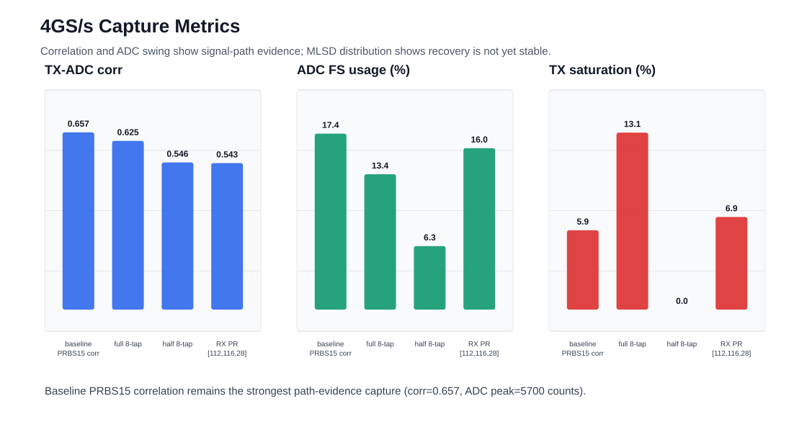
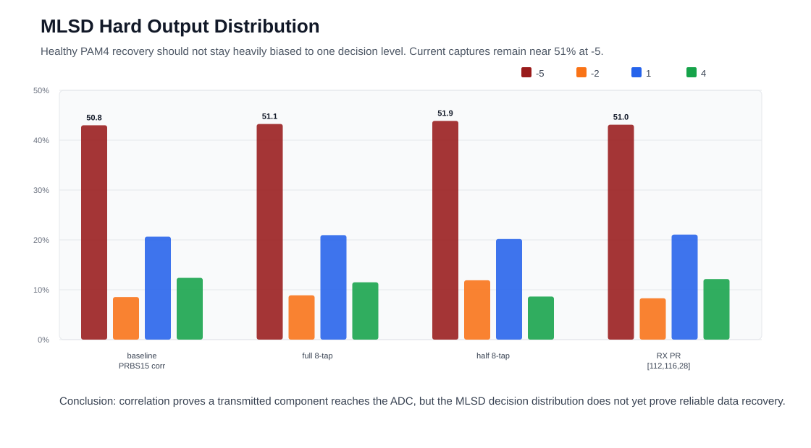

# 4GS/s PRBS Correlation Evidence Brief

## Professor Question

**Q. 4GS/s에서는 데이터 복원이 좀 이루어지고 있나요?**

**A. 아직 안정적인 data recovery가 이루어진다고 보기는 어렵습니다.** 다만 RFDC ILA 기준으로 TX PRBS/PAM4 패턴 성분이 ADC까지 전달되는 것은 확인됩니다. Baseline capture에서 slot0 DAC input과 slot1 ADC output 사이에 약 **534 sample delay**를 두고 normalized correlation **0.657**가 관측되었고, ADC swing도 peak **5700 counts** 수준으로 확인되었습니다. 따라서 신호 경로가 완전히 깨진 상태는 아니며, 현재는 **signal path/correlation은 확인되었지만 MLSD/checker 기준의 reliable recovery는 미달**인 상태로 보는 것이 정확합니다.

## Why PRBS Correlation Was Used

- PRBS는 송신 sequence를 알고 있으므로 ADC waveform과 cross-correlation을 걸어 path delay와 신호 성분 존재 여부를 확인할 수 있습니다.
- single-bit response는 alignment와 반복성 확보가 어렵기 때문에, 연속 PRBS를 사용하면 더 긴 관측 구간에서 채널 응답과 ISI 경향을 추정할 수 있습니다.
- PRBS15는 period가 길어 channel/correlation 추정에 유리하고, PRBS7은 bring-up/checker lock 검증에 더 단순합니다. 그래서 다음 패치는 PRBS7 검증 모드로 전환했습니다.

## Evidence Summary

| Evidence | Baseline Observation | Interpretation |
|---|---:|---|
| RFDC valid/ready | slot0/slot1 모두 1024/1024 | AXIS stream 정상 |
| TX DAC input | 10 discrete levels, not constant | PAM4/FFE PRBS pattern present |
| ADC swing | peak 5700 counts, FS 17.4% | ADC에 유의미한 신호 입력 |
| TX-ADC correlation | corr 0.657, lag 534 samples | TX 성분이 ADC에서 관측됨 |
| MLSD hard output | -5 level 약 50.8% | decision bias 존재, recovery 미완 |

## Visuals

## Suggested Wording

> 4GS/s에서 RFDC ILA 기준으로 slot0 DAC input은 constant가 아니라 PRBS 기반 PAM4/FFE pattern의 discrete level을 보였고, slot1 ADC output도 유의미한 swing을 가졌습니다. 또한 slot0 TX pattern과 slot1 ADC waveform 사이에서 약 534 sample 지연의 normalized correlation 0.657이 관측되어, TX pattern 성분이 ADC까지 전달되고 있음을 확인했습니다. 다만 MLSD hard decision 분포가 아직 -5 level 쪽으로 약 50.8% 치우쳐 있고 PRBS checker lock은 확인되지 않았기 때문에, 안정적인 data recovery가 완료되었다고 보기는 어렵습니다.
